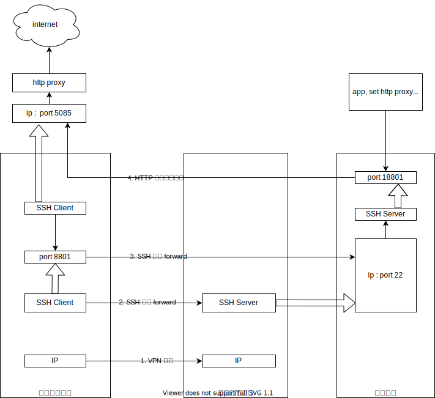

# 内网隔离情况下，使用SSH正向和反向代理，实现连通外网http proxy

我们的实验室环境是一个内网隔离的环境，但是我们做实验，需要从外网下载一些依赖，那么我们可以使用SSH正向和反向代理相结合的办法，实现连接外网http proxy。



从图里面，我们可看到，我们有一个跳板机，我们就利用这个跳板机来完成内网，外网的互通：
- 第一步，是公网连接到跳板机，这个过程可能涉及vpn拨号，或者多次ssh到跳板机上，但是最终目的是，公网的主机和跳板机ssh可达，并能ssh到跳板机上。
- 第二步，ssh正向forward，实际上，这是ssh到跳板机，然后让跳板机上的ssh服务器打开一个到内网主机的tcp通道，并且在公网主机上监听一个端口，以后访问公网主机的端口，流量就直接转发到内网主机上。
- 第三步，通过第二步打开的正向tcp通道，建立一个ssh反向forward的连接，作用是公网主机直接ssh到内网主机上，然后在内网主机上打开一个监听端口，所有到这个端口上的流量，直接转发到一个指定的公网ip和端口上。
- 第四步，就是我们可以在内网应用上，配置http代理，指向内网主机和监听的端口，实际效果是，这些流量被转发到了公网ip和端口上。

```bash

# gateway port for ssh -R
sed -i 's/#GatewayPorts no/GatewayPorts yes/g' /etc/ssh/sshd_config
systemctl restart sshd

# 第二步的命令范例
/usr/local/bin/autossh -M 0 -N -D 8801 -i /Users/wzh/.ssh/id_rsa root@ocp.pan.redhat.ren

# 第三部的命令范例
/usr/local/bin/autossh -M 0 -N -R 0.0.0.0:18801:127.0.0.1:5085 -i /Users/wzh/.ssh/id_rsa root@ocp.pan.redhat.ren

```