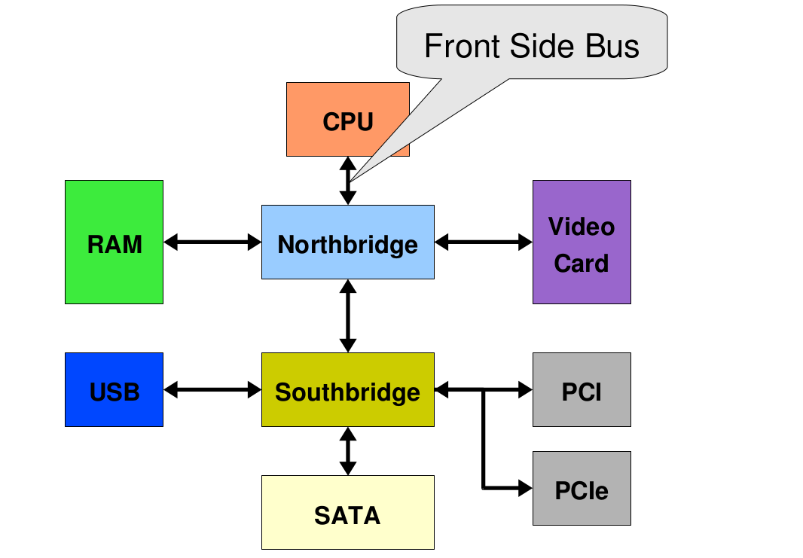
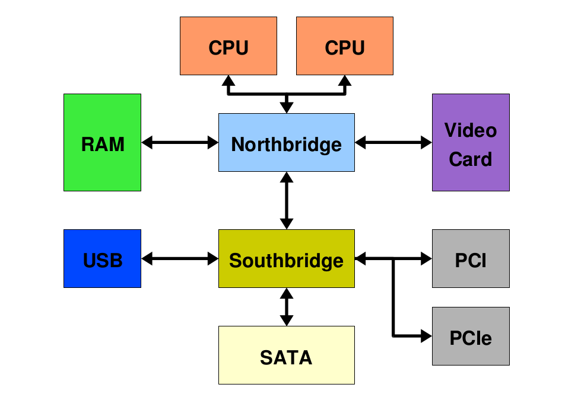
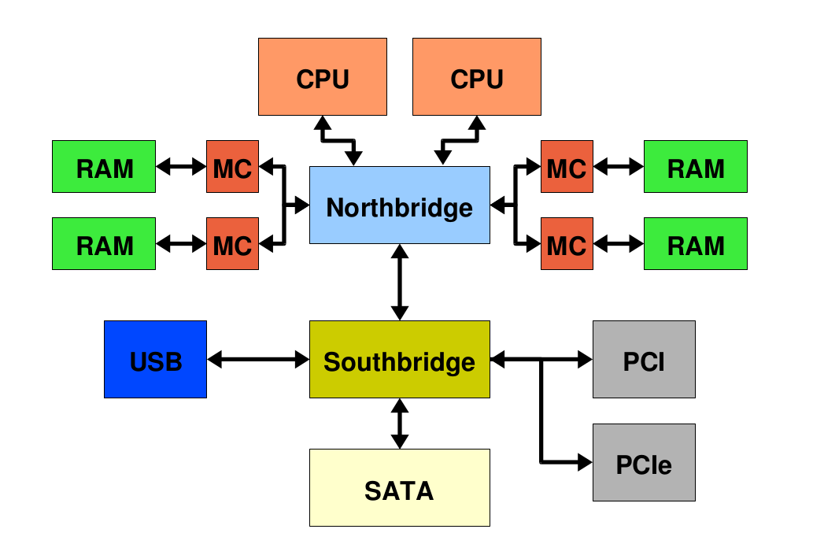
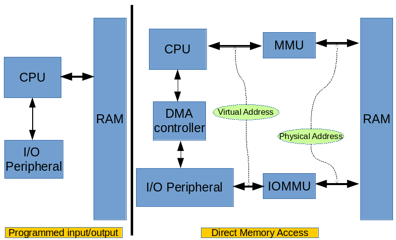
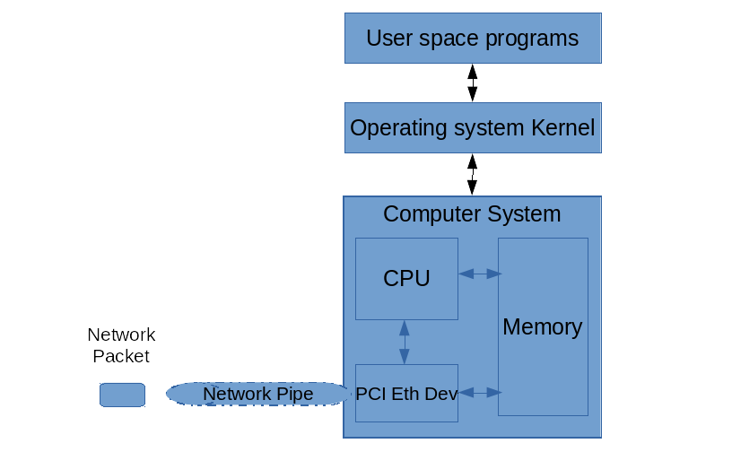
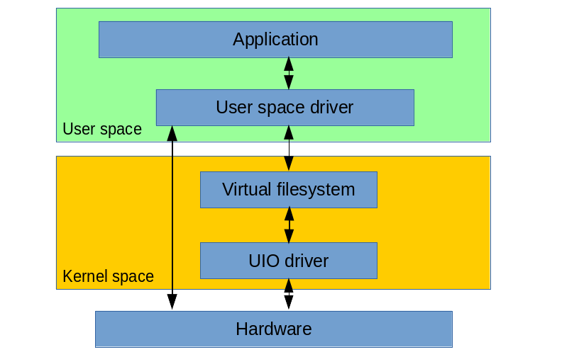
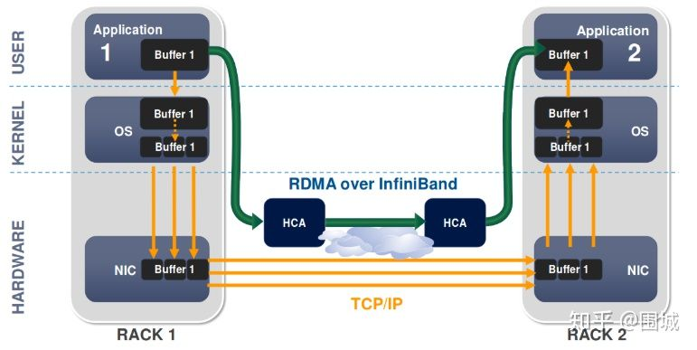

# RDMA & IB

本文，描述一下在rhel7上，如何配置和使用InfinitiBand网络。试验环境是mellanox CX6

其实官方已经有完善的文档了，参见以下链接。

https://access.redhat.com/documentation/en-us/red_hat_enterprise_linux/7/html-single/networking_guide/index#sec-Configuring_IPoIB

说到RDMA/IB，就不得不说一下计算机架构。

传统的计算机架构是这样的，北桥管内存，南桥管外设。


当有多CPU的时候，都挂在北桥上，由北桥协调对内存的访问，在这里，北桥就是访问的瓶颈了。


UMA架构，就是intel提出来的，解决北桥瓶颈的架构，MC就是memory controller，被从北桥拿出来，每个CPU都有单独的北桥连接。


最后就是大名鼎鼎的NUMA架构，北桥被取消，memory controller被集成到了CPU里面


用下面的命令，可以查看numa的情况
```bash
numactl -H
```

传统外设的信息传递，需要通过CPU才能写入内存，DMA的方案，可以让外设，直接写入内存。


传统IO处理模式


DPDK的IO处理模式，可以在用户态下，直接写硬件


知道了DMA，那RDMA就很好理解了。可以理解为，两个主机应用，相互直接直写内存，不浪费CPU资源。网络性能可以最大化。


接着，我们就看看，在操作系统上，怎么操作RDMA/IB相关的命令。

```bash

vi /etc/default/grub
GRUB_CMDLINE_LINUX="nofb splash=quiet console=tty0 ... intel_iommu=on iommu=pt default_hugepagesz=1G hugepagesz=1G hugepages=8 rdblacklist=nouveau"

grub2-mkconfig -o /boot/efi/EFI/bclinux/grub.cfg

cat << EOF > /etc/modprobe.d/blacklist-nouveau.conf
blacklist nouveau
options nouveau modeset=0
EOF
dracut --force

cd /data/mlx
tar zvxf MLNX_OFED_LINUX-5.2-2.2.0.0-bclinux7.6-x86_64-ext.tgz

cd /data/mlx/MLNX_OFED_LINUX-5.2-2.2.0.0-bclinux7.6-x86_64-ext/
./mlnxofedinstall --force

dracut -f

systemctl enable --now mst
systemctl enable --now openibd
systemctl enable --now opensmd

lsmod | grep mlx
modinfo mlx5_core
ibdev2netdev -v

# restore
systemctl disable --now mst
systemctl disable --now openibd

opensm
sminfo
ibstat
ibdev2netdev
mst status

udevadm info -a -n /dev/infiniband/umad0

# on 102
ibping -S -C mlx5_0 -P 0

# on 105
# below 2 both ok
ibping -c 1000 -f -C mlx5_0 -P 0 -L 2
ibping -c 1000 -f -C mlx5_0 -P 1 -L 2
# --- panlab105.(none) (Lid 1) ibping statistics ---
# 1000 packets transmitted, 1000 received, 0% packet loss, time 906 ms
# rtt min/avg/max = 0.003/0.906/900.008 ms

# on 105
# below 2 both ok
ibping -c 1000 -f -C mlx5_0 -P 0 -G 0x98039b0300cc7124
ibping -c 1000 -f -C mlx5_0 -P 1 -G 0x98039b0300cc7124

# use nmtui to config ib
# follow https://access.redhat.com/documentation/en-us/red_hat_enterprise_linux/7/html-single/networking_guide/index#sec-Configuring_IPoIB

# on 102
ib_write_bw -d mlx5_0 -a -F

# on 105
ib_write_bw -d mlx5_0 -D 10 192.168.111.102

```