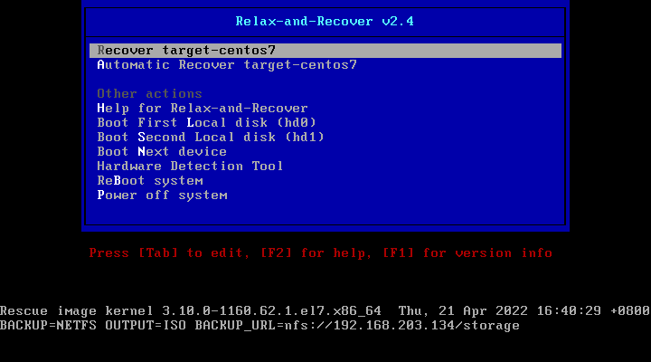
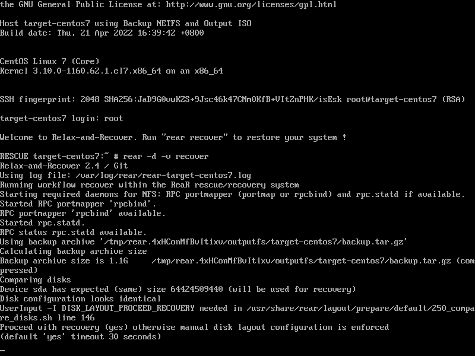
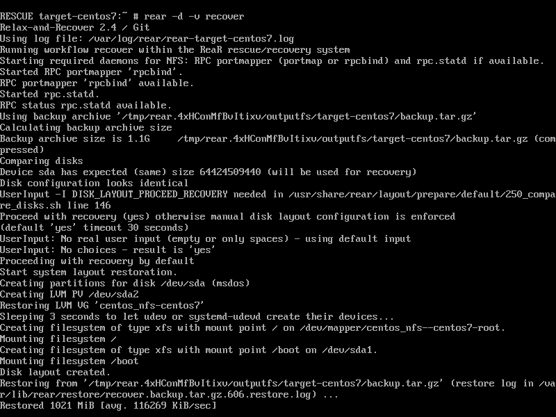
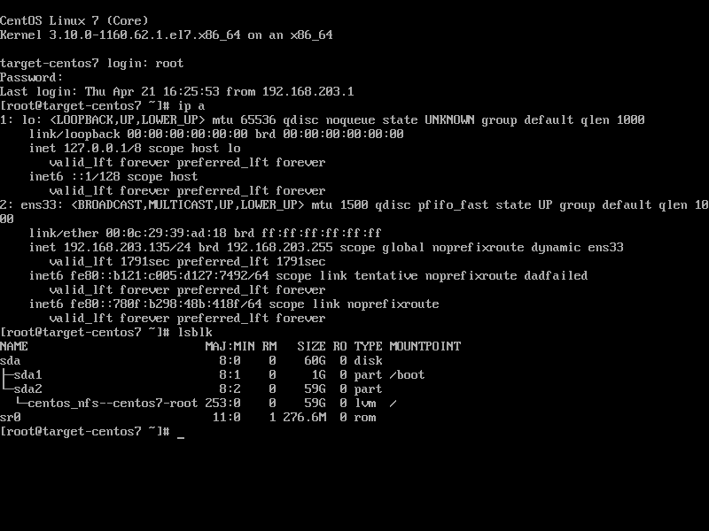

# Relax and Recover(ReaR)  / disaster recovery

Redhat give us a system back solution (ReaR), althought it is not supported by redhat, but it works. now we test it out.

reference:
- https://access.redhat.com/solutions/2115051

```bash

# on nfs server
yum install -y nfs-utils

mkdir -p /storage

cat << EOF > /etc/exports
/storage        *(fsid=0,rw,sync,no_root_squash,no_subtree_check,crossmnt)
EOF

cat /etc/exports
# /storage        *(fsid=0,rw,sync,no_root_squash,no_subtree_check,crossmnt)  

systemctl enable --now nfs

systemctl disable --now firewalld

# on target server

yum install -y rear pstree nfs-utils

cat << EOF > /etc/rear/local.conf
OUTPUT=ISO
OUTPUT_URL=nfs://192.168.203.134/storage
BACKUP=NETFS
BACKUP_URL=nfs://192.168.203.134/storage
BACKUP_PROG_EXCLUDE=("${BACKUP_PROG_EXCLUDE[@]}" '/media' '/var/tmp' '/var/crash')
NETFS_KEEP_OLD_BACKUP_COPY=
EOF

rear -d -v mkbackup

# on nfs server, new files created from target centos7 vm

tree /storage
# /storage
# └── target-centos7
#     ├── backup.log
#     ├── backup.tar.gz
#     ├── README
#     ├── rear-target-centos7.iso
#     ├── rear-target-centos7.log
#     ├── selinux.autorelabel
#     └── VERSION

# now destroy the target centos vm, and recreate a new one
# boot the new vm using rear-target-centos7.iso
```
  

  

  

  

  

after reboot, the system comes back

  
