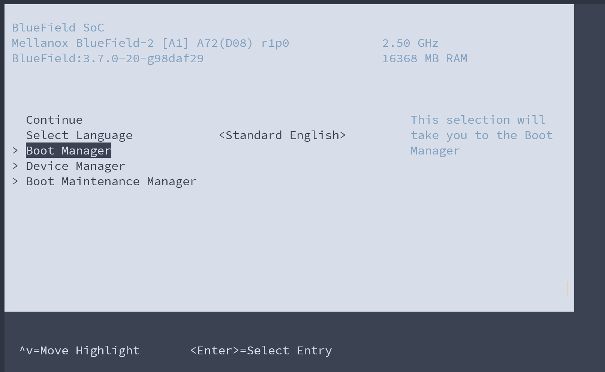
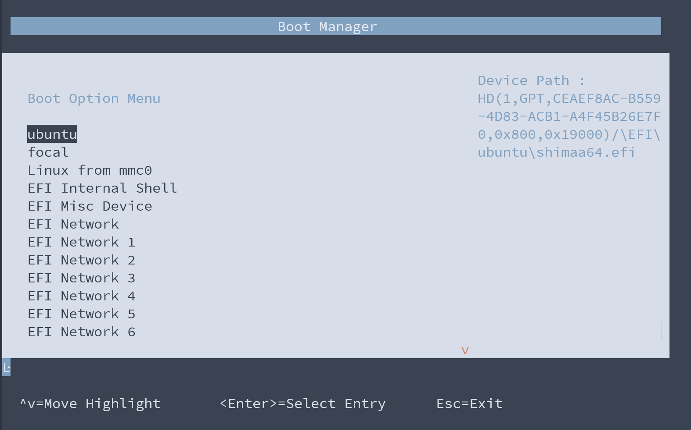

# openshift 4.10 BF2 offload

# fresh BF2 os with rhel 8.6

- [Installing Red Hat Enterprise Linux on NVIDIA BlueField-2 DPU](https://developers.redhat.com/articles/2021/10/18/sensitive-information-detection-using-nvidia-morpheus-ai-framework#setting_up_nvidia_netq_agent_on_nvidia_bluefield_2_dpu)

```bash


# https://bugzilla.redhat.com/show_bug.cgi?id=1814682
dnf install -y kernel-modules-extra psmisc

mkdir -p /data/down/
cd /data/down/

dnf install -y rshim expect wget minicom rpm-build lshw
systemctl enable --now rshim
systemctl status rshim --no-pager -l

dnf install -y openssl-devel mstflint

# nat router on host
# https://access.redhat.com/discussions/4642721
cat << EOF >> /etc/sysctl.d/99-wzh-sysctl.conf

net.ipv4.ip_forward = 1

EOF
sysctl --system

systemctl disable --now firewalld

# download bfb from here
# https://developer.nvidia.com/networking/doca
# and docs here
# https://docs.nvidia.com/networking/display/BlueFieldDPUOSLatest/Deploying+DPU+OS+Using+BFB+from+Host
wget -O bf2.bfb https://content.mellanox.com/BlueField/BFBs/Ubuntu20.04/DOCA_1.3.0_BSP_3.9.0_Ubuntu_20.04-6.signed.bfb

cat bf2.bfb > /dev/rshim0/boot

# on console of bf2
# login using ubuntu / ubuntu

# upgrade fw
/opt/mellanox/mlnx-fw-updater/mlnx_fw_updater.pl

mlxconfig -d /dev/mst/mt41686_pciconf0 -y reset

mlxconfig -d /dev/mst/mt41686_pciconf0  s LINK_TYPE_P1=2 LINK_TYPE_P2=2

# power off and on machine.

# shell come frome https://github.com/wangzheng422/rhel-on-bf2
# download rhel8.6 install iso from  
# https://access.redhat.com/downloads/content/419/ver=/rhel---8/8.6/aarch64/product-software
export RHEL_ISO=rhel-8.6-aarch64-dvd.iso
bash bluefield_provision.sh -s
# === STATUS === Checking usability of SRIOV for PCI 0000:06:00.0
# SRIOV needs to be enabled in BIOS
# EMBEDDED_CPU mode enabled
# === STATUS === Checking usability of SRIOV for PCI 0000:06:00.1
# SRIOV needs to be enabled in BIOS
# EMBEDDED_CPU mode enabled

setenforce 0

# bash bluefield_provision.sh -p

iptables -F
bash ./PXE_setup_RHEL_install_over_mlx.sh -i "${RHEL_ISO}" -p tmfifo -k RHEL8-bluefield.ks

uplink_interface="$(ip route |grep ^default | sed 's/.*dev \([^ ]\+\).*/\1/')"
test -n "${uplink_interface}" || die "need a default route"
    
iptables -t nat -A POSTROUTING -o "${uplink_interface}" -j MASQUERADE

# on a new terminal
minicom --color on --baudrate 115200 --device /dev/rshim0/console

# change back to original terminal
echo BOOT_MODE 1 > /dev/rshim0/misc
echo SW_RESET 1 > /dev/rshim0/misc

sleep 10
nmcli conn up tmfifo_net0
systemctl restart dhcpd

iptables -t nat -A POSTROUTING -o "${uplink_interface}" -j MASQUERADE

# and see result on com console
# and press 'ESC' to see bios console
# and select 'Boot Manager'
# select EFI network with following content


```
see result on com console, press 'ESC' to see bios console


select 'Boot Manager'



select EFI network with following content



```
MAC(001ACAFFFF01,0x1)/
IPv4(0.0.0.0)
```
in our env, it is 'EFI Network 8'


select the item , and it will boot through pxe and install os

```bash
# on bf2 console
# login using root / bluefield


BF_VERSION=3.9.0
MLNX_OFED_VERSION=5.6-1.0.3.3

wget --quiet https://linux.mellanox.com/public/repo/bluefield/${BF_VERSION}/extras/mlnx_ofed/${MLNX_OFED_VERSION}/MLNX_OFED_SRC-${MLNX_OFED_VERSION}.tgz
tar xzf MLNX_OFED_SRC-${MLNX_OFED_VERSION}.tgz
MLNX_OFED_SRC-${MLNX_OFED_VERSION}/install.pl -k $kernel --kernel-extra-args '--with-sf-cfg-drv --without-xdp --without-odp' --kernel-only --disable-kmp

```

# install ocp master on kvm on 102


# add ocp worker on baremetal on 103


# config BF2 to install ovnK to connect to ocp


