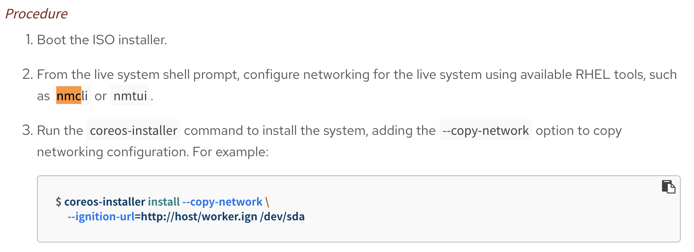

# install node using live iso

- https://docs.openshift.com/container-platform/4.7/installing/installing_bare_metal/installing-bare-metal-network-customizations.html#installation-user-infra-machines-advanced_network_installing-bare-metal-network-customizations




```bash
sudo -i
# manually set ip address, don't forget to set hostname, otherwise, you will get 'localhost'
nmtui

# to cleanup lvm partition, then reboot
sfdisk --delete /dev/sda

coreos-installer install --copy-network \
     --ignition-url=http://192.168.7.11:8080/ignition/worker-0.ign /dev/sda --insecure-ignition

coreos-installer install --copy-network \
     --ignition-url=http://192.168.7.11:8080/ignition/worker-0.ign \
     /dev/sda --insecure-ignition \
     --append-karg "ip=192.168.7.16::192.168.7.1:255.255.255.0:worker-0:enp1s0:none nameserver=192.168.7.11"

# dhcp
coreos-installer install --copy-network \
     --ignition-url=http://192.168.7.11:8080/ignition/worker-0.ign \
     /dev/sda --insecure-ignition \
     --append-karg "ip=::::worker-0:enp1s0:dhcp nameserver=192.168.7.11"

reboot

# on helper
oc get csr | grep -v Approved
oc get csr -ojson | jq -r '.items[] | select(.status == {} ) | .metadata.name' | xargs oc adm certificate approve

# after install, you need to set the node name
# https://access.redhat.com/solutions/5152031
oc delete node/localhost

# go to worker-1
sudo rm /var/lib/kubelet/pki/*

reboot

# rpm-ostree rebase --experimental /run/mco-machine-os-content/os-content-309629249/srv/repo:9ffdb01436a78b3568af1a60899a09fe83303bc32028ca4535e2d086de9c4f5d --custom-origin-url pivot://quay.io/openshift-release-dev/ocp-v4.0-art-dev@sha256:b63d6a30bb976e30ae95393db315d079638415917c6015f09f0fa106cc29b068 --custom-origin-description Managed by machine-config-operator
```