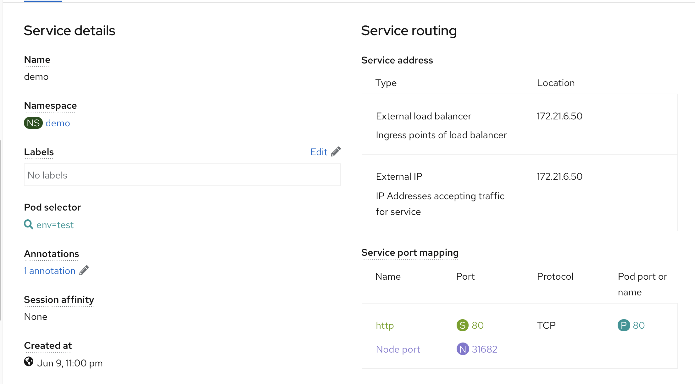
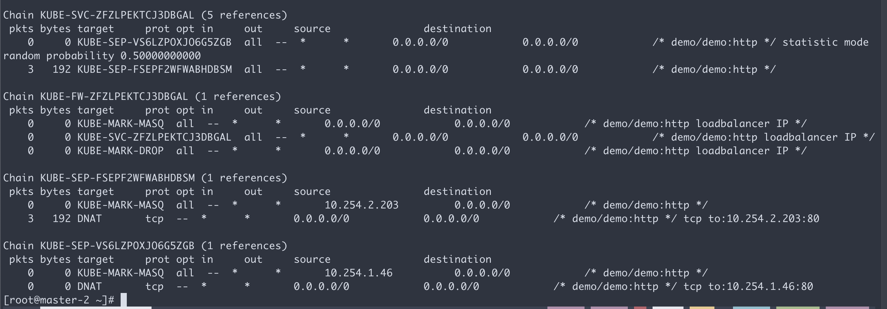

# keepalived operator in openshift4

## 痛点

openshift4 标准安装，使用router(haproxy)来做ingress，向集群导入流量，这么做，默认只能工作在7层，虽然也有方法进行定制，让他工作在4层，但是不管从对外暴露的IP地址的可管理性，以及应用端口冲突处理方面来说，都非常不方便。

根本原因，其实是openshift4 私有化安装不支持 LoadBalancer 这个service type。 那么今天我们就找了 keepalived operator，来弥补这个缺陷。

视频讲解:

[<kbd></kbd>](https://www.ixigua.com/6972082855060963848)

<!-- - [bilibili]() -->
- [xigua](https://www.ixigua.com/6972082855060963848)
- [youtube](https://youtu.be/_c9s8dQoWUw)


本文，参考openshift blog上的文章

https://www.openshift.com/blog/self-hosted-load-balancer-for-openshift-an-operator-based-approach

## 试验架构图


可以看到，keepalived，会在节点上，根据service的定义，创建second IP，然后外部流量，就从这个IP地址，进入集群。这是一种k8s LoadBalancer 的实现方式，和ingress controller的方式对比，就是天然支持tcp模式的4层转发。

安装keepalived operator很简单


在web界面操作完了，需要标记节点，已经调整一下权限
```bash
oc label node master-2 node-role.kubernetes.io/loadbalancer=""
oc label node master-1 node-role.kubernetes.io/loadbalancer=""

oc adm policy add-scc-to-user privileged -z default -n keepalived-operator
```
接下来，我们来看看keepalived的部署有什么特殊的地方。

我们可以看到 keepalived pod 使用了 hostnetwork 和 privileged: true。 但是keepalived pod 没有挂载特殊的主机目录。 


# 测试部署一个应用

```bash
cat << 'EOF' > /data/install/network-patch.yaml
spec:
  externalIP:
    policy:
      allowedCIDRs:
      - ${ALLOWED_CIDR}
    autoAssignCIDRs:
      - "${AUTOASSIGNED_CIDR}"
EOF

# export VERSION="4.9.4"
# export BINARY="yq_linux_amd64"
# wget https://github.com/mikefarah/yq/releases/download/${VERSION}/${BINARY} -O /usr/local/bin/yq && chmod +x /usr/local/bin/yq

# 24 256
# 25 128
# 26 64
# 27 32
# 28 16
cd /data/install
export ALLOWED_CIDR="172.21.6.33/27"
export AUTOASSIGNED_CIDR="172.21.6.33/27"
oc patch network cluster -p "$(envsubst < ./network-patch.yaml | yq eval -j -)" --type=merge

oc get network cluster -o yaml
# spec:
#   clusterNetwork:
#   - cidr: 10.254.0.0/16
#     hostPrefix: 24
#   externalIP:
#     autoAssignCIDRs:
#     - 172.21.6.33/27
#     policy:
#       allowedCIDRs:
#       - 172.21.6.33/27
#   networkType: OpenShiftSDN
#   serviceNetwork:
#   - 172.30.0.0/16
# status:
#   clusterNetwork:
#   - cidr: 10.254.0.0/16
#     hostPrefix: 24
#   clusterNetworkMTU: 1450
#   networkType: OpenShiftSDN
#   serviceNetwork:
#   - 172.30.0.0/16

oc new-project demo

cat << EOF > /data/install/demo.yaml
---
apiVersion: v1
kind: Pod
metadata:
  name: test-0
  labels:
    env: test
spec:
  restartPolicy: OnFailure
  nodeSelector:
    kubernetes.io/hostname: 'master-0'
  containers:
  - name: php
    image: "quay.io/wangzheng422/php:demo.02"
---
apiVersion: v1
kind: Pod
metadata:
  name: test-1
  labels:
    env: test
spec:
  restartPolicy: OnFailure
  nodeSelector:
    kubernetes.io/hostname: 'master-2'
  containers:
  - name: php
    image: "quay.io/wangzheng422/php:demo.02"
---
kind: Service
apiVersion: v1
metadata:
  name: demo
  annotations:
    keepalived-operator.redhat-cop.io/keepalivedgroup: keepalived-operator/keepalivedgroup-workers
spec:
  type: LoadBalancer
  ports:
    - name: "http"
      protocol: TCP
      port: 80
      targetPort: 80
  selector:
    env: test
EOF
oc create -n demo -f /data/install/demo.yaml

# to restore
oc delete -n demo -f /data/install/demo.yaml

```
## 分析一下应用的行为

看看service的配置，能看到已经分配了对外的IP

```bash
oc get svc
# NAME   TYPE           CLUSTER-IP       EXTERNAL-IP               PORT(S)        AGE
# demo   LoadBalancer   172.30.203.237   172.21.6.50,172.21.6.50   80:31682/TCP   14m

curl http://172.21.6.50/
# Hello!<br>Welcome to RedHat Developer<br>Enjoy all of the ad-free articles<br>

```

master-2 上面，相关的iptables 配置
```
    0     0 KUBE-FW-ZFZLPEKTCJ3DBGAL  tcp  --  *      *       0.0.0.0/0            172.21.6.50          /* demo/demo:http loadbalancer IP */ tcp dpt:80
```
可以看到，svc的防火墙策略，分流到了pod


# keepalived pods definition
we can see, it use hostnetwork and privileged: true
```yaml
kind: Pod
apiVersion: v1
metadata:
  generateName: keepalivedgroup-workers-
  annotations:
    openshift.io/scc: privileged
  selfLink: /api/v1/namespaces/keepalived-operator/pods/keepalivedgroup-workers-fgzv8
  resourceVersion: '2700532'
  name: keepalivedgroup-workers-fgzv8
  uid: 1addc7c7-4e6d-49c7-ae5e-3a4e2963755b
  creationTimestamp: '2021-06-09T08:51:40Z'
  namespace: keepalived-operator
  ownerReferences:
    - apiVersion: apps/v1
      kind: DaemonSet
      name: keepalivedgroup-workers
      uid: dba36a9c-f2aa-4951-aa60-a3836275ae1b
      controller: true
      blockOwnerDeletion: true
  labels:
    controller-revision-hash: 7459c85f64
    keepalivedGroup: keepalivedgroup-workers
    pod-template-generation: '1'
spec:
  nodeSelector:
    node-role.kubernetes.io/loadbalancer: ''
  restartPolicy: Always
  initContainers:
    - resources: {}
      terminationMessagePath: /dev/termination-log
      name: config-setup
      command:
        - bash
        - '-c'
        - /usr/local/bin/notify.sh
      env:
        - name: file
          value: /etc/keepalived.d/src/keepalived.conf
        - name: dst_file
          value: /etc/keepalived.d/dst/keepalived.conf
        - name: reachip
        - name: create_config_only
          value: 'true'
      securityContext:
        runAsUser: 0
      imagePullPolicy: Always
      volumeMounts:
        - name: config
          readOnly: true
          mountPath: /etc/keepalived.d/src
        - name: config-dst
          mountPath: /etc/keepalived.d/dst
      terminationMessagePolicy: File
      image: 'quay.io/redhat-cop/keepalived-operator:latest'
  serviceAccountName: default
  imagePullSecrets:
    - name: default-dockercfg-2d5d5
  priority: 0
  schedulerName: default-scheduler
  hostNetwork: true
  enableServiceLinks: false
  affinity:
    nodeAffinity:
      requiredDuringSchedulingIgnoredDuringExecution:
        nodeSelectorTerms:
          - matchFields:
              - key: metadata.name
                operator: In
                values:
                  - master-1
  terminationGracePeriodSeconds: 30
  shareProcessNamespace: true
  preemptionPolicy: PreemptLowerPriority
  nodeName: master-1
  securityContext: {}
  containers:
    - resources: {}
      terminationMessagePath: /dev/termination-log
      name: keepalived
      command:
        - /bin/bash
      env:
        - name: POD_NAME
          valueFrom:
            fieldRef:
              apiVersion: v1
              fieldPath: metadata.name
      securityContext:
        privileged: true
      imagePullPolicy: Always
      volumeMounts:
        - name: lib-modules
          readOnly: true
          mountPath: /lib/modules
        - name: config-dst
          readOnly: true
          mountPath: /etc/keepalived.d
        - name: pid
          mountPath: /etc/keepalived.pid
        - name: stats
          mountPath: /tmp
      terminationMessagePolicy: File
      image: registry.redhat.io/openshift4/ose-keepalived-ipfailover
      args:
        - '-c'
        - >
          exec /usr/sbin/keepalived --log-console --log-detail --dont-fork
          --config-id=${POD_NAME} --use-file=/etc/keepalived.d/keepalived.conf
          --pid=/etc/keepalived.pid/keepalived.pid
    - resources: {}
      terminationMessagePath: /dev/termination-log
      name: config-reloader
      command:
        - bash
        - '-c'
        - /usr/local/bin/notify.sh
      env:
        - name: pid
          value: /etc/keepalived.pid/keepalived.pid
        - name: file
          value: /etc/keepalived.d/src/keepalived.conf
        - name: dst_file
          value: /etc/keepalived.d/dst/keepalived.conf
        - name: reachip
        - name: create_config_only
          value: 'false'
      securityContext:
        runAsUser: 0
      imagePullPolicy: Always
      volumeMounts:
        - name: config
          readOnly: true
          mountPath: /etc/keepalived.d/src
        - name: config-dst
          mountPath: /etc/keepalived.d/dst
        - name: pid
          mountPath: /etc/keepalived.pid
      terminationMessagePolicy: File
      image: 'quay.io/redhat-cop/keepalived-operator:latest'
    - resources: {}
      terminationMessagePath: /dev/termination-log
      name: prometheus-exporter
      command:
        - /usr/local/bin/keepalived_exporter
      securityContext:
        privileged: true
      ports:
        - name: metrics
          hostPort: 9650
          containerPort: 9650
          protocol: TCP
      imagePullPolicy: Always
      volumeMounts:
        - name: lib-modules
          readOnly: true
          mountPath: /lib/modules
        - name: stats
          mountPath: /tmp
      terminationMessagePolicy: File
      image: 'quay.io/redhat-cop/keepalived-operator:latest'
      args:
        - '-web.listen-address'
        - ':9650'
        - '-web.telemetry-path'
        - /metrics
  automountServiceAccountToken: false
  serviceAccount: default
  volumes:
    - name: lib-modules
      hostPath:
        path: /lib/modules
        type: ''
    - name: config
      configMap:
        name: keepalivedgroup-workers
        defaultMode: 420
    - name: config-dst
      emptyDir: {}
    - name: pid
      emptyDir:
        medium: Memory
    - name: stats
      emptyDir: {}
  dnsPolicy: ClusterFirst
  tolerations:
    - operator: Exists
    - key: node.kubernetes.io/not-ready
      operator: Exists
      effect: NoExecute
    - key: node.kubernetes.io/unreachable
      operator: Exists
      effect: NoExecute
    - key: node.kubernetes.io/disk-pressure
      operator: Exists
      effect: NoSchedule
    - key: node.kubernetes.io/memory-pressure
      operator: Exists
      effect: NoSchedule
    - key: node.kubernetes.io/pid-pressure
      operator: Exists
      effect: NoSchedule
    - key: node.kubernetes.io/unschedulable
      operator: Exists
      effect: NoSchedule
    - key: node.kubernetes.io/network-unavailable
      operator: Exists
      effect: NoSchedule
status:
  containerStatuses:
    - restartCount: 0
      started: true
      ready: true
      name: config-reloader
      state:
        running:
          startedAt: '2021-06-09T08:52:34Z'
      imageID: >-
        quay.io/redhat-cop/keepalived-operator@sha256:dab32df252b705b07840dc0488fce0577ed743aaa33bed47e293f115bdda9348
      image: 'quay.io/redhat-cop/keepalived-operator:latest'
      lastState: {}
      containerID: 'cri-o://2d9c37aea1c623f1ff4afb50233c1d67567d3315ea64d10476cd613e8ccc2d04'
    - restartCount: 0
      started: true
      ready: true
      name: keepalived
      state:
        running:
          startedAt: '2021-06-09T08:52:34Z'
      imageID: >-
        registry.redhat.io/openshift4/ose-keepalived-ipfailover@sha256:385f014b07acc361d1bb41ffd9d3abc151ab64e01f42dacba80053a4dfcbd242
      image: 'registry.redhat.io/openshift4/ose-keepalived-ipfailover:latest'
      lastState: {}
      containerID: 'cri-o://02b384c94506b7dcbd18cbf8ceadef83b366c356de36b8e2646cc233f1c23902'
    - restartCount: 0
      started: true
      ready: true
      name: prometheus-exporter
      state:
        running:
          startedAt: '2021-06-09T08:52:34Z'
      imageID: >-
        quay.io/redhat-cop/keepalived-operator@sha256:dab32df252b705b07840dc0488fce0577ed743aaa33bed47e293f115bdda9348
      image: 'quay.io/redhat-cop/keepalived-operator:latest'
      lastState: {}
      containerID: 'cri-o://daeb85bf94923d9562a0cc777664397269ed642bd0d86cf993f12a2ff6fff925'
  qosClass: BestEffort
  podIPs:
    - ip: 192.168.7.14
  podIP: 192.168.7.14
  hostIP: 192.168.7.14
  startTime: '2021-06-09T08:51:40Z'
  initContainerStatuses:
    - name: config-setup
      state:
        terminated:
          exitCode: 0
          reason: Completed
          startedAt: '2021-06-09T08:51:54Z'
          finishedAt: '2021-06-09T08:51:54Z'
          containerID: >-
            cri-o://9ecc0e9a469a0518a7ca2fc5feef551d56c052dfe569dba391d0c0fc998b2f41
      lastState: {}
      ready: true
      restartCount: 0
      image: 'quay.io/redhat-cop/keepalived-operator:latest'
      imageID: >-
        quay.io/redhat-cop/keepalived-operator@sha256:dab32df252b705b07840dc0488fce0577ed743aaa33bed47e293f115bdda9348
      containerID: 'cri-o://9ecc0e9a469a0518a7ca2fc5feef551d56c052dfe569dba391d0c0fc998b2f41'
  conditions:
    - type: Initialized
      status: 'True'
      lastProbeTime: null
      lastTransitionTime: '2021-06-09T08:51:55Z'
    - type: Ready
      status: 'True'
      lastProbeTime: null
      lastTransitionTime: '2021-06-09T08:52:35Z'
    - type: ContainersReady
      status: 'True'
      lastProbeTime: null
      lastTransitionTime: '2021-06-09T08:52:35Z'
    - type: PodScheduled
      status: 'True'
      lastProbeTime: null
      lastTransitionTime: '2021-06-09T08:51:40Z'
  phase: Running

```

# 准备一个php的测试镜像
```bash
# 准备一个php的测试镜像

cat << 'EOF' > index.php
<?php
$localIP = getHostByName(getHostName());
ECHO "Hello!<br>";
echo "Welcome to RedHat Developer<br>";
EcHo "Enjoy all of the ad-free articles<br>".$localIP;
?>
EOF

cat << EOF > php.dockerfile
FROM php:apache
COPY . /var/www/html/
EOF

buildah bud -t quay.io/wangzheng422/php:demo.02 -f php.dockerfile .

buildah push quay.io/wangzheng422/php:demo.02

```