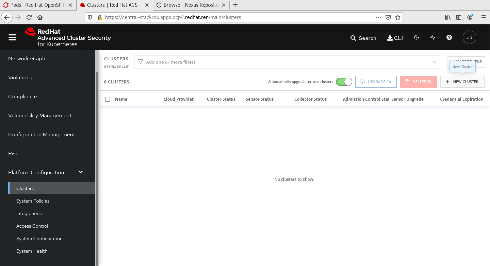
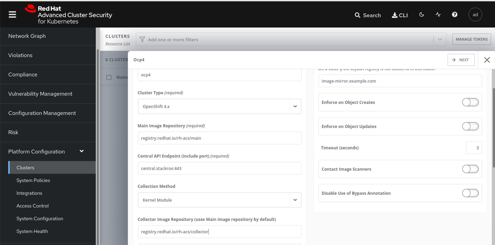
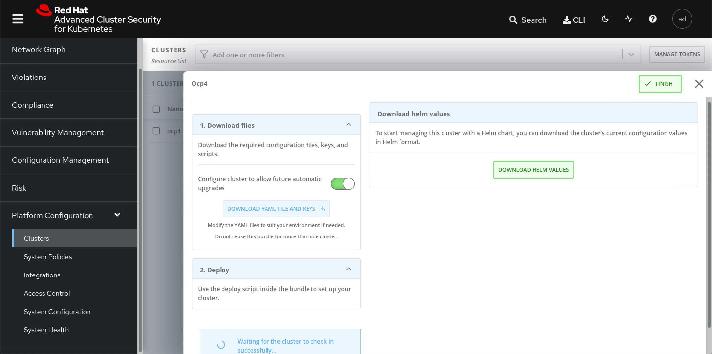

# RHACS / stackrox
官方的安装文档，非常详细和准确，照着做就好。
- https://help.stackrox.com/docs/get-started/quick-start/

视频讲解

[<kbd></kbd>](https://www.bilibili.com/video/BV1bo4y127EQ/)

- [bilibili](https://www.bilibili.com/video/BV1bo4y127EQ/)
- [xigua](https://www.ixigua.com/6959765547965743646)
- [youtube](https://youtu.be/1WMJ_JQGY1o)

## install rhacs
```bash
# below is no use for v3.0.59.1
cat <<EOF | oc apply -f -
apiVersion: helm.openshift.io/v1beta1
kind: HelmChartRepository
metadata:
  name: rhacs-repo
spec:
  name: rhacs-repo
  connectionConfig:
    url: http://registry.ocp4.redhat.ren:8080/rhacs-chart/
EOF

# restore
oc delete HelmChartRepository rhacs-repo

mkdir -p /data/install/rhacs
cd /data/install/rhacs

roxctl central generate interactive
# password: redhat

# Enter path to the backup bundle from which to restore keys and certificates (optional):
# Enter PEM cert bundle file (optional):
# Enter administrator password (default: autogenerated):
# Re-enter administrator password:
# Enter orchestrator (k8s, openshift): openshift
# Enter the directory to output the deployment bundle to (default: "central-bundle"):
# Enter the OpenShift major version (3 or 4) to deploy on (default: "0"): 4
# Enter Istio version when deploying into an Istio-enabled cluster (leave empty when not running Istio) (optional):
# Enter the method of exposing Central (route, lb, np, none) (default: "none"): route
# Enter main image to use (default: "stackrox.io/main:3.0.59.1"): registry.redhat.io/rh-acs/main:3.0.59.1
# Enter whether to run StackRox in offline mode, which avoids reaching out to the Internet (default: "false"): true
# Enter whether to enable telemetry (default: "true"):
# Enter the deployment tool to use (kubectl, helm, helm-values) (default: "kubectl"):
# Enter Scanner DB image to use (default: "stackrox.io/scanner-db:2.13.0"): registry.redhat.io/rh-acs/scanner-db:2.13.0
# Enter Scanner image to use (default: "stackrox.io/scanner:2.13.0"): registry.redhat.io/rh-acs/scanner:2.13.0
# Enter Central volume type (hostpath, pvc): pvc
# Enter external volume name (default: "stackrox-db"):
# Enter external volume size in Gi (default: "100"): 100
# Enter storage class name (optional if you have a default StorageClass configured):
# Generating deployment bundle...
# NOTE: Unless run in offline mode, StackRox Kubernetes Security Platform collects and transmits aggregated usage and system health information.  If you want to OPT OUT from this, re-generate the deployment bundle with the '--enable-telemetry=false' flag
# Done!

# Wrote central bundle to "central-bundle"

# To deploy:
#   - If you need to add additional trusted CAs, run central/scripts/ca-setup.sh.

#   - Deploy Central
#     - Run central/scripts/setup.sh
#     - Run oc create -R -f central

#   - Deploy Scanner
#      If you want to run the StackRox Scanner:
#      - Run scanner/scripts/setup.sh
#      - Run oc create -R -f scanner

# PLEASE NOTE: The recommended way to deploy StackRox is by using Helm. If you have
# Helm 3.1+ installed, please consider choosing this deployment route instead. For your
# convenience, all required files have been written to the helm/ subdirectory, along with
# a README file detailing the Helm-based deployment process.

# For administrator login, select the "Login with username/password" option on
# the login page, and log in with username "admin" and the password found in the
# "password" file located in the same directory as this README.

./central-bundle/central/scripts/setup.sh

oc -n stackrox get route central
# NAME      HOST/PORT                               PATH   SERVICES   PORT    TERMINATION   WILDCARD
# central   central-stackrox.apps.ocp4.redhat.ren          central    https   passthrough   None

cat central-bundle/password
# redhat

# open https://central-stackrox.apps.ocp4.redhat.ren 
# with admin / redhat

./central-bundle/scanner/scripts/setup.sh

oc create -R -f central-bundle/scanner
# serviceaccount/scanner created
# clusterrole.rbac.authorization.k8s.io/stackrox-scanner-psp created
# rolebinding.rbac.authorization.k8s.io/stackrox-scanner-psp created
# podsecuritypolicy.policy/stackrox-scanner created
# securitycontextconstraints.security.openshift.io/scanner created
# secret/scanner-db-password created
# secret/scanner-tls created
# secret/scanner-db-tls created
# configmap/scanner-config created
# networkpolicy.networking.k8s.io/scanner created
# networkpolicy.networking.k8s.io/scanner-db created
# deployment.apps/scanner created
# deployment.apps/scanner-db created
# service/scanner created
# service/scanner-db created
# horizontalpodautoscaler.autoscaling/scanner created
```

## install sensor
sensor是stackrox的runtime扫描器核心，本质上，是一个内核模块/ebpf注入，而且是从容器里面注入，这里面的原理，我会单独做一个视频解释一下。

为了装sensor，我们需要在central平台上，添加集群。登录到系统中，选择系统配置，集群，添加集群：


添加集群里面，有2个参数，是sensor的镜像地址，我们当然要用registry.redhat.io的这种不需要申请license的地址了，对应的栏位填写如下信息：
- registry.redhat.io/rh-acs/main
- registry.redhat.io/rh-acs/collector



点击下一步以后，下载一个文件，然后到helper上继续。


```bash
cd  /data/install/rhacs/

/bin/cp -f ~/Downloads/sensor-ocp4.zip /data/install/rhacs/
unzip -d sensor sensor-ocp4.zip

./sensor/sensor.sh
# namespace/stackrox annotated
# Now using project "stackrox" on server "https://api.ocp4.redhat.ren:6443".
# Creating sensor secrets...
# secret/sensor-tls created
# Creating sensor RBAC roles...
# serviceaccount/sensor created
# clusterrole.rbac.authorization.k8s.io/stackrox:view-cluster created
# clusterrolebinding.rbac.authorization.k8s.io/stackrox:monitor-cluster created
# role.rbac.authorization.k8s.io/edit created
# rolebinding.rbac.authorization.k8s.io/manage-namespace created
# clusterrole.rbac.authorization.k8s.io/stackrox:edit-workloads created
# clusterrolebinding.rbac.authorization.k8s.io/stackrox:enforce-policies created
# clusterrole.rbac.authorization.k8s.io/stackrox:network-policies created
# clusterrolebinding.rbac.authorization.k8s.io/stackrox:network-policies-binding created
# clusterrole.rbac.authorization.k8s.io/stackrox:update-namespaces created
# clusterrolebinding.rbac.authorization.k8s.io/stackrox:update-namespaces-binding created
# clusterrole.rbac.authorization.k8s.io/stackrox:create-events created
# clusterrolebinding.rbac.authorization.k8s.io/stackrox:create-events-binding created
# clusterrole.rbac.authorization.k8s.io/stackrox:review-tokens created
# clusterrolebinding.rbac.authorization.k8s.io/stackrox:review-tokens-binding created
# Creating sensor security context constraints...
# securitycontextconstraints.security.openshift.io/sensor created
# Creating sensor network policies...
# networkpolicy.networking.k8s.io/sensor created
# Creating sensor pod security policies...
# clusterrole.rbac.authorization.k8s.io/stackrox-sensor-psp created
# rolebinding.rbac.authorization.k8s.io/stackrox-sensor-psp created
# podsecuritypolicy.policy/stackrox-sensor created
# Enter username for docker registry at registry.redhat.io: wandering.star
# Enter password for wandering.star @ registry.redhat.io: secret/collector-stackrox created
# Creating admission controller security context constraints...
# securitycontextconstraints.security.openshift.io/admission-control created
# Creating admission controller secrets...
# secret/admission-control-tls created
# Creating admission controller RBAC roles...
# serviceaccount/admission-control created
# role.rbac.authorization.k8s.io/watch-config created
# rolebinding.rbac.authorization.k8s.io/admission-control-watch-config created
# Creating admission controller network policies...
# networkpolicy.networking.k8s.io/admission-control-no-ingress created
# Creating admission controller pod security policies...
# podsecuritypolicy.policy/stackrox-admission-control created
# clusterrole.rbac.authorization.k8s.io/stackrox-admission-control-psp created
# rolebinding.rbac.authorization.k8s.io/stackrox-admission-control-psp created
# Creating admission controller deployment...
# deployment.apps/admission-control created
# service/admission-control created
# W0507 18:24:56.251769   13915 warnings.go:70] admissionregistration.k8s.io/v1beta1 ValidatingWebhookConfiguration is deprecated in v1.16+, unavailable in v1.22+; use admissionregistration.k8s.io/v1 ValidatingWebhookConfiguration
# W0507 18:24:56.272199   13915 warnings.go:70] admissionregistration.k8s.io/v1beta1 ValidatingWebhookConfiguration is deprecated in v1.16+, unavailable in v1.22+; use admissionregistration.k8s.io/v1 ValidatingWebhookConfiguration
# validatingwebhookconfiguration.admissionregistration.k8s.io/stackrox created
# Creating collector security context constraints...
# securitycontextconstraints.security.openshift.io/collector created
# Creating collector secrets...
# secret/collector-tls created
# Creating collector RBAC roles...
# serviceaccount/collector created
# Creating collector network policies...
# networkpolicy.networking.k8s.io/collector-no-ingress created
# Creating collector pod security policies...
# clusterrole.rbac.authorization.k8s.io/stackrox-collector-psp created
# rolebinding.rbac.authorization.k8s.io/stackrox-collector-psp created
# podsecuritypolicy.policy/stackrox-collector created
# Creating collector daemon set...
# daemonset.apps/collector created
# Creating sensor deployment...
# deployment.apps/sensor created
# service/sensor created
# service/sensor-webhook created
# secret/helm-effective-cluster-name created
# Creating upgrader service account
# serviceaccount/sensor-upgrader created
# clusterrolebinding.rbac.authorization.k8s.io/stackrox:upgrade-sensors created

```
我们来简单的窥探一下，装了sensor以后，master node上面dmesg的信息，可以看到有一个collector kmod加载了，并且还用到了CPU指令集的特性。


在master node上面，执行lsmod，也能看到这个collector kmod
```bash
lsmod | grep coll
# collector             651264  22
```

## remove sensor

```bash
cd /data/install/rhacs

# ./sensor/delete-sensor.sh

kubectl delete --raw /apis/security.openshift.io/v1/securitycontextconstraints/collector

./sensor/delete-sensor.sh


```

bugfix for https://access.redhat.com/solutions/5911951
```bash
cd /data/install/rhacs


```

## upgrade

https://help.stackrox.com/docs/upgrade-stackrox/from-44/

