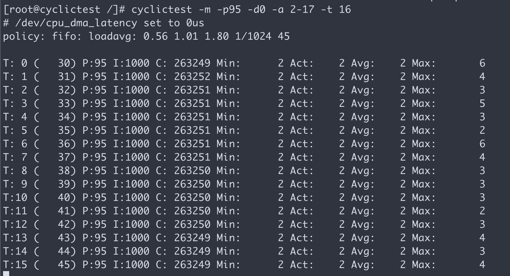

# prepare a rt-test docker image

```bash
VAR_ID_1=`ls -1 /data/rhel8/entitle/*.pem | sed 's/.*\///g' | sed 's|\.pem||g' | sed -n '1p'`
VAR_ID_2=`ls -1 /data/rhel8/entitle/*.pem | sed 's/.*\///g' | sed 's|\.pem||g' | sed -n '2p'`

podman run -it -v /data/rhel8/dnf:/data/dnf:z \
    --mount type=bind,source=/data/rhel8/entitle/${VAR_ID_1}.pem,target=/etc/pki/entitlement/${VAR_ID_1}.pem,relabel=shared  \
    --mount type=bind,source=/data/rhel8/entitle/${VAR_ID_1}.pem,target=/etc/pki/entitlement/${VAR_ID_1}-key.pem,relabel=shared \
    --mount type=bind,source=/data/rhel8/entitle/${VAR_ID_2}.pem,target=/etc/pki/entitlement/${VAR_ID_2}.pem,relabel=shared  \
    --mount type=bind,source=/data/rhel8/entitle/${VAR_ID_2}.pem,target=/etc/pki/entitlement/${VAR_ID_2}-key.pem,relabel=shared \
    registry.access.redhat.com/ubi8 bash

sed -i 's|%(ca_cert_dir)sredhat-uep.pem|/etc/rhsm/ca/redhat-uep.pem|g' /etc/yum.repos.d/redhat.repo

sed -i 's|enabled=1|enabled=0|g' /etc/yum/pluginconf.d/subscription-manager.conf

mkdir -p /etc/yum.repos.d
cat > /etc/yum.repos.d/rhel.repo << 'EOF'
[rt]
name=rt
baseurl=file:///data/dnf
gpgcheck=0
EOF

rm -f /etc/ssl/certs/ca-bundle.crt 
dnf reinstall -y --repo rt ca-certificates

dnf install -y --repo rt rt-tests ca-certificates

cyclictest -m -p95 -d0 -a 2-17 -t 16
```



```bash
##########################################################
dnf -y list --releasever=8.2 \
--repo rhel-8-for-x86_64-rt-rpms,rhel-8-for-x86_64-appstream-rpms,ubi-8-baseos,ubi-8-appstream \
rt-*


dnf -y list --releasever=8.2 \
--repo rhel-8-for-x86_64-rt-rpms,rhel-8-for-x86_64-appstream-rpms \
rt-*

dnf -y install --releasever=8.2 --downloadonly \
--destdir ./ --repo rhel-8-for-x86_64-rt-rpms,rhel-8-for-x86_64-appstream-rpms \
rt-tests ca-certificates

dnf -y download --resolve --alldeps --downloadonly \
--destdir ./ --repo rhel-8-for-x86_64-rt-rpms,rhel-8-for-x86_64-baseos-rpms,rhel-8-for-x86_64-appstream-rpms \
rt-tests ca-certificates


```