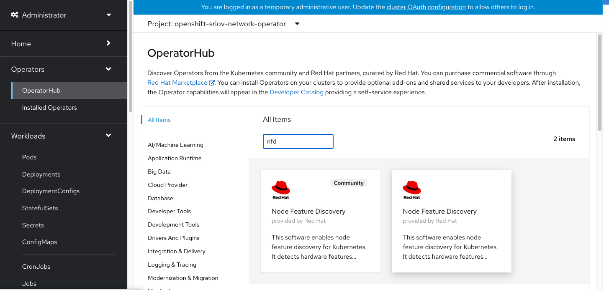
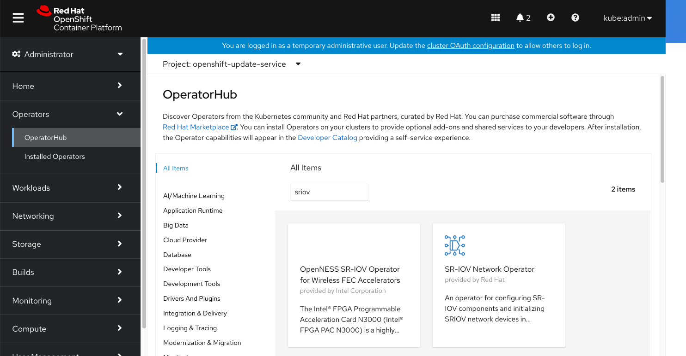

# sriov

there is nic whitelist build-in for openshift4's sriov, to disable it, using: 
- https://docs.openshift.com/container-platform/4.6/networking/hardware_networks/configuring-sriov-operator.html#disable-enable-sr-iov-operator-admission-control-webhook_configuring-sriov-operator

# kvm config sriov passthrough
- https://www.cnblogs.com/dion-90/articles/8522733.html
- https://access.redhat.com/documentation/en-us/red_hat_enterprise_linux/7/html/virtualization_deployment_and_administration_guide/sect-pci_devices-pci_passthrough

```bash
# on 101
ls /sys/class/net/

lspci -vv | grep -i Mellanox
# pcilib: sysfs_read_vpd: read failed: Input/output error
# 05:00.0 Ethernet controller: Mellanox Technologies MT27710 Family [ConnectX-4 Lx]
#         Subsystem: Mellanox Technologies Stand-up ConnectX-4 Lx EN, 25GbE dual-port SFP28, PCIe3.0 x8, MCX4121A-ACAT
# 05:00.1 Ethernet controller: Mellanox Technologies MT27710 Family [ConnectX-4 Lx]
#         Subsystem: Mellanox Technologies Stand-up ConnectX-4 Lx EN, 25GbE dual-port SFP28, PCIe3.0 x8, MCX4121A-ACAT
# 07:00.0 Ethernet controller: Mellanox Technologies MT27710 Family [ConnectX-4 Lx]
#         Subsystem: Mellanox Technologies Stand-up ConnectX-4 Lx EN, 25GbE dual-port SFP28, PCIe3.0 x8, MCX4121A-ACAT
# 07:00.1 Ethernet controller: Mellanox Technologies MT27710 Family [ConnectX-4 Lx]
#         Subsystem: Mellanox Technologies Stand-up ConnectX-4 Lx EN, 25GbE dual-port SFP28, PCIe3.0 x8, MCX4121A-ACAT

virsh nodedev-list | grep 000_05
# pci_0000_05_00_0
# pci_0000_05_00_1

virsh nodedev-dumpxml pci_0000_05_00_0
```
```xml
<device>
  <name>pci_0000_05_00_0</name>
  <path>/sys/devices/pci0000:00/0000:00:06.0/0000:05:00.0</path>
  <parent>pci_0000_00_06_0</parent>
  <driver>
    <name>mlx5_core</name>
  </driver>
  <capability type='pci'>
    <domain>0</domain>
    <bus>5</bus>
    <slot>0</slot>
    <function>0</function>
    <product id='0x1015'>MT27710 Family [ConnectX-4 Lx]</product>
    <vendor id='0x15b3'>Mellanox Technologies</vendor>
    <capability type='virt_functions' maxCount='64'/>
    <iommuGroup number='17'>
      <address domain='0x0000' bus='0x05' slot='0x00' function='0x0'/>
    </iommuGroup>
    <pci-express>
      <link validity='cap' port='0' speed='8' width='8'/>
      <link validity='sta' speed='5' width='4'/>
    </pci-express>
  </capability>
</device>
```
```bash
virsh nodedev-dumpxml pci_0000_05_00_1
```
```xml
<device>
  <name>pci_0000_05_00_1</name>
  <path>/sys/devices/pci0000:00/0000:00:06.0/0000:05:00.1</path>
  <parent>pci_0000_00_06_0</parent>
  <driver>
    <name>mlx5_core</name>
  </driver>
  <capability type='pci'>
    <domain>0</domain>
    <bus>5</bus>
    <slot>0</slot>
    <function>1</function>
    <product id='0x1015'>MT27710 Family [ConnectX-4 Lx]</product>
    <vendor id='0x15b3'>Mellanox Technologies</vendor>
    <capability type='virt_functions' maxCount='64'/>
    <iommuGroup number='18'>
      <address domain='0x0000' bus='0x05' slot='0x00' function='0x1'/>
    </iommuGroup>
    <pci-express>
      <link validity='cap' port='0' speed='8' width='8'/>
      <link validity='sta' speed='5' width='4'/>
    </pci-express>
  </capability>
</device>
```

## on 103
```bash
ls /sys/class/net/
# baremetal  eno1  eno2  eno3  eno4  enp4s0f0  enp4s0f1  lo  virbr0  virbr0-nic
echo 0 > /sys/class/net/enp4s0f0/device/sriov_numvfs
echo 0 > /sys/class/net/enp4s0f1/device/sriov_numvfs

lspci -vv | grep -i Mellanox
# 04:00.0 Ethernet controller: Mellanox Technologies MT2892 Family [ConnectX-6 Dx]
#         Subsystem: Mellanox Technologies Device 0011
# 04:00.1 Ethernet controller: Mellanox Technologies MT2892 Family [ConnectX-6 Dx]
#         Subsystem: Mellanox Technologies Device 0011

virsh nodedev-list | grep 000_04
# pci_0000_04_00_0
# pci_0000_04_00_1

virsh nodedev-dumpxml pci_0000_04_00_0
```
```xml
<device>
  <name>pci_0000_04_00_0</name>
  <path>/sys/devices/pci0000:00/0000:00:02.0/0000:04:00.0</path>
  <parent>pci_0000_00_02_0</parent>
  <driver>
    <name>mlx5_core</name>
  </driver>
  <capability type='pci'>
    <class>0x020000</class>
    <domain>0</domain>
    <bus>4</bus>
    <slot>0</slot>
    <function>0</function>
    <product id='0x101d'>MT2892 Family [ConnectX-6 Dx]</product>
    <vendor id='0x15b3'>Mellanox Technologies</vendor>
    <capability type='virt_functions' maxCount='8'/>
    <iommuGroup number='27'>
      <address domain='0x0000' bus='0x04' slot='0x00' function='0x0'/>
    </iommuGroup>
    <numa node='0'/>
    <pci-express>
      <link validity='cap' port='0' speed='16' width='16'/>
      <link validity='sta' speed='8' width='8'/>
    </pci-express>
  </capability>
</device>
```
```bash
virsh nodedev-dumpxml pci_0000_04_00_1
```
```xml
<device>
  <name>pci_0000_04_00_1</name>
  <path>/sys/devices/pci0000:00/0000:00:02.0/0000:04:00.1</path>
  <parent>pci_0000_00_02_0</parent>
  <driver>
    <name>mlx5_core</name>
  </driver>
  <capability type='pci'>
    <class>0x020000</class>
    <domain>0</domain>
    <bus>4</bus>
    <slot>0</slot>
    <function>1</function>
    <product id='0x101d'>MT2892 Family [ConnectX-6 Dx]</product>
    <vendor id='0x15b3'>Mellanox Technologies</vendor>
    <capability type='virt_functions' maxCount='8'/>
    <iommuGroup number='28'>
      <address domain='0x0000' bus='0x04' slot='0x00' function='0x1'/>
    </iommuGroup>
    <numa node='0'/>
    <pci-express>
      <link validity='cap' port='0' speed='16' width='16'/>
      <link validity='sta' speed='8' width='8'/>
    </pci-express>
  </capability>
</device>
```

for ocp4-aHelper, change below kvm config 
```xml
<hostdev mode='subsystem' type='pci' managed='yes'>
      <driver name='vfio'/>
      <source>
        <address domain='0x0000' bus='0x05' slot='0x00' function='0x0'/>
      </source>
      <alias name='hostdev0'/>
      <address type='pci' domain='0x0000' bus='0x00' slot='0x0a' function='0x0'/>
    </hostdev>
    <hostdev mode='subsystem' type='pci' managed='yes'>
      <driver name='vfio'/>
      <source>
        <address domain='0x0000' bus='0x05' slot='0x00' function='0x1'/>
      </source>
      <alias name='hostdev1'/>
      <address type='pci' domain='0x0000' bus='0x00' slot='0x0b' function='0x0'/>
    </hostdev>
```
to 
```xml
    <interface type='hostdev' managed='yes'>
      <driver name='vfio'/>
      <source>
        <address type='pci' domain='0x0000' bus='0x05' slot='0x00' function='0x0'/>
      </source>
    </interface>
    <interface type='hostdev' managed='yes'>
      <driver name='vfio'/>
      <source>
        <address type='pci' domain='0x0000' bus='0x05' slot='0x00' function='0x1'/>
      </source>
    </interface>
```
```bash
virsh edit ocp4-aHelper
```

# openshift
```bash

# check vendoer id and device id
# https://access.redhat.com/solutions/56081

# on master-1
lspci -vv | grep -i Mellanox
# 00:0a.0 Ethernet controller: Mellanox Technologies MT27710 Family [ConnectX-4 Lx]
#         Subsystem: Mellanox Technologies Stand-up ConnectX-4 Lx EN, 25GbE dual-port SFP28, PCIe3.0 x8, MCX4121A-ACAT
# 00:0b.0 Ethernet controller: Mellanox Technologies MT27710 Family [ConnectX-4 Lx]
#         Subsystem: Mellanox Technologies Stand-up ConnectX-4 Lx EN, 25GbE dual-port SFP28, PCIe3.0 x8, MCX4121A-ACAT

lspci -nvv | grep "00:0a.0\|00:0b.0"
# 00:0a.0 0200: 15b3:1015
# 00:0b.0 0200: 15b3:1015

# on worker-1
lspci -vv | grep -i Mellanox
# 07:00.0 Ethernet controller: Mellanox Technologies MT2892 Family [ConnectX-6 Dx]
#         Subsystem: Mellanox Technologies Device 0011
# 08:00.0 Ethernet controller: Mellanox Technologies MT2892 Family [ConnectX-6 Dx]
#         Subsystem: Mellanox Technologies Device 0011

lspci -nvv | grep "07:00.0\|08:00.0"
# 07:00.0 0200: 15b3:101d
# 08:00.0 0200: 15b3:101d

cat /sys/class/net/*/device/sriov_numvfs
cat /sys/class/net/*/device/sriov_totalvfs


```
install NFD ( node feature discovery) operator



install SRIOV operator



```bash
oc create namespace openshift-sriov-network-operator

oc create -f - <<EOF
apiVersion: operators.coreos.com/v1
kind: OperatorGroup
metadata:
  name: sriov-network-operators
  namespace: openshift-sriov-network-operator
spec:
  targetNamespaces:
  - openshift-sriov-network-operator
EOF

# https://catalog.redhat.com/software/containers/openshift4/dpdk-base-rhel8/5e32be6cdd19c77896004a41
# registry.redhat.io/openshift4/dpdk-base-rhel8:latest

# oc get sriovnetworknodestates -n openshift-sriov-network-operator -o jsonpath='{.items[*].status}'  | jq

oc get sriovnetworknodestates -n openshift-sriov-network-operator -o json  | jq ".items[] | (.metadata.name, .status)"

```

```json

"master-0"
{
  "interfaces": [
    {
      "deviceID": "1000",
      "driver": "virtio-pci",
      "pciAddress": "0000:00:03.0",
      "vendor": "1af4"
    }
  ],
  "syncStatus": "Succeeded"
}
"master-1"
{
  "interfaces": [
    {
      "deviceID": "1000",
      "driver": "virtio-pci",
      "pciAddress": "0000:00:03.0",
      "vendor": "1af4"
    },
    {
      "deviceID": "1015",
      "driver": "mlx5_core",
      "linkSpeed": "-1 Mb/s",
      "linkType": "ETH",
      "mac": "50:6b:4b:c0:9a:c8",
      "mtu": 1500,
      "name": "ens10",
      "pciAddress": "0000:00:0a.0",
      "vendor": "15b3"
    },
    {
      "deviceID": "1015",
      "driver": "mlx5_core",
      "linkSpeed": "-1 Mb/s",
      "linkType": "ETH",
      "mac": "50:6b:4b:c0:9a:c9",
      "mtu": 1500,
      "name": "ens11",
      "pciAddress": "0000:00:0b.0",
      "vendor": "15b3"
    }
  ],
  "syncStatus": "Succeeded"
}
"master-2"
{
  "interfaces": [
    {
      "deviceID": "1000",
      "driver": "virtio-pci",
      "pciAddress": "0000:00:03.0",
      "vendor": "1af4"
    }
  ],
  "syncStatus": "Succeeded"
}
"worker-0"
{
  "interfaces": [
    {
      "deviceID": "1000",
      "driver": "virtio-pci",
      "pciAddress": "0000:00:03.0",
      "vendor": "1af4"
    }
  ],
  "syncStatus": "Succeeded"
}
"worker-1"
{
  "interfaces": [
    {
      "deviceID": "1041",
      "driver": "virtio-pci",
      "pciAddress": "0000:01:00.0",
      "vendor": "1af4"
    },
    {
      "deviceID": "101d",
      "driver": "mlx5_core",
      "linkSpeed": "-1 Mb/s",
      "linkType": "ETH",
      "mac": "0c:42:a1:fa:18:52",
      "mtu": 1500,
      "name": "enp7s0",
      "pciAddress": "0000:07:00.0",
      "vendor": "15b3"
    },
    {
      "deviceID": "101d",
      "driver": "mlx5_core",
      "linkSpeed": "-1 Mb/s",
      "linkType": "ETH",
      "mac": "0c:42:a1:fa:18:53",
      "mtu": 1500,
      "name": "enp8s0",
      "pciAddress": "0000:08:00.0",
      "vendor": "15b3"
    }
  ],
  "syncStatus": "Succeeded"
}
```

```bash
cat << EOF > /data/install/sriov-cx4.yaml
apiVersion: sriovnetwork.openshift.io/v1
kind: SriovNetworkNodePolicy
metadata:
  name: policy-cx4-net-1
  namespace: openshift-sriov-network-operator
spec:
  resourceName: cx4nic1
  nodeSelector:
    feature.node.kubernetes.io/network-sriov.capable: "true"
  numVfs: 4
  nicSelector:
    vendor: "15b3"
    deviceID: "1015"
    # rootDevices:
    #   - "0000:19:00.0"
  linkType: eth
  isRdma: false
EOF
oc create -f /data/install/sriov-cx4.yaml

# to restore
oc delete -f /data/install/sriov-cx4.yaml


```