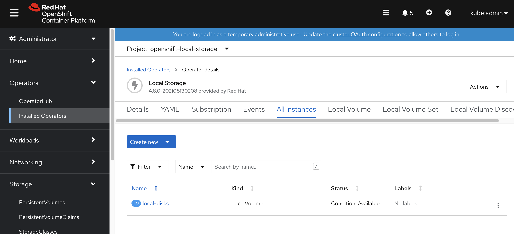
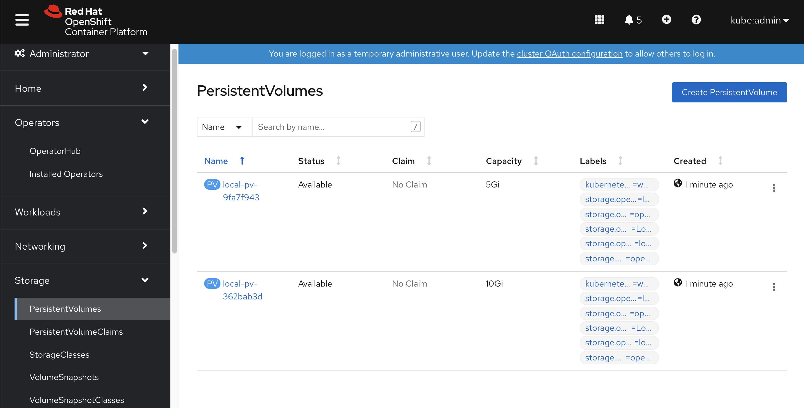
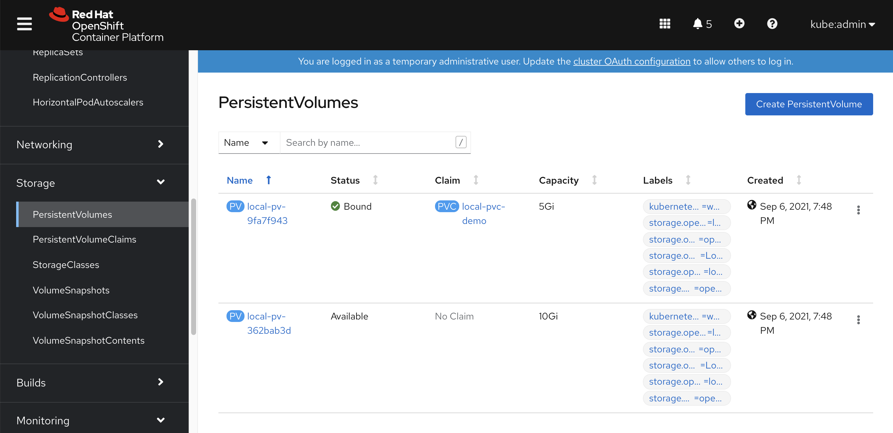
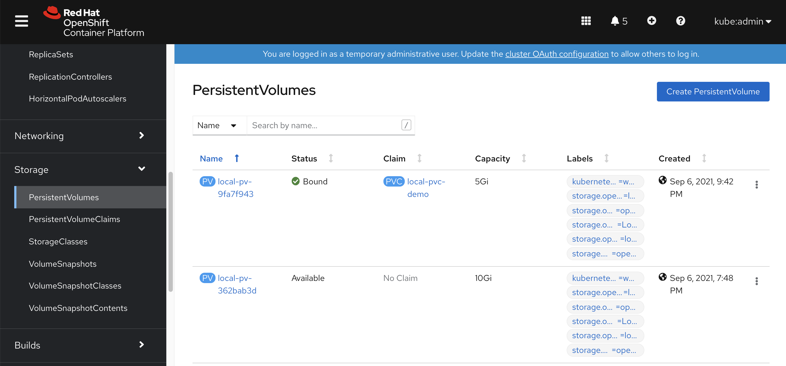

# openshift4 缩小 / & sysroot 分区大小

openshift4默认安装的时候，会把sda/vda整个硬盘占满，如果我们是baremetal按照，一般会配置SSD/NVME, 1T大小，这样非常浪费。我们完全可以把硬盘空间节省下来，分一些分区，给local storage operator用。

```bash
# backup the ignition file you want
/bin/cp -f /var/www/html/ignition/worker-1.ign /var/www/html/ignition/worker-1.ign.bak

# 修改 /data/ocp4/partition.sh ，
# 主要是修改里面的root分区大小，默认是200G
# 然后是想要创建的数据分区的个数和大小参数，
# 默认会创建5个10G分区，5个5G分区。
bash /data/ocp4/partition.sh

butane /data/ocp4/root-partition.bu -r -o /data/install/partition-ric.ign

/bin/cp -f /var/www/html/ignition/worker-1.ign.bak /var/www/html/ignition/worker-1.ign

jq -s '.[0] * .[1]' /var/www/html/ignition/worker-1.ign /data/install/partition-ric.ign | jq -c . > /var/www/html/ignition/worker-1.ign.new

/bin/cp -f /var/www/html/ignition/worker-1.ign.new /var/www/html/ignition/worker-1.ign

# then install using iso

# login to worker-1
lsblk
# NAME    MAJ:MIN RM  SIZE RO TYPE MOUNTPOINT
# sr0      11:0    1 1024M  0 rom
# vda     252:0    0    1T  0 disk
# ├─vda1  252:1    0    1M  0 part
# ├─vda2  252:2    0  127M  0 part
# ├─vda3  252:3    0  384M  0 part /boot
# ├─vda4  252:4    0  200G  0 part /sysroot
# ├─vda5  252:5    0   10G  0 part
# ├─vda6  252:6    0   10G  0 part
# ├─vda7  252:7    0   10G  0 part
# ├─vda8  252:8    0   10G  0 part
# ├─vda9  252:9    0   10G  0 part
# ├─vda10 252:10   0    5G  0 part
# ├─vda11 252:11   0    5G  0 part
# ├─vda12 252:12   0    5G  0 part
# ├─vda13 252:13   0    5G  0 part
# └─vda14 252:14   0    5G  0 part /var/lib/kubelet/pods/a364c83a-deae-4431-b7c3-bcef8457aed6/volumes/kubernetes.io~local-volume/local-pv-9fa7f

# let's check what we created
cat /data/ocp4/root-partition.bu
# variant: openshift
# version: 4.8.0
# metadata:
#   name: root-storage
#   labels:
#     machineconfiguration.openshift.io/role: worker
# storage:
#   disks:
#     - device: /dev/vda
#       wipe_table: false
#       partitions:
#         - number: 4
#           label: root
#           size_mib: 204800
#           resize: true
#         - label: data_10G_1
#           size_mib: 10240
#         - label: data_10G_2
#           size_mib: 10240
#         - label: data_10G_3
#           size_mib: 10240
#         - label: data_10G_4
#           size_mib: 10240
#         - label: data_10G_5
#           size_mib: 10240
#         - label: data_5G_1
#           size_mib: 5120
#         - label: data_5G_2
#           size_mib: 5120
#         - label: data_5G_3
#           size_mib: 5120
#         - label: data_5G_4
#           size_mib: 5120
#         - label: data_5G_5
#           size_mib: 5120

cat /data/install/partition-ric.ign | jq .
# {
#   "ignition": {
#     "version": "3.2.0"
#   },
#   "storage": {
#     "disks": [
#       {
#         "device": "/dev/vda",
#         "partitions": [
#           {
#             "label": "root",
#             "number": 4,
#             "resize": true,
#             "sizeMiB": 204800
#           },
#           {
#             "label": "data_10G_1",
#             "sizeMiB": 10240
#           },
#           {
#             "label": "data_10G_2",
#             "sizeMiB": 10240
#           },
#           {
#             "label": "data_10G_3",
#             "sizeMiB": 10240
#           },
#           {
#             "label": "data_10G_4",
#             "sizeMiB": 10240
#           },
#           {
#             "label": "data_10G_5",
#             "sizeMiB": 10240
#           },
#           {
#             "label": "data_5G_1",
#             "sizeMiB": 5120
#           },
#           {
#             "label": "data_5G_2",
#             "sizeMiB": 5120
#           },
#           {
#             "label": "data_5G_3",
#             "sizeMiB": 5120
#           },
#           {
#             "label": "data_5G_4",
#             "sizeMiB": 5120
#           },
#           {
#             "label": "data_5G_5",
#             "sizeMiB": 5120
#           }
#         ],
#         "wipeTable": false
#       }
#     ]
#   }
# }
```

# local storage operator

我们有了很多分区，那么赶快来测试一下如何把他们变成 PV 吧

```yaml
apiVersion: "local.storage.openshift.io/v1"
kind: "LocalVolume"
metadata:
  name: "local-disks"
  namespace: "openshift-local-storage" 
spec:
  nodeSelector: 
    nodeSelectorTerms:
    - matchExpressions:
        - key: kubernetes.io/hostname
          operator: In
          values:
          - worker-1
  storageClassDevices:
    - storageClassName: "local-sc" 
      volumeMode: Filesystem 
      fsType: xfs 
      devicePaths: 
        - /dev/vda5
        - /dev/vda14
```
我们可以看到配置已经生效

系统已经帮我们创建好了PV


我们创建pod，创建和使用pvc，然后弄点数据，然后删掉pod，删掉pvc。然后重新创建pod，创建和使用pvc，看看里面的数据是否会清空。

```bash
cat << EOF >> /data/install/pvc-demo.yaml
---
kind: PersistentVolumeClaim
apiVersion: v1
metadata:
  name: local-pvc-demo
spec:
  accessModes:
  - ReadWriteOnce
  volumeMode: Filesystem 
  resources:
    requests:
      storage: 2Gi 
  storageClassName: local-sc 
---
kind: Pod
apiVersion: v1
metadata:
  annotations:
  name: demo1
spec:
  nodeSelector:
    kubernetes.io/hostname: 'worker-1'
  restartPolicy: Always
  containers:
    - name: demo1
      image: >- 
        quay.io/wangzheng422/qimgs:centos7-test
      env:
        - name: key
          value: value
      command: 
        - sleep
        - infinity
      imagePullPolicy: Always
      volumeMounts:
        - mountPath: /data
          name: demo 
          readOnly: false
  volumes:
    - name: demo 
      persistentVolumeClaim:
        claimName: local-pvc-demo 
EOF
oc create -n default -f /data/install/pvc-demo.yaml

```
我们能看到 PVC 已经创建

PV 也已经挂载


```bash
oc rsh pod/demo1
df -h
# Filesystem      Size  Used Avail Use% Mounted on
# overlay         200G  8.4G  192G   5% /
# tmpfs            64M     0   64M   0% /dev
# tmpfs            24G     0   24G   0% /sys/fs/cgroup
# shm              64M     0   64M   0% /dev/shm
# tmpfs            24G   64M   24G   1% /etc/hostname
# /dev/vda14      5.0G   68M  5.0G   2% /data
# /dev/vda4       200G  8.4G  192G   5% /etc/hosts
# tmpfs            24G   20K   24G   1% /run/secrets/kubernetes.io/serviceaccount
# tmpfs            24G     0   24G   0% /proc/acpi
# tmpfs            24G     0   24G   0% /proc/scsi
# tmpfs            24G     0   24G   0% /sys/firmware

echo wzh > /data/1
cat /data/1
# wzh

# destroy the pvc and pod
oc delete -n default -f /data/install/pvc-demo.yaml

# recreate 
oc create -n default -f /data/install/pvc-demo.yaml

```
PVC重新创建了

PV也重新挂在了


我们发现，PV release以后，重新挂载，之前的存储内容，就都没有了。
```bash
oc rsh pod/demo1
sh-4.2# cd /data
sh-4.2# ls
sh-4.2# ls -hl
total 0

```