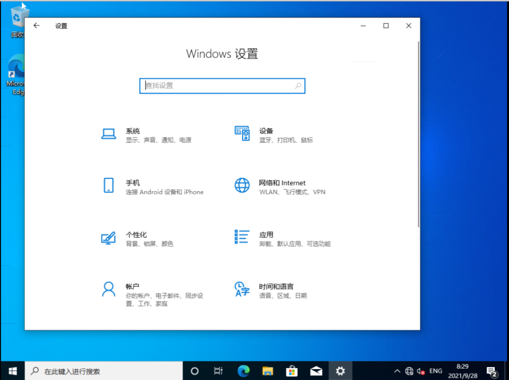
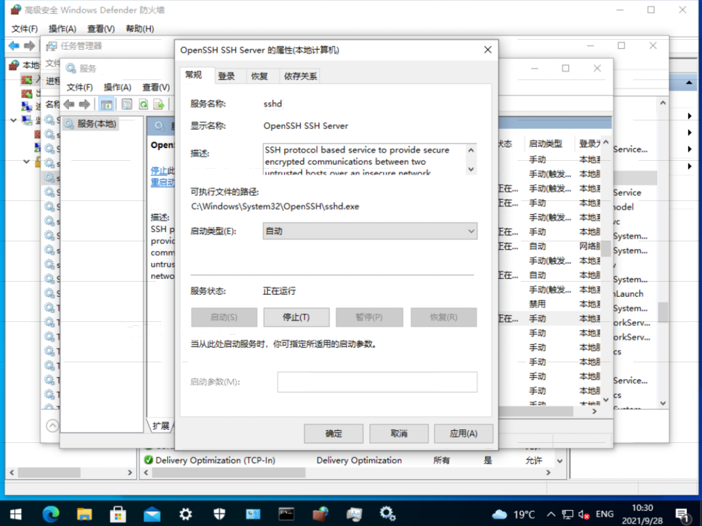
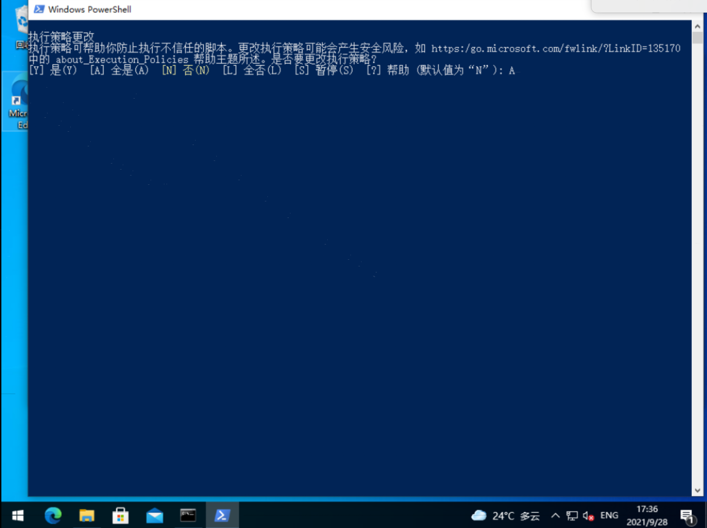

# windows node in openshift 4.8

```bash
podman pull registry.redhat.io/container-native-virtualization/virtio-win
podman run --rm -it --name swap registry.redhat.io/container-native-virtualization/virtio-win bash
podman create --name swap registry.redhat.io/container-native-virtualization/virtio-win ls
podman cp swap:/disk/virtio-win.iso - > virtio-win.iso.tar
gzip virtio-win.iso.tar
podman rm swap

export KVM_DIRECTORY=/data/kvm
virt-install --name=ocp4-windows --vcpus=2 --ram=8192 \
--disk path=/data/nvme/ocp4-windows.qcow2,bus=virtio,size=50 \
--os-variant win10 --network bridge=baremetal,model=virtio \
--graphics vnc,port=59017 \
--boot menu=on \
--cdrom ${KVM_DIRECTORY}/win10.iso \
--disk ${KVM_DIRECTORY}/virtio-win.iso,device=cdrom


```








the username/passwd: wzh / redhat
```bash
ssh wzh@worker-1
# Microsoft Windows [版本 10.0.19043.1237]
# (c) Microsoft Corporation。保留所有权利。

# wzh@DESKTOP-FUIF19L C:\Users\wzh>

```

## setup ssh key auth

```bash
cat << EOF > /data/install/win-ssh.ps1
$acl = Get-Acl C:\ProgramData\ssh\administrators_authorized_keys
$acl.SetAccessRuleProtection($true, $false)
$administratorsRule = New-Object system.security.accesscontrol.filesystemaccessrule("Administrators","FullControl","Allow")
$systemRule = New-Object system.security.accesscontrol.filesystemaccessrule("SYSTEM","FullControl","Allow")
$acl.SetAccessRule($administratorsRule)
$acl.SetAccessRule($systemRule)
$acl | Set-Acl
EOF

scp /data/install/win-ssh.ps1 wzh@worker-1:c:\\win-ssh.ps1
scp ~/.ssh/id_rsa.pub wzh@worker-1:C:\\ProgramData\\ssh\\administrators_authorized_keys

```





## backup win7 kvm
https://schh.medium.com/backup-and-restore-kvm-vms-21c049e707c1
```bash
# poweroff you win7 vm

mkdir -p /data/nvme/bak

cd /data/nvme

virsh dumpxml ocp4-windows > /data/nvme/bak/ocp4-windows.xml
pigz -c ocp4-windows.qcow2 > /data/nvme/bak/ocp4-windows.qcow2.gz

cd /data/nvme/bak

var_date=$(date '+%Y-%m-%d-%H%M')
echo $var_date

buildah from --name onbuild-container scratch
buildah copy onbuild-container ocp4-windows.xml  /
buildah copy onbuild-container ocp4-windows.qcow2.gz  /
buildah umount onbuild-container 
buildah commit --rm onbuild-container quay.io/wangzheng422/qimgs:win7-ssh-$var_date
# buildah rm onbuild-container
# rm -f nexus-image.tgz 
buildah push quay.io/wangzheng422/qimgs:win7-ssh-$var_date
echo "quay.io/wangzheng422/qimgs:win7-ssh-$var_date"

```

# install ocp, in ovn with hybrid mode

```bash

# vi install-config.yaml 
cat << EOF > /data/install/install-config.yaml 
apiVersion: v1
baseDomain: redhat.ren
compute:
- hyperthreading: Enabled
  name: worker
  replicas: 0
controlPlane:
  hyperthreading: Enabled
  name: master
  replicas: 1
metadata:
  name: ocp4
networking:
  clusterNetworks:
  - cidr: 10.128.0.0/14
    hostPrefix: 23
  networkType: OVNKubernetes
  serviceNetwork:
  - 172.30.0.0/16
platform:
  none: {}
pullSecret: '{"auths":{"registry.ocp4.redhat.ren:5443": {"auth": "ZHVtbXk6ZHVtbXk=","email": "noemail@localhost"},"registry.ppa.redhat.ren:5443": {"auth": "ZHVtbXk6ZHVtbXk=","email": "noemail@localhost"}}}'
sshKey: |
$( cat /root/.ssh/id_rsa.pub | sed 's/^/   /g' )
additionalTrustBundle: |
$( cat /etc/crts/redhat.ren.ca.crt | sed 's/^/   /g' )
imageContentSources:
- mirrors:
  - registry.ocp4.redhat.ren:5443/ocp4/openshift4
  - registry.ocp4.redhat.ren:5443/ocp4/release
  source: quay.io/openshift-release-dev/ocp-release
- mirrors:
  - registry.ocp4.redhat.ren:5443/ocp4/openshift4
  - registry.ocp4.redhat.ren:5443/ocp4/release
  source: quay.io/openshift-release-dev/ocp-v4.0-art-dev
EOF

cat << EOF > /data/install/manifests/cluster-network-03-config.yml
apiVersion: operator.openshift.io/v1
kind: Network
metadata:
  name: cluster
spec:
  defaultNetwork:
    ovnKubernetesConfig:
      hybridOverlayConfig:
        hybridClusterNetwork: 
        - cidr: 10.132.0.0/14
          hostPrefix: 23
        # hybridOverlayVXLANPort: 9898 
EOF


```

