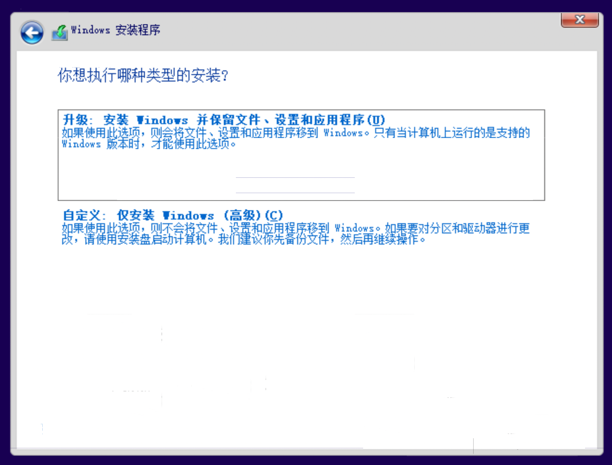
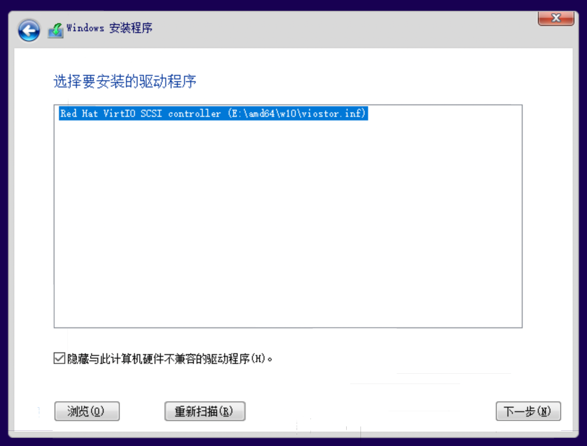
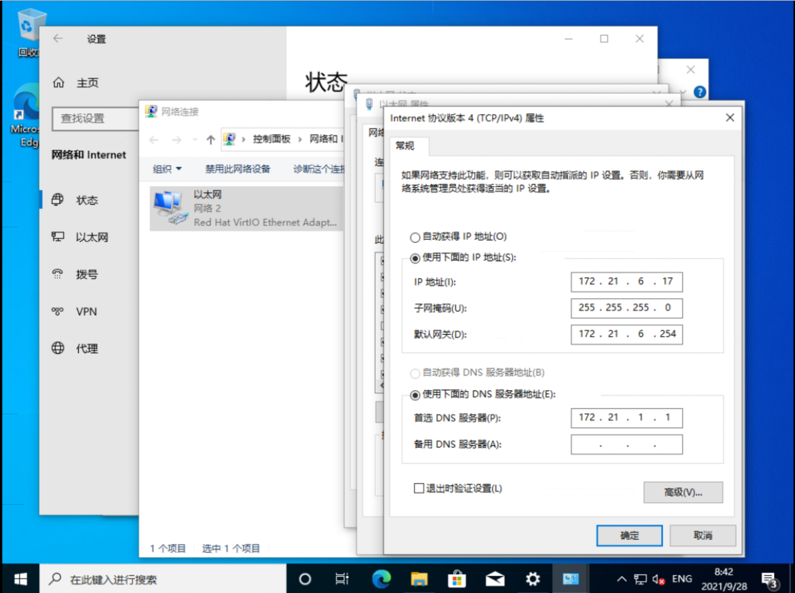
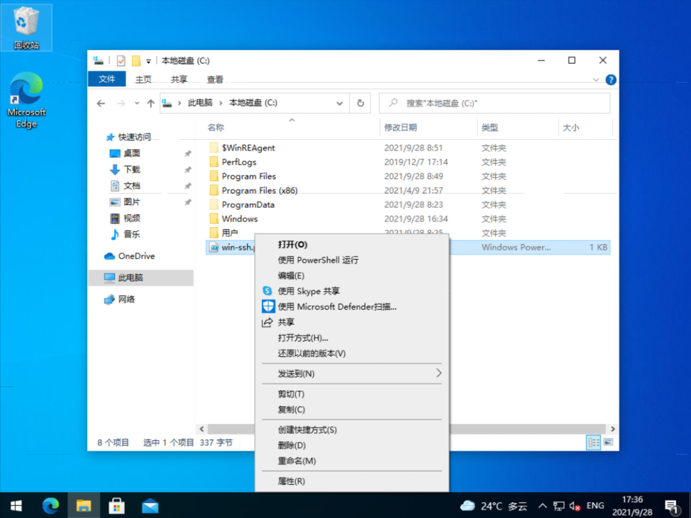
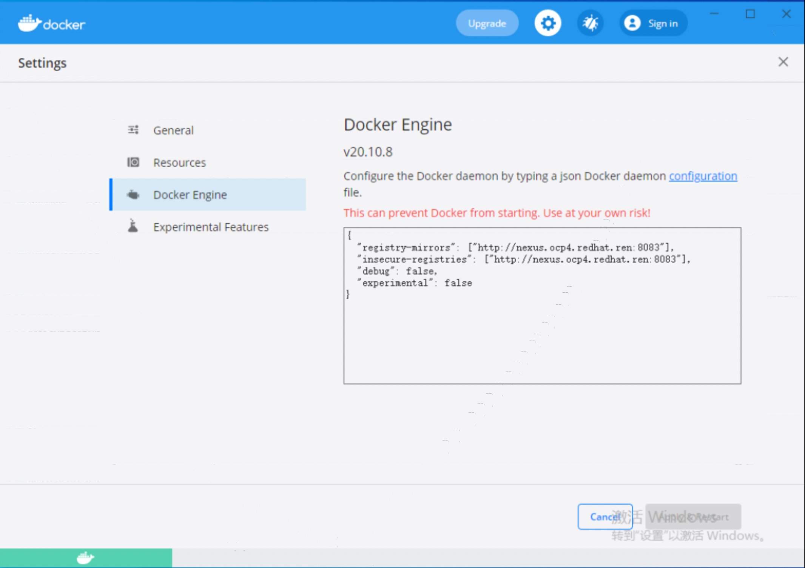
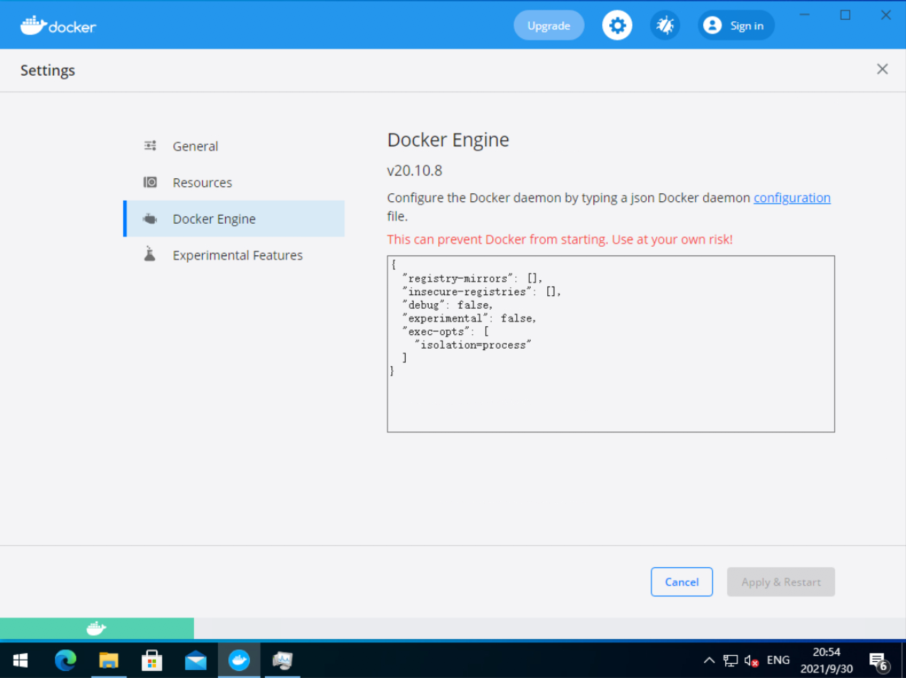

# windows node in openshift 4.8

在本文中，我们将安装一个win10节点，并加入到openshift 4.8集群中去。之后会部署一个演示应用。

经过测试，我们发现，当前的win10当作worker节点，还是不太适合，原因如下：
- windows要求容器的基础镜像版本，和宿主机的版本严格一致，这样就不能向rhel一样，在rhel8上运行rhel7的容器，在部署的时候会造成很大困惑。
- windows的容器，不能运行GUI app。虽然也有很多.net的web服务应用，但是更多的老旧windows应用，应该还是包含GUI的程序。这样大大的限制了windows容器的应用访问。
- docker for windows版本，只能设置proxy，不能为第三方镜像仓库设置mirror，这样对于离线部署，就很难受了。
- 目前版本，对静态IP部署还不友好，需要手动配置windows网卡。
- 目前版本的稳定性还有待加强，会出现k8s的服务崩溃现象，只能做开发测试，体验用，当然如果我们用windows server来做，稳定性会好很多。

本次部署的架构图：


视频讲解:

[<kbd></kbd>](https://www.bilibili.com/video/BV1Hf4y1c79D/)

- [bilibili](https://www.bilibili.com/video/BV1Hf4y1c79D/)
- [youtube](https://youtu.be/Zs7Z-HyEyEI)

# 安装 win10
安装win10，需要注意选择正确的版本，因为win10的docker镜像版本，要求和宿主机一致。 [在这里查看 win10 docker image version](https://hub.docker.com/_/microsoft-windows).

在本文撰写的时候，版本是win10 20H2 20H2, [在这里找下载这个版本的ISO](https://www.itechtics.com/download-windows-10-20h2/).

选择好版本，我们就要开始安装了。
```bash
# 先要准备一下 virtio 的驱动，因为 win10 里面没有， 安装的时候找不到硬盘。
podman pull registry.redhat.io/container-native-virtualization/virtio-win
podman run --rm -it --name swap registry.redhat.io/container-native-virtualization/virtio-win bash
podman create --name swap registry.redhat.io/container-native-virtualization/virtio-win ls
podman cp swap:/disk/virtio-win.iso - > virtio-win.iso.tar
gzip virtio-win.iso.tar
podman rm swap

# 直接创建kvm, 自动开始安装啦。
export KVM_DIRECTORY=/data/kvm
virt-install --name=ocp4-windows --vcpus=6,cores=6 --ram=12288 \
--cpu=host-model \
--disk path=/data/nvme/ocp4-windows.qcow2,bus=virtio,size=100 \
--os-variant win10 --network bridge=baremetal,model=virtio \
--graphics vnc,port=59017 \
--boot menu=on \
--cdrom ${KVM_DIRECTORY}/win10.iso \
--disk ${KVM_DIRECTORY}/virtio-win.iso,device=cdrom

```
win10的话，必须选择专业版。


选择自定义安装，因为我们要加载硬盘驱动



选择加载驱动程序


选择正确的驱动程序位置


选择驱动，下一步



默认安装整个硬盘


安装就自动进行


安装完成后，进入系统，把剩下的驱动，一口气都装了。


系统识别出了网卡，那就设置IP地址吧


我们需要装ssh服务端，从 设置-应用 中找


点击可选功能


<!-- 
 -->
点击添加功能


搜索ssh服务器，并安装


<!--  -->

安装完了ssh是这样样子的


我们还需要打开防火墙端口，从网络配置进入


选择高级设置


新建入站规则


根据文档要求，打开 22, 10250 端口


允许连接


所有网络位置都允许


给起个名字


<!--  -->

ssh服务不是自动启动了，我们设置成自动启动


选择自动


从外面，就能ssh到windows了


我把实验用的win10，打包到了一个镜像里面，需要的可以下载使用。

用户名密码是: wzh / redhat
```bash
ssh wzh@worker-1
# Microsoft Windows [版本 10.0.19043.1237]
# (c) Microsoft Corporation。保留所有权利。

# wzh@DESKTOP-FUIF19L C:\Users\wzh>

```

## 设置 ssh key auth

我们需要设置ssh使用key的方式自动登录，那么要有几个特殊的步骤。

首先，是[解除win10的powershell的限制](https://superuser.com/questions/106360/how-to-enable-execution-of-powershell-scripts)
```
Set-ExecutionPolicy unrestricted
```
接下来准备2个文件
- [wsl2 kernel update](https://docs.microsoft.com/en-us/windows/wsl/install-manual#step-4---download-the-linux-kernel-update-package)
- [docker install file](https://docs.docker.com/desktop/windows/install/)

[参考这个文章](https://www.concurrency.com/blog/may-2019/key-based-authentication-for-openssh-on-windows)，写一个允许ssh自动key登录的脚本，我们在里面还加上了自动激活hyper-v, windows container的步骤。

```bash
# the script here also enable hyper-v and windows container
cat << 'EOF' > /data/install/win-ssh.ps1
$acl = Get-Acl C:\ProgramData\ssh\administrators_authorized_keys
$acl.SetAccessRuleProtection($true, $false)
$administratorsRule = New-Object system.security.accesscontrol.filesystemaccessrule("Administrators","FullControl","Allow")
$systemRule = New-Object system.security.accesscontrol.filesystemaccessrule("SYSTEM","FullControl","Allow")
$acl.SetAccessRule($administratorsRule)
$acl.SetAccessRule($systemRule)
$acl | Set-Acl

Enable-WindowsOptionalFeature -Online -FeatureName $("Microsoft-Hyper-V", "Containers") -All
EOF

# 把脚本, key, 还有安装文件，复制到win10上 
scp /data/install/win-ssh.ps1 wzh@worker-1:c:\\win-ssh.ps1

scp /root/.ssh/id_rsa.pub wzh@worker-1:C:\\ProgramData\\ssh\\administrators_authorized_keys

scp /data/down/Docker\ Desktop\ Installer.exe wzh@worker-1:c:\\docker-install.exe

scp /data/down/wsl_update_x64.msi wzh@worker-1:c:\\wsl_update_x64.msi
```
<!-- 

 -->
用管理员权限，打开power shell


运行我们的脚本


<!-- Restart your openssh server on win10, then you can ssh to you win10 without password. :) -->
重启win10, 然后你就可以用key自动登录啦。
<!-- ## enable hyper-v & windows container

https://docs.microsoft.com/en-us/virtualization/hyper-v-on-windows/quick-start/enable-hyper-v

https://docs.microsoft.com/en-us/virtualization/windowscontainers/quick-start/set-up-environment?tabs=Windows-10


 -->

<!-- https://hub.docker.com/editions/community/docker-ce-desktop-windows -->

安装docker，并切换到windows container。

第一次启动docker，会说什么wsl2 linux kernel要更新，可以用我提供的文件，直接更新，也可以直接切换windows container，不用理会那个报警。

<!-- remember to switch to "windows container" -->


<!-- also set the docker's registry mirror, and insecure registry

 -->

[设置 docker for windows, 使用 process 来隔离](https://blog.miniasp.com/post/2019/03/22/Enable-process-isolation-by-default-on-Windows-containers/), 因为kvm上的某种未知配置错误，默认hyper-v形式的隔离，启动不了容器，我们换成process来隔离.

```json
{
  "registry-mirrors": [],
  "insecure-registries": [],
  "debug": true,
  "experimental": false,
  "exec-opts": [
    "isolation=process"
  ]
}
```
配置界面长这样



记得改一下windows的主机名


## backup win10 kvm

我们备份一下win10 kvm，并上传quay.io，方便以后重新做实验。

[我们可以参考这里，来备份和回复kvm。](https://schh.medium.com/backup-and-restore-kvm-vms-21c049e707c1)

```bash
# poweroff you win7 vm

mkdir -p /data/nvme/bak

cd /data/nvme

virsh dumpxml ocp4-windows > /data/nvme/bak/ocp4-windows.xml
pigz -c ocp4-windows.qcow2 > /data/nvme/bak/ocp4-windows.qcow2.gz

cd /data/nvme/bak

var_date=$(date '+%Y-%m-%d-%H%M')
echo $var_date

buildah from --name onbuild-container scratch
buildah copy onbuild-container ocp4-windows.xml  /
buildah copy onbuild-container ocp4-windows.qcow2.gz  /
buildah umount onbuild-container 
buildah commit --rm onbuild-container quay.io/wangzheng422/qimgs:win7-ssh-$var_date
# buildah rm onbuild-container
# rm -f nexus-image.tgz 
echo "quay.io/wangzheng422/qimgs:win7-ssh-$var_date"
buildah push quay.io/wangzheng422/qimgs:win7-ssh-$var_date

# so, we got a image contain win10, and feature enabled.
# this is for win10 versin 10.0.19043.1237
# quay.io/wangzheng422/qimgs:win7-ssh-2021-09-30-1340

```
<!-- you can use the image above to extract the win10 image, and run locally, to try the windows node. -->

你可以使用上面的这个版本的镜像，拉取到本地，并从中取出win10虚拟机，然后自己尝试啦。

# 安装 ocp, 使用 ovn with hybrid mode

参考官方文档：
- https://docs.openshift.com/container-platform/4.8/windows_containers/byoh-windows-instance.html
- https://docs.openshift.com/container-platform/4.8/windows_containers/enabling-windows-container-workloads.html

```bash

# vi install-config.yaml 
cat << EOF > /data/install/install-config.yaml 
apiVersion: v1
baseDomain: redhat.ren
compute:
- hyperthreading: Enabled
  name: worker
  replicas: 0
controlPlane:
  hyperthreading: Enabled
  name: master
  replicas: 1
metadata:
  name: ocp4
networking:
  clusterNetworks:
  - cidr: 10.128.0.0/16
    hostPrefix: 23
  networkType: OVNKubernetes
  serviceNetwork:
  - 172.30.0.0/16
platform:
  none: {}
pullSecret: '{"auths":{"registry.ocp4.redhat.ren:5443": {"auth": "ZHVtbXk6ZHVtbXk=","email": "noemail@localhost"},"registry.ppa.redhat.ren:5443": {"auth": "ZHVtbXk6ZHVtbXk=","email": "noemail@localhost"}}}'
sshKey: |
$( cat /root/.ssh/id_rsa.pub | sed 's/^/   /g' )
additionalTrustBundle: |
$( cat /etc/crts/redhat.ren.ca.crt | sed 's/^/   /g' )
imageContentSources:
- mirrors:
  - registry.ocp4.redhat.ren:5443/ocp4/openshift4
  - registry.ocp4.redhat.ren:5443/ocp4/release
  source: quay.io/openshift-release-dev/ocp-release
- mirrors:
  - registry.ocp4.redhat.ren:5443/ocp4/openshift4
  - registry.ocp4.redhat.ren:5443/ocp4/release
  source: quay.io/openshift-release-dev/ocp-v4.0-art-dev
EOF

cat << EOF > /data/install/manifests/cluster-network-03-config.yml
apiVersion: operator.openshift.io/v1
kind: Network
metadata:
  name: cluster
spec:
  defaultNetwork:
    ovnKubernetesConfig:
      hybridOverlayConfig:
        hybridClusterNetwork: 
        - cidr: 10.132.0.0/16
          hostPrefix: 23
        hybridOverlayVXLANPort: 9898 
EOF

```
安装windows machien config operator


```bash
# 导入ssh key
oc create secret generic cloud-private-key --from-file=private-key.pem=/root/.ssh/id_rsa \
    -n openshift-windows-machine-config-operator

# 配置win10自动登录用户名和ip地址
cat << EOF > /data/install/win-node.yaml
kind: ConfigMap
apiVersion: v1
metadata:
  name: windows-instances
  namespace: openshift-windows-machine-config-operator
data:
  192.168.7.17: |- 
    username=wzh
EOF
oc create -f /data/install/win-node.yaml

# to restore
oc delete -f /data/install/win-node.yaml

# csr is automatically approved
oc get csr
# NAME                                       AGE   SIGNERNAME                                    REQUESTOR                                                                         CONDITION
# csr-ff7q5                                  63m   kubernetes.io/kube-apiserver-client-kubelet   system:serviceaccount:openshift-machine-config-operator:node-bootstrapper         Approved,Issued
# csr-gzlpq                                  53s   kubernetes.io/kubelet-serving                 system:node:worker-1                                                              Approved,Issued
# csr-rgdzv                                  59s   kubernetes.io/kube-apiserver-client-kubelet   system:serviceaccount:openshift-machine-config-operator:node-bootstrapper         Approved,Issued
# csr-zkw8c                                  63m   kubernetes.io/kubelet-serving                 system:node:master-0                                                              Approved,Issued
# system:openshift:openshift-authenticator   59m   kubernetes.io/kube-apiserver-client           system:serviceaccount:openshift-authentication-operator:authentication-operator   Approved,Issued
```
估计是当前实现的bug，或者其他原因，windows的默认网卡，上面的协议会被disable掉，造成windows node加入集群失败，目前暂时手动的把这些协议都enable，只留一个不激活。当然，你也可以只enable ipv4的配置，也是可以的。


之后就等着好了，openshift会自动上传程序和配置，并配置好windows node，加入集群，成功以后，我们就能看到如下的日志。
```log
{"level":"info","ts":1633004643.789956,"logger":"controllers.configmap","msg":"processing","instances in":"windows-instances"}
{"level":"info","ts":1633004674.0080738,"logger":"wc 192.168.7.17","msg":"configuring"}
{"level":"info","ts":1633004675.3135288,"logger":"wc 192.168.7.17","msg":"transferring files"}
{"level":"info","ts":1633004693.670281,"logger":"wc 192.168.7.17","msg":"configured","service":"windows_exporter","args":"--collectors.enabled cpu,cs,logical_disk,net,os,service,system,textfile,container,memory,cpu_info\""}
{"level":"info","ts":1633004697.0266535,"logger":"controllers.CertificateSigningRequests","msg":"CSR approved","CSR":"csr-rgdzv"}
{"level":"info","ts":1633004703.104529,"logger":"controllers.CertificateSigningRequests","msg":"CSR approved","CSR":"csr-gzlpq"}
{"level":"info","ts":1633004726.9497287,"logger":"wc 192.168.7.17","msg":"configured kubelet","cmd":"C:\\k\\\\wmcb.exe initialize-kubelet --ignition-file C:\\Windows\\Temp\\worker.ign --kubelet-path C:\\k\\kubelet.exe --node-ip=192.168.7.17","output":"Bootstrapping completed successfully"}
{"level":"info","ts":1633004757.078427,"logger":"wc 192.168.7.17","msg":"configure","service":"hybrid-overlay-node","args":"--node worker-1 --hybrid-overlay-vxlan-port=9898 --k8s-kubeconfig c:\\k\\kubeconfig --windows-service --logfile C:\\var\\log\\hybrid-overlay\\hybrid-overlay.log\" depend= kubelet"}
{"level":"info","ts":1633004880.6788793,"logger":"wc 192.168.7.17","msg":"configured","service":"hybrid-overlay-node","args":"--node worker-1 --hybrid-overlay-vxlan-port=9898 --k8s-kubeconfig c:\\k\\kubeconfig --windows-service --logfile C:\\var\\log\\hybrid-overlay\\hybrid-overlay.log\" depend= kubelet"}
{"level":"info","ts":1633004928.5883121,"logger":"wc 192.168.7.17","msg":"configured kubelet for CNI","cmd":"C:\\k\\wmcb.exe configure-cni --cni-dir=\"C:\\k\\cni\\ --cni-config=\"C:\\k\\cni\\config\\cni.conf","output":"CNI configuration completed successfully"}
{"level":"info","ts":1633004941.3937094,"logger":"wc 192.168.7.17","msg":"configured","service":"kube-proxy","args":"--windows-service --v=4 --proxy-mode=kernelspace --feature-gates=WinOverlay=true --hostname-override=worker-1 --kubeconfig=c:\\k\\kubeconfig --cluster-cidr=10.132.0.0/24 --log-dir=C:\\var\\log\\kube-proxy\\ --logtostderr=false --network-name=OVNKubernetesHybridOverlayNetwork --source-vip=10.132.0.14 --enable-dsr=false --feature-gates=IPv6DualStack=false\" depend= hybrid-overlay-node"}
{"level":"info","ts":1633004956.4613981,"logger":"nc 192.168.7.17","msg":"instance has been configured as a worker node","version":"3.1.0+06e96071"}
{"level":"info","ts":1633004956.4949114,"logger":"metrics","msg":"Prometheus configured","endpoints":"windows-exporter","port":9182,"name":"metrics"}
{"level":"info","ts":1633004956.5283544,"logger":"controllers.configmap","msg":"processing","instances in":"windows-instances"}
{"level":"info","ts":1633004956.5387952,"logger":"controllers.configmap","msg":"instance is up to date","node":"worker-1","version":"3.1.0+06e96071"}
{"level":"info","ts":1633004956.5493839,"logger":"metrics","msg":"Prometheus configured","endpoints":"windows-exporter","port":9182,"name":"metrics"}
```

我们能看到 windows节点了。
```bash
oc get node
# NAME       STATUS   ROLES           AGE     VERSION
# master-0   Ready    master,worker   19h     v1.21.1+a620f50
# worker-1   Ready    worker          4m50s   v1.21.1-1398+98073871f173ba

oc get node --show-labels
# NAME       STATUS   ROLES           AGE     VERSION                       LABELS
# master-0   Ready    master,worker   4h13m   v1.21.1+a620f50               beta.kubernetes.io/arch=amd64,beta.kubernetes.io/os=linux,kubernetes.io/arch=amd64,kubernetes.io/hostname=master-0,kubernetes.io/os=linux,node-role.kubernetes.io/master=,node-role.kubernetes.io/worker=,node.openshift.io/os_id=rhcos
# worker-1   Ready    worker          5m25s   v1.21.1-1398+98073871f173ba   beta.kubernetes.io/arch=amd64,beta.kubernetes.io/os=windows,kubernetes.io/arch=amd64,kubernetes.io/hostname=worker-1,kubernetes.io/os=windows,node-role.kubernetes.io/worker=,node.kubernetes.io/windows-build=10.0.19042,node.openshift.io/os_id=Windows,windowsmachineconfig.openshift.io/byoh=true

# 看了windows节点不占用machine config pool
oc get mcp
# NAME     CONFIG                                             UPDATED   UPDATING   DEGRADED   MACHINECOUNT   READYMACHINECOUNT   UPDATEDMACHINECOUNT   DEGRADEDMACHINECOUNT   AGE
# master   rendered-master-607708e411d75c10e680d8bf5e24de6f   True      False      False      1              1                   1                     0                      19h
# worker   rendered-worker-cacf7f7f871c77ae92070b0a44fe0b91   True      False      False      0              0                   0                     0                      19h
```

## 探索一下装了什么

进入win10，可以看到C:\下面，有一个k目录，还有一个var目录，k目录下面就是配置和可执行程序啦。
```cmd
wzh@WORKER-1 c:\>dir
 驱动器 C 中的卷没有标签。
 卷的序列号是 C607-13D4

 c:\ 的目录

2021/09/28  19:37       535,444,968 Docker Desktop Installer.exe
2021/09/29  11:12    <DIR>          k
2019/12/07  17:14    <DIR>          PerfLogs
2021/09/28  19:57    <DIR>          Program Files
2021/04/09  21:57    <DIR>          Program Files (x86)
2021/09/29  11:12    <DIR>          Temp
2021/09/28  08:25    <DIR>          Users
2021/09/29  11:11    <DIR>          var
2021/09/28  17:51               428 win-ssh.ps1
2021/09/28  16:34    <DIR>          Windows
               2 个文件    535,445,396 字节
               8 个目录 19,381,813,248 可用字节

wzh@WORKER-1 c:\>dir k
 驱动器 C 中的卷没有标签。
 卷的序列号是 C607-13D4

 c:\k 的目录

2021/09/29  11:12    <DIR>          .
2021/09/29  11:12    <DIR>          ..
2021/09/29  11:12            10,908 bootstrap-kubeconfig
2021/09/29  11:12    <DIR>          cni
2021/09/29  11:12    <DIR>          etc
2021/09/29  11:12        47,493,632 hybrid-overlay-node.exe
2021/09/29  11:12        47,809,536 kube-proxy.exe
2021/09/29  11:12            10,132 kubeconfig
2021/09/29  11:12             5,875 kubelet-ca.crt
2021/09/29  11:12               739 kubelet.conf
2021/09/29  11:12       117,698,048 kubelet.exe
2021/09/29  11:12    <DIR>          usr
2021/09/29  11:12        16,986,112 windows_exporter.exe
2021/09/29  11:12        16,331,776 wmcb.exe
               9 个文件    246,346,758 字节
               5 个目录 19,381,317,632 可用字节

wzh@WORKER-1 c:\>dir var\log
 驱动器 C 中的卷没有标签。
 卷的序列号是 C607-13D4

 c:\var\log 的目录

2021/09/29  11:12    <DIR>          .
2021/09/29  11:12    <DIR>          ..
2021/09/29  11:12    <DIR>          containers
2021/09/29  11:12    <DIR>          hybrid-overlay
2021/09/29  11:16    <DIR>          kube-proxy
2021/09/29  11:12    <DIR>          kubelet
2021/09/29  11:12    <DIR>          pods
               0 个文件              0 字节
               7 个目录 19,381,059,584 可用字节

wzh@WORKER-1 c:\>dir var\lib
 驱动器 C 中的卷没有标签。
 卷的序列号是 C607-13D4

 c:\var\lib 的目录

2021/09/28  20:36    <DIR>          .
2021/09/28  20:36    <DIR>          ..
2021/09/28  20:36    <DIR>          dockershim
2021/09/28  20:38    <DIR>          kubelet
               0 个文件              0 字节
               4 个目录 19,381,043,200 可用字节

```

## 删除windows节点

除了官方文档说的，改config map之外，发现，最好还是重启一下windows node为好。

改了config map，耐心等着，最后oc get node，就会看到windows node没有了。

从operator的日志里面，可以看到如下的日志信息。
```log
{"level":"info","ts":1632916600.248877,"logger":"controllers.configmap","msg":"processing","instances in":"windows-instances"}
{"level":"info","ts":1632916610.646764,"logger":"wc 192.168.7.17","msg":"deconfiguring"}
{"level":"info","ts":1632916641.877409,"logger":"wc 192.168.7.17","msg":"deconfigured","service":"windows_exporter"}
{"level":"info","ts":1632916672.9587948,"logger":"wc 192.168.7.17","msg":"deconfigured","service":"kube-proxy"}
{"level":"info","ts":1632916703.9290483,"logger":"wc 192.168.7.17","msg":"deconfigured","service":"hybrid-overlay-node"}
{"level":"info","ts":1632916734.8715909,"logger":"wc 192.168.7.17","msg":"deconfigured","service":"kubelet"}
{"level":"info","ts":1632916734.8733184,"logger":"wc 192.168.7.17","msg":"removing directories"}
{"level":"info","ts":1632916735.4904935,"logger":"wc 192.168.7.17","msg":"removing HNS networks"}
{"level":"info","ts":1632916924.5720427,"logger":"nc 192.168.7.17","msg":"instance has been deconfigured","node":"worker-1"}
{"level":"info","ts":1632916924.6041753,"logger":"metrics","msg":"Prometheus configured","endpoints":"windows-exporter","port":9182,"name":"metrics"}
{"level":"info","ts":1632916924.6054258,"logger":"controllers.configmap","msg":"processing","instances in":"windows-instances"}
{"level":"info","ts":1632916924.6281445,"logger":"metrics","msg":"Prometheus configured","endpoints":"windows-exporter","port":9182,"name":"metrics"}
```

## resize qcow2 disk
https://computingforgeeks.com/how-to-extend-increase-kvm-virtual-machine-disk-size/

```bash
qemu-img info /data/nvme/ocp4-windows.qcow2
# image: /data/nvme/ocp4-windows.qcow2
# file format: qcow2
# virtual size: 50 GiB (53687091200 bytes)
# disk size: 43.3 GiB
# cluster_size: 65536
# Format specific information:
#     compat: 1.1
#     lazy refcounts: true
#     refcount bits: 16
#     corrupt: false

qemu-img resize /data/nvme/ocp4-windows.qcow2 +20G
# Image resized.


```

# windows workload

似乎现在的 docker for windows 并不支持给 mcr.microsoft.com 做镜像代理，只能配置一个proxy，这个太讨厌了，等以后迁移到 podman 或者 containerd 吧。所以我们现在基本上属于联网或者半联网的部署模式。

[在这里查找windows镜像的版本](https://hub.docker.com/_/microsoft-windows-base-os-images)。


```bash
# pod pause的镜像
# mcr.microsoft.com/oss/kubernetes/pause:3.4.1

# 创建runtime class
cat << EOF > /data/install/win-runtime.yaml
apiVersion: node.k8s.io/v1beta1
kind: RuntimeClass
metadata:
  name: runtime-class-win10
handler: 'docker'
scheduling:
  nodeSelector: 
    kubernetes.io/os: 'windows'
    kubernetes.io/arch: 'amd64'
    node.kubernetes.io/windows-build: '10.0.19042'
  tolerations: 
  - effect: NoSchedule
    key: os
    operator: Equal
    value: "Windows"
EOF
oc create -f /data/install/win-runtime.yaml

# https://hub.docker.com/_/microsoft-windows
# mcr.microsoft.com/windows:20H2
cat << 'EOF' > /data/install/win-dep.yaml
apiVersion: apps/v1
kind: Deployment
metadata:
  labels:
    app: win-webserver
  name: win-webserver
spec:
  selector:
    matchLabels:
      app: win-webserver
  replicas: 1
  template:
    metadata:
      labels:
        app: win-webserver
      name: win-webserver
    spec:
      tolerations:
      - key: "os"
        value: "Windows"
        Effect: "NoSchedule"
      containers:
      - name: windowswebserver
        image: mcr.microsoft.com/windows:20H2
        imagePullPolicy: IfNotPresent
        command:
        - powershell.exe
        - -command
        - $listener = New-Object System.Net.HttpListener; $listener.Prefixes.Add('http://*:80/'); $listener.Start();Write-Host('Listening at http://*:80/'); while ($listener.IsListening) { $context = $listener.GetContext(); $response = $context.Response; $content='<html><body><H1>Red Hat OpenShift + Windows Container Workloads</H1></body></html>'; $buffer = [System.Text.Encoding]::UTF8.GetBytes($content); $response.ContentLength64 = $buffer.Length; $response.OutputStream.Write($buffer, 0, $buffer.Length); $response.Close(); };
        securityContext:
          windowsOptions:
            runAsUserName: "ContainerAdministrator"
      nodeSelector:
        beta.kubernetes.io/os: windows
EOF
oc create -f /data/install/win-dep.yaml

# to restore
oc delete -f /data/install/win-dep.yaml

cat << EOF > /data/install/win-svc.yaml
---
apiVersion: v1
kind: Service
metadata:
  name: win-webserver
  labels:
    app: win-webserver
spec:
  ports:
    # the port that this service should serve on
  - port: 80
    targetPort: 80
  selector:
    app: win-webserver
---
apiVersion: route.openshift.io/v1
kind: Route
metadata:
  name: win-webserver
spec:
  port:
    targetPort: 80
  to:
    kind: Service
    name: win-webserver
---
EOF
oc create -f /data/install/win-svc.yaml

# try windows server core, if you run on windows server
# otherwize, it will failed, say os not match with host: 
# "The container operating system does not match the host operating system."
# https://hub.docker.com/_/microsoft-windows-servercore
# mcr.microsoft.com/windows/servercore:20H2

cat << EOF > /data/install/test-pod.yaml
apiVersion: apps/v1
kind: Deployment
metadata:
  name: mypod
  labels:
    app: mypod
spec:
  replicas: 1
  selector:
    matchLabels:
      app: mypod
  template:
    metadata:
      labels:
        app: mypod
    spec:
      containers:
      - name: mypod
        image: quay.io/wangzheng422/qimgs:centos7-test
        command:
          - sleep
          - infinity
EOF
oc create -f /data/install/test-pod.yaml

oc get all
# NAME                                READY   STATUS    RESTARTS   AGE
# pod/mypod-6b8b7b46cb-rrfmd          1/1     Running   1          21h
# pod/win-webserver-9f98c76d4-8nb2q   1/1     Running   0          110s

# NAME                    TYPE           CLUSTER-IP      EXTERNAL-IP                            PORT(S)   AGE
# service/kubernetes      ClusterIP      172.30.0.1      <none>                                 443/TCP   26h
# service/openshift       ExternalName   <none>          kubernetes.default.svc.cluster.local   <none>    25h
# service/win-webserver   ClusterIP      172.30.240.75   <none>                                 80/TCP    21h

# NAME                            READY   UP-TO-DATE   AVAILABLE   AGE
# deployment.apps/mypod           1/1     1            1           21h
# deployment.apps/win-webserver   1/1     1            1           110s

# NAME                                      DESIRED   CURRENT   READY   AGE
# replicaset.apps/mypod-6b8b7b46cb          1         1         1       21h
# replicaset.apps/win-webserver-9f98c76d4   1         1         1       110s

# NAME                                     HOST/PORT                                    PATH   SERVICES        PORT   TERMINATION   WILDCARD
# route.route.openshift.io/win-webserver   win-webserver-default.apps.ocp4.redhat.ren          win-webserver   80                   None

curl win-webserver-default.apps.ocp4.redhat.ren && echo
# <html><body><H1>Red Hat OpenShift + Windows Container Workloads</H1></body></html>

```

```cmd
oc exec -it pod/win-webserver-9f98c76d4-8nb2q -- cmd

Microsoft Windows [Version 10.0.19042.1237]
(c) Microsoft Corporation. All rights reserved.

C:\>tasklist

Image Name                     PID Session Name        Session#    Mem Usage
========================= ======== ================ =========== ============
System Idle Process              0                            0          8 K
System                           4                            0        148 K
smss.exe                      9992                            0      1,760 K
csrss.exe                     6788 Services                   3      4,524 K
wininit.exe                   7096 Services                   3      5,260 K
services.exe                  6456 Services                   3      6,668 K
lsass.exe                     3324 Services                   3     12,536 K
fontdrvhost.exe               5736 Services                   3      2,860 K
svchost.exe                   4948 Services                   3     12,896 K
svchost.exe                   6960 Services                   3      8,180 K
svchost.exe                   3332 Services                   3     16,952 K
svchost.exe                    756 Services                   3     53,864 K
svchost.exe                   5924 Services                   3      9,728 K
svchost.exe                   6412 Services                   3      8,012 K
svchost.exe                   5628 Services                   3      6,740 K
svchost.exe                   9488 Services                   3      4,688 K
svchost.exe                   8912 Services                   3     12,896 K
CExecSvc.exe                  5616 Services                   3      4,020 K
svchost.exe                   5916 Services                   3     28,600 K
svchost.exe                   2780 Services                   3      4,404 K
powershell.exe                2816 Services                   3     78,156 K
CompatTelRunner.exe           3056 Services                   3      2,852 K
svchost.exe                   9412 Services                   3     11,104 K
conhost.exe                   7748 Services                   3     10,824 K
svchost.exe                   3636 Services                   3      7,404 K
conhost.exe                   1288 Services                   3      3,800 K
cmd.exe                       5112 Services                   3      2,884 K
svchost.exe                   4492 Services                   3      8,900 K
MicrosoftEdgeUpdate.exe       8808 Services                   3      1,760 K
svchost.exe                   7612 Services                   3     10,112 K
conhost.exe                   4944 Services                   3      5,176 K
cmd.exe                       9848 Services                   3      5,140 K
MoUsoCoreWorker.exe           3016 Services                   3     17,220 K
WmiPrvSE.exe                  7924 Services                   3      9,340 K
WmiPrvSE.exe                  5976 Services                   3      9,384 K
spoolsv.exe                   6204 Services                   3      6,580 K
conhost.exe                   6184 Services                   3      5,208 K
cmd.exe                       5680 Services                   3      4,428 K
tasklist.exe                  8424 Services                   3      8,812 K
```
在win10上，我们能从docker界面上，看到有2个container启动了。


同样，在docker界面上，我们能看到他下载了2个镜像，并且正在使用中。


# 排错

如果发现有异常，首先要做的是，查看kubelet, kubeproxy, hybrid-overlay-node 这3个服务，是不是还在运行，当前的版本，似乎这几个服务，很容易崩溃。

之后，就是看看默认网卡的ipv4配置，是否被禁用了，估计未来兼容性好了，就不用操心这个了。
<!-- if anything wrong, first, check kubelet, kubeproxy, hybrid-overlay-node services on windows node, those services are easy to crash right now.

Then go to check nic ipv4 config, by default, it will change to dhcp, but in our static-ip deployment, it should change to some static ip config. -->

```bash
# on windows cmd
netsh interface dump

```
