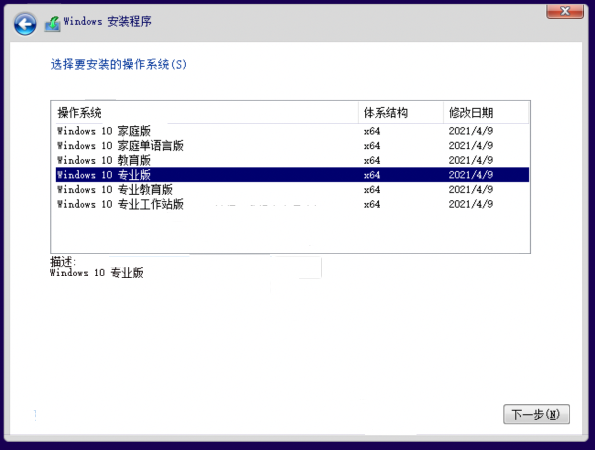
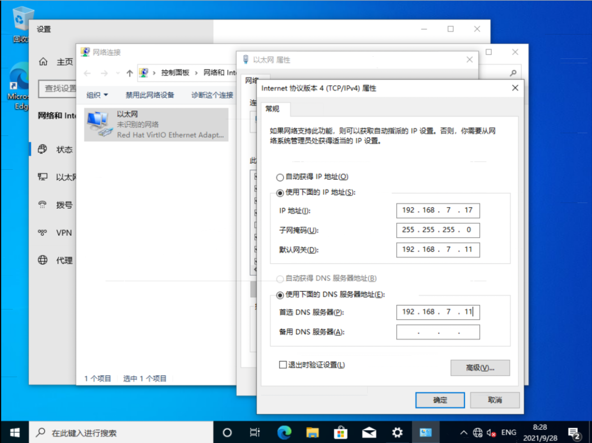
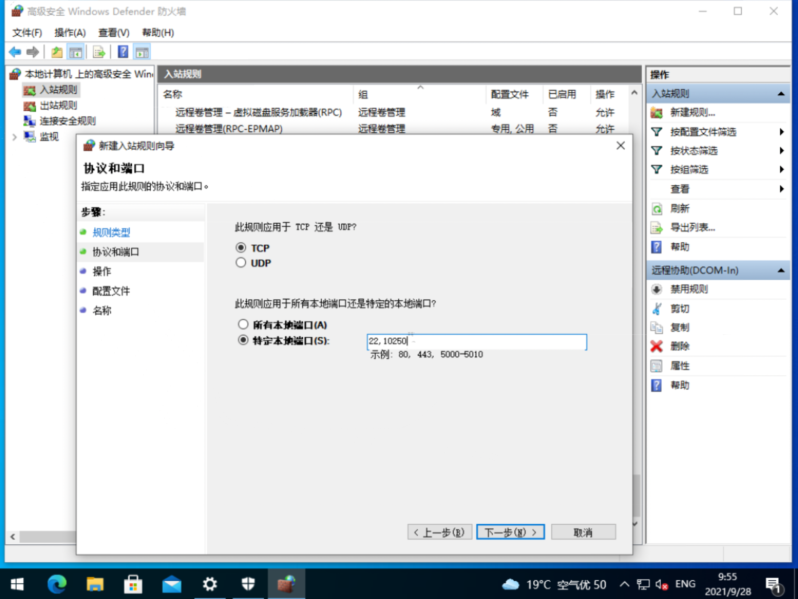
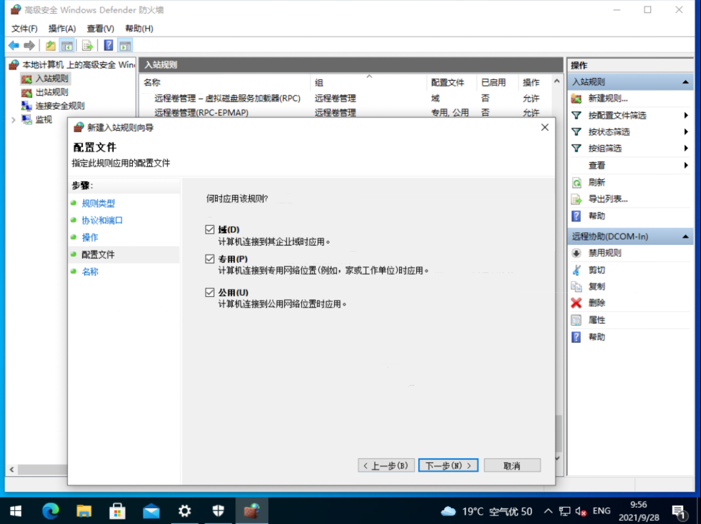
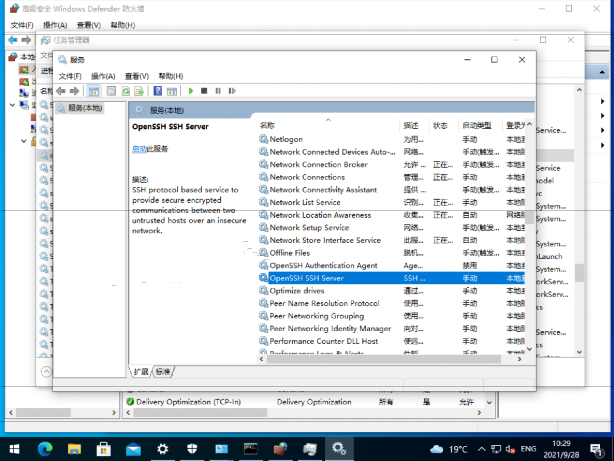
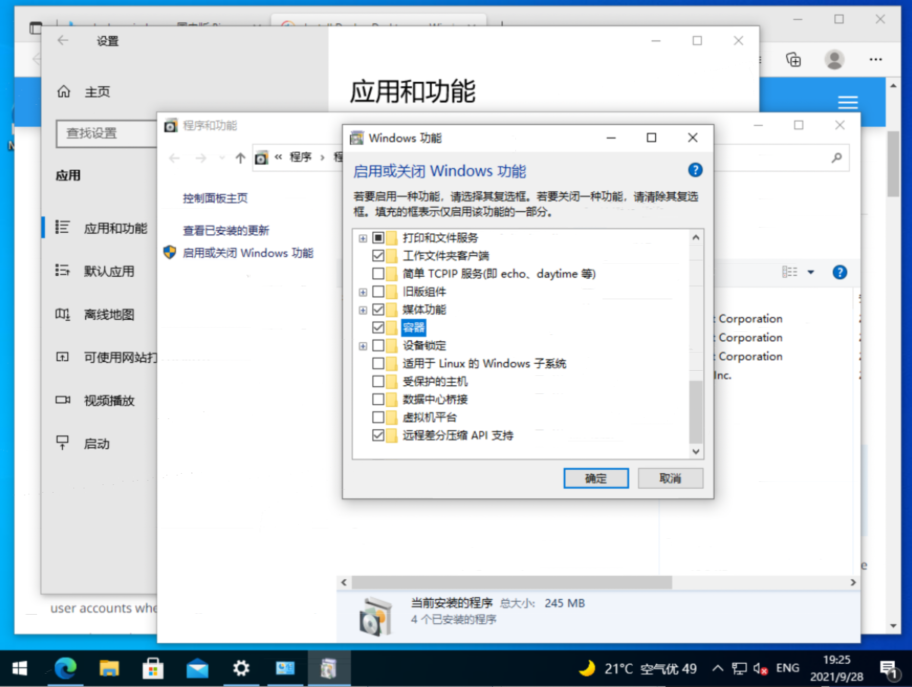
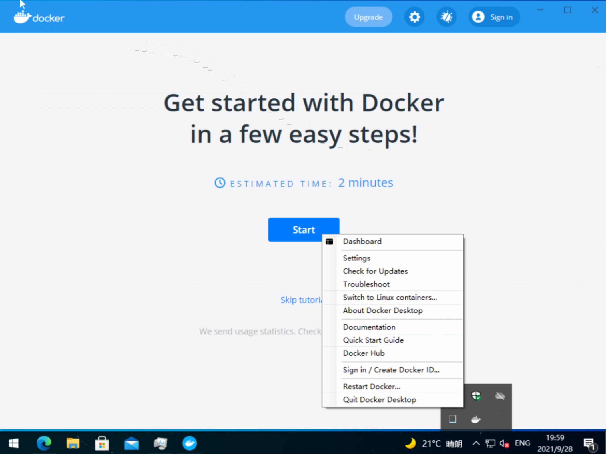
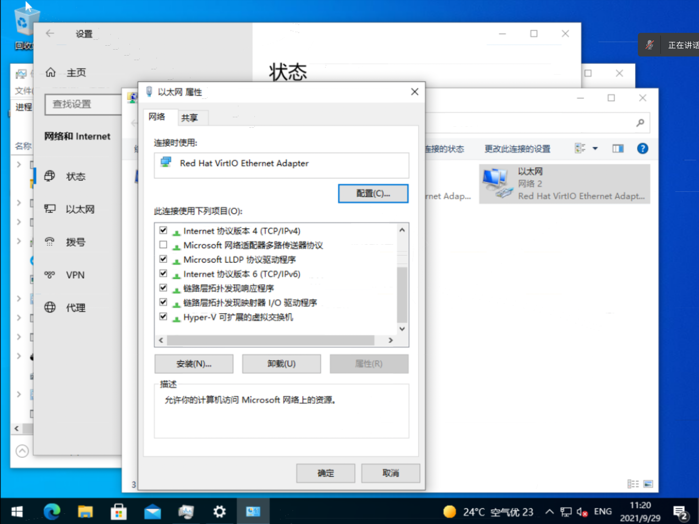

# windows node in openshift 4.8

```bash
podman pull registry.redhat.io/container-native-virtualization/virtio-win
podman run --rm -it --name swap registry.redhat.io/container-native-virtualization/virtio-win bash
podman create --name swap registry.redhat.io/container-native-virtualization/virtio-win ls
podman cp swap:/disk/virtio-win.iso - > virtio-win.iso.tar
gzip virtio-win.iso.tar
podman rm swap

export KVM_DIRECTORY=/data/kvm
virt-install --name=ocp4-windows --vcpus=4 --ram=8192 \
--cpu=host-model \
--disk path=/data/nvme/ocp4-windows.qcow2,bus=virtio,size=50 \
--os-variant win10 --network bridge=baremetal,model=virtio \
--graphics vnc,port=59017 \
--boot menu=on \
--cdrom ${KVM_DIRECTORY}/win10.iso \
--disk ${KVM_DIRECTORY}/virtio-win.iso,device=cdrom


```
















the username/passwd: wzh / redhat
```bash
ssh wzh@worker-1
# Microsoft Windows [版本 10.0.19043.1237]
# (c) Microsoft Corporation。保留所有权利。

# wzh@DESKTOP-FUIF19L C:\Users\wzh>

```

## setup ssh key auth
https://www.concurrency.com/blog/may-2019/key-based-authentication-for-openssh-on-windows
```bash
cat << 'EOF' > /data/install/win-ssh.ps1
$acl = Get-Acl C:\ProgramData\ssh\administrators_authorized_keys
$acl.SetAccessRuleProtection($true, $false)
$administratorsRule = New-Object system.security.accesscontrol.filesystemaccessrule("Administrators","FullControl","Allow")
$systemRule = New-Object system.security.accesscontrol.filesystemaccessrule("SYSTEM","FullControl","Allow")
$acl.SetAccessRule($administratorsRule)
$acl.SetAccessRule($systemRule)
$acl | Set-Acl
EOF

scp /data/install/win-ssh.ps1 wzh@worker-1:c:\\win-ssh.ps1
scp /root/.ssh/id_rsa.pub wzh@worker-1:C:\\ProgramData\\ssh\\administrators_authorized_keys

```
<!-- 

 -->

https://superuser.com/questions/106360/how-to-enable-execution-of-powershell-scripts

```
Set-ExecutionPolicy unrestricted
```


Restart your openssh server on win10, then you can ssh to you win10 without password. :)

## enable hyper-v & windows container

https://docs.microsoft.com/en-us/virtualization/hyper-v-on-windows/quick-start/enable-hyper-v

https://docs.microsoft.com/en-us/virtualization/windowscontainers/quick-start/set-up-environment?tabs=Windows-10




https://hub.docker.com/editions/community/docker-ce-desktop-windows

remember to switch to "windows container"



change windows hostname


## backup win7 kvm
https://schh.medium.com/backup-and-restore-kvm-vms-21c049e707c1
```bash
# poweroff you win7 vm

mkdir -p /data/nvme/bak

cd /data/nvme

virsh dumpxml ocp4-windows > /data/nvme/bak/ocp4-windows.xml
pigz -c ocp4-windows.qcow2 > /data/nvme/bak/ocp4-windows.qcow2.gz

cd /data/nvme/bak

var_date=$(date '+%Y-%m-%d-%H%M')
echo $var_date

buildah from --name onbuild-container scratch
buildah copy onbuild-container ocp4-windows.xml  /
buildah copy onbuild-container ocp4-windows.qcow2.gz  /
buildah umount onbuild-container 
buildah commit --rm onbuild-container quay.io/wangzheng422/qimgs:win7-ssh-$var_date
# buildah rm onbuild-container
# rm -f nexus-image.tgz 
echo "quay.io/wangzheng422/qimgs:win7-ssh-$var_date"
buildah push quay.io/wangzheng422/qimgs:win7-ssh-$var_date

# quay.io/wangzheng422/qimgs:win7-ssh-2021-09-28-2007
```
you can use the image above to extract the win10 image, and run locally, to try the windows node.

# install ocp, in ovn with hybrid mode

https://docs.openshift.com/container-platform/4.8/windows_containers/byoh-windows-instance.html

https://docs.openshift.com/container-platform/4.8/windows_containers/enabling-windows-container-workloads.html

```bash

# vi install-config.yaml 
cat << EOF > /data/install/install-config.yaml 
apiVersion: v1
baseDomain: redhat.ren
compute:
- hyperthreading: Enabled
  name: worker
  replicas: 0
controlPlane:
  hyperthreading: Enabled
  name: master
  replicas: 1
metadata:
  name: ocp4
networking:
  clusterNetworks:
  - cidr: 10.128.0.0/14
    hostPrefix: 23
  networkType: OVNKubernetes
  serviceNetwork:
  - 172.30.0.0/16
platform:
  none: {}
pullSecret: '{"auths":{"registry.ocp4.redhat.ren:5443": {"auth": "ZHVtbXk6ZHVtbXk=","email": "noemail@localhost"},"registry.ppa.redhat.ren:5443": {"auth": "ZHVtbXk6ZHVtbXk=","email": "noemail@localhost"}}}'
sshKey: |
$( cat /root/.ssh/id_rsa.pub | sed 's/^/   /g' )
additionalTrustBundle: |
$( cat /etc/crts/redhat.ren.ca.crt | sed 's/^/   /g' )
imageContentSources:
- mirrors:
  - registry.ocp4.redhat.ren:5443/ocp4/openshift4
  - registry.ocp4.redhat.ren:5443/ocp4/release
  source: quay.io/openshift-release-dev/ocp-release
- mirrors:
  - registry.ocp4.redhat.ren:5443/ocp4/openshift4
  - registry.ocp4.redhat.ren:5443/ocp4/release
  source: quay.io/openshift-release-dev/ocp-v4.0-art-dev
EOF

cat << EOF > /data/install/manifests/cluster-network-03-config.yml
apiVersion: operator.openshift.io/v1
kind: Network
metadata:
  name: cluster
spec:
  defaultNetwork:
    ovnKubernetesConfig:
      hybridOverlayConfig:
        hybridClusterNetwork: 
        - cidr: 10.132.0.0/14
          hostPrefix: 23
        # hybridOverlayVXLANPort: 9898 
EOF

```


```bash
oc create secret generic cloud-private-key --from-file=private-key.pem=/root/.ssh/id_rsa \
    -n openshift-windows-machine-config-operator

cat << EOF > /data/install/win-node.yaml
kind: ConfigMap
apiVersion: v1
metadata:
  name: windows-instances
  namespace: openshift-windows-machine-config-operator
data:
  192.168.7.17: |- 
    username=wzh
EOF
oc create -f /data/install/win-node.yaml

# to restore
oc delete -f /data/install/win-node.yaml

oc get csr
# NAME        AGE   SIGNERNAME                                    REQUESTOR                                                                   CONDITION
# csr-c5jg7   89s   kubernetes.io/kube-apiserver-client-kubelet   system:serviceaccount:openshift-machine-config-operator:node-bootstrapper   Pending

oc get csr
# NAME        AGE     SIGNERNAME                                    REQUESTOR                                                                   CONDITION
# csr-c5jg7   2m22s   kubernetes.io/kube-apiserver-client-kubelet   system:serviceaccount:openshift-machine-config-operator:node-bootstrapper   Approved,Issued
# csr-gpggz   9s      kubernetes.io/kubelet-serving                 system:node:desktop-fuif19l                                                 Pending

oc get csr -ojson | jq -r '.items[] | select(.status == {} ) | .metadata.name' | xargs oc adm certificate approve
```

```log
{"level":"info","ts":1632884619.4006023,"logger":"controllers.configmap","msg":"processing","instances in":"windows-instances"}
{"level":"info","ts":1632884619.4108891,"logger":"metrics","msg":"Prometheus configured","endpoints":"windows-exporter","port":9182,"name":"metrics"}
{"level":"info","ts":1632884619.7208638,"logger":"controllers.configmap","msg":"processing","instances in":"windows-instances"}
{"level":"info","ts":1632884619.730729,"logger":"metrics","msg":"Prometheus configured","endpoints":"windows-exporter","port":9182,"name":"metrics"}
{"level":"info","ts":1632885084.333724,"logger":"controllers.configmap","msg":"processing","instances in":"windows-instances"}
{"level":"info","ts":1632885114.6055324,"logger":"wc 192.168.7.17","msg":"configuring"}
{"level":"info","ts":1632885115.732336,"logger":"wc 192.168.7.17","msg":"transferring files"}
{"level":"info","ts":1632885137.6292639,"logger":"wc 192.168.7.17","msg":"configured","service":"windows_exporter","args":"--collectors.enabled cpu,cs,logical_disk,net,os,service,system,textfile,container,memory,cpu_info\""}
{"level":"info","ts":1632885143.1107311,"logger":"wc 192.168.7.17","msg":"configured kubelet","cmd":"C:\\k\\\\wmcb.exe initialize-kubelet --ignition-file C:\\Windows\\Temp\\worker.ign --kubelet-path C:\\k\\kubelet.exe --node-ip=192.168.7.17","output":"Bootstrapping completed successfully"}
{"level":"info","ts":1632885143.175688,"logger":"controllers.CertificateSigningRequests","msg":"CSR approved","CSR":"csr-s4258"}
{"level":"info","ts":1632885149.2199192,"logger":"controllers.CertificateSigningRequests","msg":"CSR approved","CSR":"csr-7rf54"}
{"level":"info","ts":1632885173.1581633,"logger":"wc 192.168.7.17","msg":"configure","service":"hybrid-overlay-node","args":"--node worker-1 --k8s-kubeconfig c:\\k\\kubeconfig --windows-service --logfile C:\\var\\log\\hybrid-overlay\\hybrid-overlay.log\" depend= kubelet"}
{"level":"info","ts":1632885296.7131085,"logger":"wc 192.168.7.17","msg":"configured","service":"hybrid-overlay-node","args":"--node worker-1 --k8s-kubeconfig c:\\k\\kubeconfig --windows-service --logfile C:\\var\\log\\hybrid-overlay\\hybrid-overlay.log\" depend= kubelet"}
{"level":"info","ts":1632885345.015352,"logger":"wc 192.168.7.17","msg":"configured kubelet for CNI","cmd":"C:\\k\\wmcb.exe configure-cni --cni-dir=\"C:\\k\\cni\\ --cni-config=\"C:\\k\\cni\\config\\cni.conf","output":"CNI configuration completed successfully"}
{"level":"info","ts":1632885360.5098932,"logger":"wc 192.168.7.17","msg":"configured","service":"kube-proxy","args":"--windows-service --v=4 --proxy-mode=kernelspace --feature-gates=WinOverlay=true --hostname-override=worker-1 --kubeconfig=c:\\k\\kubeconfig --cluster-cidr=10.132.0.0/24 --log-dir=C:\\var\\log\\kube-proxy\\ --logtostderr=false --network-name=OVNKubernetesHybridOverlayNetwork --source-vip=10.132.0.101 --enable-dsr=false --feature-gates=IPv6DualStack=false\" depend= hybrid-overlay-node"}
{"level":"info","ts":1632885375.5411081,"logger":"nc 192.168.7.17","msg":"instance has been configured as a worker node","version":"3.1.0+06e96071"}
{"level":"info","ts":1632885375.5682037,"logger":"metrics","msg":"Prometheus configured","endpoints":"windows-exporter","port":9182,"name":"metrics"}
{"level":"info","ts":1632885375.5690808,"logger":"controllers.configmap","msg":"processing","instances in":"windows-instances"}
{"level":"info","ts":1632885375.5705748,"logger":"controllers.configmap","msg":"instance is up to date","node":"worker-1","version":"3.1.0+06e96071"}
{"level":"info","ts":1632885375.5861452,"logger":"metrics","msg":"Prometheus configured","endpoints":"windows-exporter","port":9182,"name":"metrics"}
```

估计是当前实现的bug，或者其他原因，windows的默认网卡，上面的协议会被disable掉，造成windows node加入集群失败，目前暂时手动的把这些协议都enable，只留一个不激活。


```bash
oc get node
# NAME       STATUS   ROLES           AGE     VERSION
# master-0   Ready    master,worker   19h     v1.21.1+a620f50
# worker-1   Ready    worker          4m50s   v1.21.1-1398+98073871f173ba

oc get node --show-labels
# NAME       STATUS   ROLES           AGE   VERSION                       LABELS
# master-0   Ready    master,worker   19h   v1.21.1+a620f50               beta.kubernetes.io/arch=amd64,beta.kubernetes.io/os=linux,kubernetes.io/arch=amd64,kubernetes.io/hostname=master-0,kubernetes.io/os=linux,node-role.kubernetes.io/master=,node-role.kubernetes.io/worker=,node.openshift.io/os_id=rhcos
# worker-1   Ready    worker          10m   v1.21.1-1398+98073871f173ba   beta.kubernetes.io/arch=amd64,beta.kubernetes.io/os=windows,kubernetes.io/arch=amd64,kubernetes.io/hostname=worker-1,kubernetes.io/os=windows,node-role.kubernetes.io/worker=,node.kubernetes.io/windows-build=10.0.19043,node.openshift.io/os_id=Windows,windowsmachineconfig.openshift.io/byoh=true

# 看了windows节点不占用machine config pool
oc get mcp
# NAME     CONFIG                                             UPDATED   UPDATING   DEGRADED   MACHINECOUNT   READYMACHINECOUNT   UPDATEDMACHINECOUNT   DEGRADEDMACHINECOUNT   AGE
# master   rendered-master-607708e411d75c10e680d8bf5e24de6f   True      False      False      1              1                   1                     0                      19h
# worker   rendered-worker-cacf7f7f871c77ae92070b0a44fe0b91   True      False      False      0              0                   0                     0                      19h
```

## 探索一下装了什么

```cmd
wzh@WORKER-1 c:\>dir
 驱动器 C 中的卷没有标签。
 卷的序列号是 C607-13D4

 c:\ 的目录

2021/09/28  19:37       535,444,968 Docker Desktop Installer.exe
2021/09/29  11:12    <DIR>          k
2019/12/07  17:14    <DIR>          PerfLogs
2021/09/28  19:57    <DIR>          Program Files
2021/04/09  21:57    <DIR>          Program Files (x86)
2021/09/29  11:12    <DIR>          Temp
2021/09/28  08:25    <DIR>          Users
2021/09/29  11:11    <DIR>          var
2021/09/28  17:51               428 win-ssh.ps1
2021/09/28  16:34    <DIR>          Windows
               2 个文件    535,445,396 字节
               8 个目录 19,381,813,248 可用字节

wzh@WORKER-1 c:\>dir k
 驱动器 C 中的卷没有标签。
 卷的序列号是 C607-13D4

 c:\k 的目录

2021/09/29  11:12    <DIR>          .
2021/09/29  11:12    <DIR>          ..
2021/09/29  11:12            10,908 bootstrap-kubeconfig
2021/09/29  11:12    <DIR>          cni
2021/09/29  11:12    <DIR>          etc
2021/09/29  11:12        47,493,632 hybrid-overlay-node.exe
2021/09/29  11:12        47,809,536 kube-proxy.exe
2021/09/29  11:12            10,132 kubeconfig
2021/09/29  11:12             5,875 kubelet-ca.crt
2021/09/29  11:12               739 kubelet.conf
2021/09/29  11:12       117,698,048 kubelet.exe
2021/09/29  11:12    <DIR>          usr
2021/09/29  11:12        16,986,112 windows_exporter.exe
2021/09/29  11:12        16,331,776 wmcb.exe
               9 个文件    246,346,758 字节
               5 个目录 19,381,317,632 可用字节

wzh@WORKER-1 c:\>dir var\log
 驱动器 C 中的卷没有标签。
 卷的序列号是 C607-13D4

 c:\var\log 的目录

2021/09/29  11:12    <DIR>          .
2021/09/29  11:12    <DIR>          ..
2021/09/29  11:12    <DIR>          containers
2021/09/29  11:12    <DIR>          hybrid-overlay
2021/09/29  11:16    <DIR>          kube-proxy
2021/09/29  11:12    <DIR>          kubelet
2021/09/29  11:12    <DIR>          pods
               0 个文件              0 字节
               7 个目录 19,381,059,584 可用字节

wzh@WORKER-1 c:\>dir var\lib
 驱动器 C 中的卷没有标签。
 卷的序列号是 C607-13D4

 c:\var\lib 的目录

2021/09/28  20:36    <DIR>          .
2021/09/28  20:36    <DIR>          ..
2021/09/28  20:36    <DIR>          dockershim
2021/09/28  20:38    <DIR>          kubelet
               0 个文件              0 字节
               4 个目录 19,381,043,200 可用字节

```

## 删除windows节点

除了官方文档说的，改config map之外，发现，最好还是重启一下windows node为好。

# windows workload

https://hub.docker.com/_/microsoft-windows-base-os-images

```bash
cat << EOF > /data/install/win-runtime.yaml
apiVersion: node.k8s.io/v1beta1
kind: RuntimeClass
metadata:
  name: runtime-class-win10
handler: 'docker'
scheduling:
  nodeSelector: 
    kubernetes.io/os: 'windows'
    kubernetes.io/arch: 'amd64'
    node.kubernetes.io/windows-build: '10.0.19043'
  # tolerations: 
  # - effect: NoSchedule
  #   key: os
  #   operator: Equal
  #   value: "Windows"
EOF
oc create -f /data/install/win-runtime.yaml

# https://hub.docker.com/_/microsoft-windows
cat << EOF > /data/install/win-dep.yaml
apiVersion: apps/v1
kind: Deployment
metadata:
  labels:
    app: win-webserver
  name: win-webserver
spec:
  selector:
    matchLabels:
      app: win-webserver
  replicas: 1
  template:
    metadata:
      labels:
        app: win-webserver
      name: win-webserver
    spec:
      tolerations:
      - key: "os"
        value: "Windows"
        Effect: "NoSchedule"
      containers:
      - name: windowswebserver
        image: mcr.microsoft.com/windows:20H2
        imagePullPolicy: IfNotPresent
        command:
        - powershell.exe
        - -command
        - $listener = New-Object System.Net.HttpListener; $listener.Prefixes.Add('http://*:80/'); $listener.Start();Write-Host('Listening at http://*:80/'); while ($listener.IsListening) { $context = $listener.GetContext(); $response = $context.Response; $content='<html><body><H1>Red Hat OpenShift + Windows Container Workloads</H1></body></html>'; $buffer = [System.Text.Encoding]::UTF8.GetBytes($content); $response.ContentLength64 = $buffer.Length; $response.OutputStream.Write($buffer, 0, $buffer.Length); $response.Close(); };
        securityContext:
          windowsOptions:
            runAsUserName: "ContainerAdministrator"
      nodeSelector:
        beta.kubernetes.io/os: windows
EOF
oc create -f /data/install/win-dep.yaml

# https://hub.docker.com/_/microsoft-windows-servercore
cat << EOF > /data/install/win-dep-core.yaml
apiVersion: apps/v1
kind: Deployment
metadata:
  labels:
    app: win-webserver
  name: win-webserver
spec:
  selector:
    matchLabels:
      app: win-webserver
  replicas: 1
  template:
    metadata:
      labels:
        app: win-webserver
      name: win-webserver
    spec:
      tolerations:
      - key: "os"
        value: "Windows"
        Effect: "NoSchedule"
      containers:
      - name: windowswebserver
        image: mcr.microsoft.com/windows/servercore:20H2
        imagePullPolicy: IfNotPresent
        command:
        - powershell.exe
        - -command
        - $listener = New-Object System.Net.HttpListener; $listener.Prefixes.Add('http://*:80/'); $listener.Start();Write-Host('Listening at http://*:80/'); while ($listener.IsListening) { $context = $listener.GetContext(); $response = $context.Response; $content='<html><body><H1>Red Hat OpenShift + Windows Container Workloads</H1></body></html>'; $buffer = [System.Text.Encoding]::UTF8.GetBytes($content); $response.ContentLength64 = $buffer.Length; $response.OutputStream.Write($buffer, 0, $buffer.Length); $response.Close(); };
        securityContext:
          windowsOptions:
            runAsUserName: "ContainerAdministrator"
      nodeSelector:
        beta.kubernetes.io/os: windows
EOF
oc create -f /data/install/win-dep-core.yaml

```