# a simple, working ci/cd process demo

客户需求:
1. 实现一个简单的ci/cd流程，因为现在容器的ci/cd流程还没有
2. 不能影响已有的开发流程，也就是和现在的开发流程手动对接，从现在的开发流程里面，直接拿到二进制文件
3. 可以使用公有云服务，包括github, quay.io
4. 手动触发ci/cd流程，手动出发测试环境部署。

客户现场的局限：
1. 公网连接的网速比较慢，大概1MB/s
2. 服务器硬盘资源相对有限
3. 服务器性质是做实验的，所以可能被临时征用做为他用。

架构设计：


架构设计要点：
1. 公网服务采用github, quay.io，用途是持久化存储代码和镜像，避免内网服务器的不稳定或硬盘空间不足。同时在公网服务上编译基础镜像。
2. 公司内网部署gitea, quay，并和公网服务同步。
3. 采用openshift的pipeline, gitops功能，实现CI/CD流程。

# 基础镜像 / base image

我们先来配置公有云服务的基础镜像构建。我们用quay.io来作为容器镜像存储平台，用github的action功能，来编译镜像。

用github action的功能，是因为未来，我们会给予redhat ubi来编译基础镜像，在这个过程中，需要导入redhat订阅文件，这个就对公有云上的ci/cd工具的灵活性有要求，那么我们就暂时用github的action来编译基础镜像。

## quay.io
在quay.io上，配置robot账号


查看和记录robot账号的用户密码


给robot账号分配权限


reference:
1. https://event-driven.io/en/how_to_buid_and_push_docker_image_with_github_actions/
2. https://github.com/docker/build-push-action
3. https://docs.github.com/cn/actions/publishing-packages/publishing-docker-images

## github

已经制作了[单独的github项目](https://github.com/wangzheng422/container.build.demo)，作为镜像编译的源文件项目，项目中centos7目录中，有一个docker file文件，是基于centos7的镜像基础，并安装一些软件，最终结果打包，并上传 quay.io。不过，这个docker file依赖另外一个镜像，主要是需要那个镜像里面的一个安装包，我们之所以这样设计，是因为找不到一个合适的在公网上免费存储安装包的地方，于是我们就把这个很大的安装包，打到镜像里面，上传到公网的镜像仓库里面，需要用的时候，就采用这种[多阶段编译](https://docs.docker.com/develop/develop-images/multistage-build/)的方式，来使用。

包含安装包的镜像如何制作，在[项目文档中](https://github.com/wangzheng422/container.build.demo/blob/main/README.md)，有详细描述。
```bash
buildah from --name onbuild-container scratch
buildah copy onbuild-container nr5g_19.10.03.bz2 /
buildah umount onbuild-container 
buildah commit --rm onbuild-container quay.io/baicell/nr5g:latest
buildah push quay.io/baicell/nr5g:latest
```

项目中的.github/workflow目录下的main.yml文件，描述了激活github action，并且ci/cd的步骤。可以参考这个文件看公有云上，如何编译镜像。

github action里面，需要quay.io的robot账号信息，我们使用github的secret功能来实现。


## gitee

由于不可描述的原因，国内访问github很不稳定，所以我们就用gitee来克隆github repo，让gitee变相做一个git代理。github clone to [gitee](https://gitee.com/wangzheng422/container.build.demo)

## http proxy

由于我们的openshift环境是模拟的全离线环境，而我们的实验/方案，有一些操作是需要联网的，那么我们就需要部署一个http proxy，来模拟企业内部常有的访问互联网的代理。

```bash
podman run -d --rm --name tinyproxy -p 18080:8888 ghcr.io/wangzheng422/tinyproxy:latest

export http_proxy="http://192.168.7.1:18080"
export https_proxy=${http_proxy}

curl https://ifconfig.co

unset http_proxy
unset https_proxy


```

# quay

我们来部署一个quay服务，同时激活远程镜像同步功能。由于项目架构设计（基础镜像已经在公有云上扫描了）和服务器资源现状，我们就不开启镜像扫描了。

```bash
# on 103
cat << EOF >> /etc/hosts

172.21.6.103 quaylab.infra.redhat.ren
EOF

export QUAY=/data/quay

# generate cert for *.redhat.ren

# 配置registry
# 配置registry
mkdir -p /etc/crts/ && cd /etc/crts

# https://access.redhat.com/documentation/en-us/red_hat_codeready_workspaces/2.1/html/installation_guide/installing-codeready-workspaces-in-tls-mode-with-self-signed-certificates_crw
openssl genrsa -out /etc/crts/redhat.ren.ca.key 4096
openssl req -x509 \
  -new -nodes \
  -key /etc/crts/redhat.ren.ca.key \
  -sha256 \
  -days 36500 \
  -out /etc/crts/redhat.ren.ca.crt \
  -subj /CN="Local Red Hat Ren Signer" \
  -reqexts SAN \
  -extensions SAN \
  -config <(cat /etc/pki/tls/openssl.cnf \
      <(printf '[SAN]\nbasicConstraints=critical, CA:TRUE\nkeyUsage=keyCertSign, cRLSign, digitalSignature'))

openssl genrsa -out /etc/crts/redhat.ren.key 2048

openssl req -new -sha256 \
    -key /etc/crts/redhat.ren.key \
    -subj "/O=Local Red Hat Ren /CN=*.ocp4.redhat.ren" \
    -reqexts SAN \
    -config <(cat /etc/pki/tls/openssl.cnf \
        <(printf "\n[SAN]\nsubjectAltName=DNS:*.ocp4.redhat.ren,DNS:*.apps.ocp4.redhat.ren,DNS:*.ocp4a.redhat.ren,DNS:*.apps.ocp4a.redhat.ren,DNS:*.ocp4b.redhat.ren,DNS:*.apps.ocp4b.redhat.ren,DNS:*.ocp4c.redhat.ren,DNS:*.apps.ocp4c.redhat.ren,DNS:*.ocp4s.redhat.ren,DNS:*.apps.ocp4s.redhat.ren,DNS:*.infra.redhat.ren,DNS:*.tool.redhat.ren,DNS:*.redhat.ren\nbasicConstraints=critical, CA:FALSE\nkeyUsage=digitalSignature, keyEncipherment, keyAgreement, dataEncipherment\nextendedKeyUsage=serverAuth")) \
    -out /etc/crts/redhat.ren.csr

openssl x509 \
    -req \
    -sha256 \
    -extfile <(printf "subjectAltName=DNS:*.ocp4.redhat.ren,DNS:*.apps.ocp4.redhat.ren,DNS:*.ocp4a.redhat.ren,DNS:*.apps.ocp4a.redhat.ren,DNS:*.ocp4b.redhat.ren,DNS:*.apps.ocp4b.redhat.ren,DNS:*.ocp4c.redhat.ren,DNS:*.apps.ocp4c.redhat.ren,DNS:*.ocp4s.redhat.ren,DNS:*.apps.ocp4s.redhat.ren,DNS:*.infra.redhat.ren,DNS:*.tool.redhat.ren,DNS:*.redhat.ren\nbasicConstraints=critical, CA:FALSE\nkeyUsage=digitalSignature, keyEncipherment, keyAgreement, dataEncipherment\nextendedKeyUsage=serverAuth") \
    -days 365 \
    -in /etc/crts/redhat.ren.csr \
    -CA /etc/crts/redhat.ren.ca.crt \
    -CAkey /etc/crts/redhat.ren.ca.key \
    -CAcreateserial -out /etc/crts/redhat.ren.crt

openssl x509 -in /etc/crts/redhat.ren.crt -text

/bin/cp -f /etc/crts/redhat.ren.ca.crt /etc/pki/ca-trust/source/anchors/
update-ca-trust extract

# first config quay
mkdir -p $QUAY/postgres-quay
setfacl -m u:26:-wx $QUAY/postgres-quay
podman run -d --rm --name postgresql-quay \
  -e POSTGRESQL_USER=quayuser \
  -e POSTGRESQL_PASSWORD=quaypass \
  -e POSTGRESQL_DATABASE=quay \
  -e POSTGRESQL_ADMIN_PASSWORD=adminpass \
  -p 5432:5432 \
  -v $QUAY/postgres-quay:/var/lib/pgsql/data:Z \
  registry.redhat.io/rhel8/postgresql-10:1

# Ensure that the Postgres pg_trgm module is installed, as it is required by Quay
podman exec -it postgresql-quay /bin/bash -c 'echo "CREATE EXTENSION IF NOT EXISTS pg_trgm" | psql -d quay -U postgres'  
# CREATE EXTENSION

podman run -d --rm --name redis \
  -p 6379:6379 \
  -e REDIS_PASSWORD=strongpassword \
  registry.redhat.io/rhel8/redis-5:1

podman run --rm -it --name quay_config -p 80:8080 -p 443:8443 registry.redhat.io/quay/quay-rhel8:v3.6.2 config secret

# go to http://quaylab.infra.redhat.ren
# Log in with the username quayconfig and password secret
# make config, and download the config
```
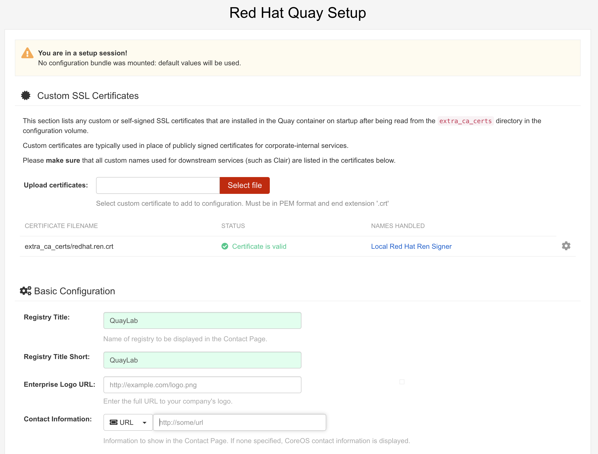

Database Type: Postgres
Database Server: quaylab.infra.redhat.ren:5432
Username: quayuser
Password: quaypass
Database Name: quay


Redis Hostname: quaylab.infra.redhat.ren
Redis port: 6379 (default)
Redis password: strongpassword


log path: /logarchive

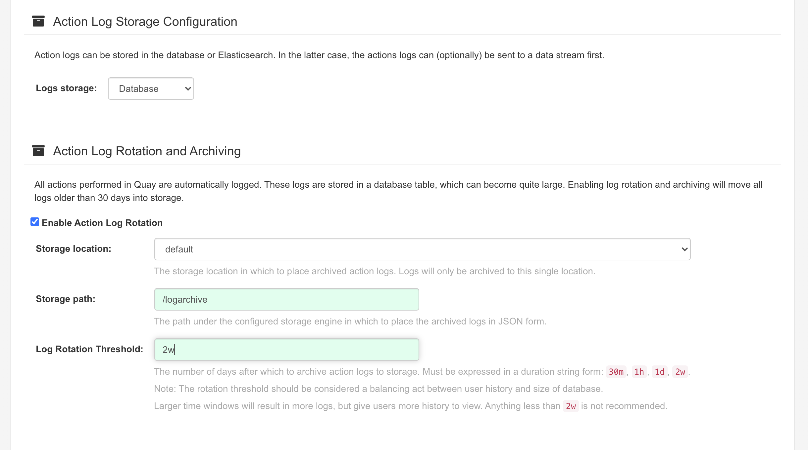

super user: quayadmin


ctrl-c exit the container

```bash
# then run the quay
mkdir $QUAY/config
cp ~/Downloads/quay-config.tar.gz $QUAY/config
cd $QUAY/config
tar xvf quay-config.tar.gz

mkdir $QUAY/storage
setfacl -m u:1001:-wx $QUAY/storage

podman run -d --rm -p 80:8080 -p 443:8443  \
   --name=quay \
   -v $QUAY/config:/conf/stack:Z \
   -v $QUAY/storage:/datastorage:Z \
   registry.redhat.io/quay/quay-rhel8:v3.6.2

```


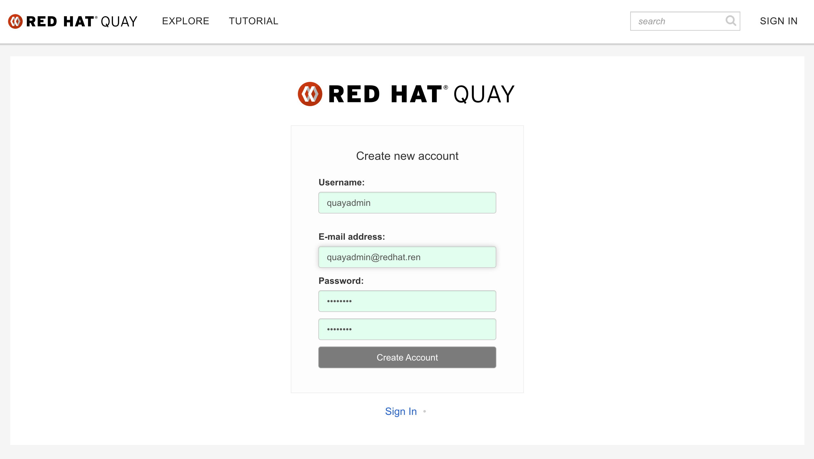

```bash
# try it out
podman login quaylab.infra.redhat.ren
# Username: quayadmin
# Password: password

/bin/cp -f /run/user/0/containers/auth.json /data/registry.auth.json

# setup quay mirror
podman run -d --name mirroring-worker \
  -v $QUAY/config:/conf/stack:Z \
  registry.redhat.io/quay/quay-rhel8:v3.6.2 repomirror

# auto restart
cd ~/
podman generate systemd --new --files --name redis
podman generate systemd --new --files --name postgresql-quay
podman generate systemd --new --files --name quay
podman generate systemd --new --files --name mirroring-worker

cp -Z container-redis.service /usr/lib/systemd/system
cp -Z container-postgresql-quay.service /usr/lib/systemd/system
cp -Z container-quay.service /usr/lib/systemd/system
cp -Z container-mirroring-worker.service /usr/lib/systemd/system

systemctl daemon-reload

systemctl enable --now container-redis.service
systemctl enable --now container-postgresql-quay.service
systemctl enable --now container-quay.service
systemctl enable --now container-mirroring-worker.service

rm -f container*

```


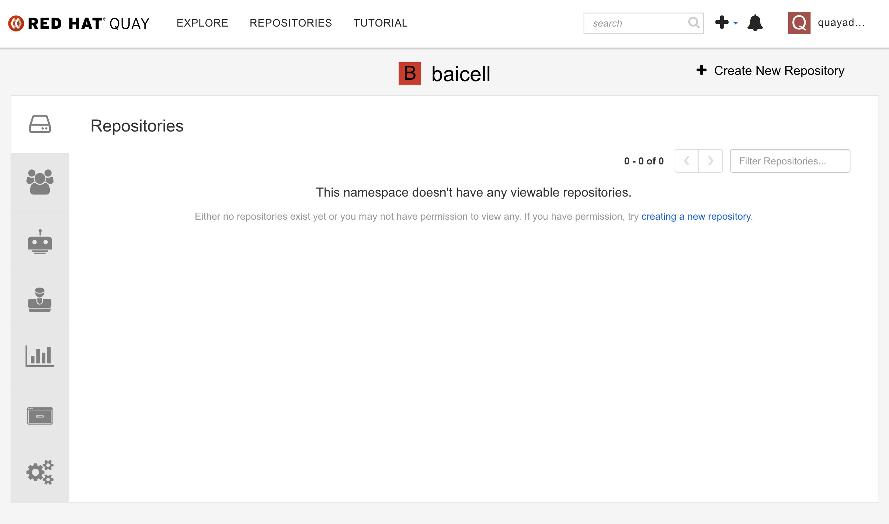


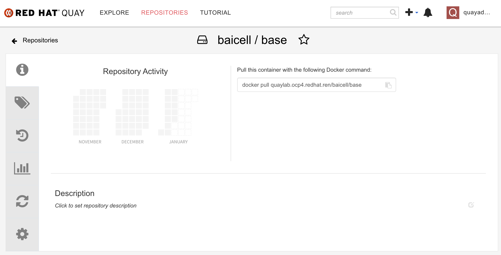

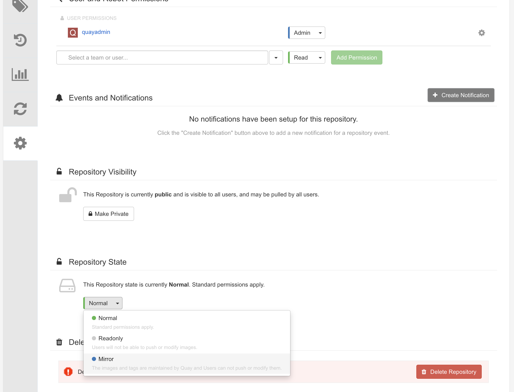


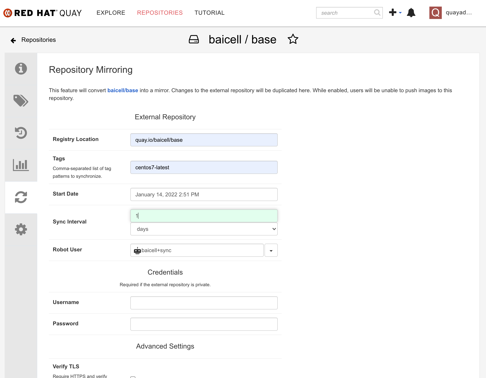


参考资料：
- [DEPLOY RED HAT QUAY FOR PROOF-OF-CONCEPT (NON-PRODUCTION) PURPOSES](https://access.redhat.com/documentation/en-us/red_hat_quay/3.6/html-single/deploy_red_hat_quay_for_proof-of-concept_non-production_purposes/index)
- [Chapter 10. Repository mirroring](https://access.redhat.com/documentation/en-us/red_hat_quay/3.6/html-single/manage_red_hat_quay/index#repo-mirroring-in-red-hat-quay)

# openshift4

## install ocp4
```bash
# import openshift4 install images into quay
export BUILDNUMBER=4.9.12

tar -xzf /data/ocp4/${BUILDNUMBER}/openshift-client-linux-${BUILDNUMBER}.tar.gz -C /usr/local/sbin/

oc image mirror -a /data/registry.auth.json --from-dir=/data/file.registry/ 'file://openshift/release:4.9.12-x86_64*' quaylab.infra.redhat.ren/ocp4/openshift4

# setup nexus
mkdir -p /data/ccn
cd /data/ccn

podman create --name swap quay.io/wangzheng422/qimgs:nexus-fs-image-2022-01-14-2155 ls
podman cp swap:/nexus-image.tgz - > /data/ccn/nexus-image.tgz.tar
podman rm -fv swap
tar vxf nexus-image.tgz.tar
tar zvxf nexus-image.tgz
rm -f nexus-image.tgz*

chown -R 200 /data/ccn/nexus-image

podman run -d -p 8082:8081 -p 8083:8083 -it --name nexus-image -v /data/ccn/nexus-image:/nexus-data:Z docker.io/sonatype/nexus3:3.33.1

# auto start nexus
cd ~/
podman generate systemd --files --name nexus-image
cp -Z container-nexus-image.service  /usr/lib/systemd/system
systemctl daemon-reload
systemctl enable --now container-nexus-image.service

# we follow single node ocp4 deployment
cd /data/kvm

wget -O rhel8.iso 'https://access.cdn.redhat.com/content/origin/files/sha256/1f/1f78e705cd1d8897a05afa060f77d81ed81ac141c2465d4763c0382aa96cadd0/rhel-8.5-x86_64-dvd.iso?user=a768b217cf6ae8041b67586bb4dd5c77&_auth_=1642400208_d400d34f0d5e2caab120537d05b0b8c9'

create_lv() {
    var_vg=$1
    var_lv=$2
    var_size=$3
    lvremove -f $var_vg/$var_lv
    lvcreate -y -L $var_size -n $var_lv $var_vg
    wipefs --all --force /dev/$var_vg/$var_lv
}

create_lv vgdata lvhelper 120G

create_lv vgdata lvbootstrap 120G
create_lv vgdata lvmaster0 120G

export http_proxy="http://192.168.195.54:5085"
export https_proxy=${http_proxy}

wget https://raw.githubusercontent.com/wangzheng422/docker_env/dev/redhat/ocp4/4.9/scripts/helper-ks-rhel8.cfg

unset http_proxy
unset https_proxy

sed -i '0,/^network.*/s/^network.*/network  --bootproto=static --device=enp1s0 --gateway=192.168.7.1 --ip=192.168.7.11  --netmask=255.255.255.0 --nameserver=192.168.7.11  --ipv6=auto --activate/' helper-ks-rhel8.cfg
# https://stackoverflow.com/questions/18620153/find-matching-text-and-replace-next-line
sed -i '/^network.*/{n;s/^network.*/network  --hostname=ocp4-helper/}' helper-ks-rhel8.cfg

export KVM_DIRECTORY=/data/kvm
virt-install --name="ocp4-Helper" --vcpus=2 --ram=4096 \
--cpu=host-model \
--disk path=/dev/vgdata/lvhelper,device=disk,bus=virtio,format=raw \
--os-variant rhel8.5 --network bridge=baremetal,model=virtio \
--graphics vnc,port=59200 \
--boot menu=on \
--location ${KVM_DIRECTORY}/rhel8.iso \
--disk ${KVM_DIRECTORY}/rhel8.iso,device=cdrom \
--initrd-inject helper-ks-rhel8.cfg --extra-args "inst.ks=file:/helper-ks-rhel8.cfg" 

# config helper vm
ssh root@192.168.7.11

export YUMIP="192.168.7.1"
cat << EOF > /etc/yum.repos.d/remote.repo
[BaseOS]
name=BaseOS
baseurl=ftp://$YUMIP/rhel/dnf/rhel-8-for-x86_64-baseos-rpms
enabled=1
gpgcheck=0

[AppStream]
name=AppStream
baseurl=ftp://$YUMIP/rhel/dnf/rhel-8-for-x86_64-appstream-rpms
enabled=1
gpgcheck=0

[Ansible]
name=Ansible
baseurl=ftp://$YUMIP/rhel/dnf/ansible-2.9-for-rhel-8-x86_64-rpms
enabled=1
gpgcheck=0

EOF

sed -i 's/#UseDNS yes/UseDNS no/g' /etc/ssh/sshd_config
systemctl restart sshd

cat << EOF > /root/.ssh/config
StrictHostKeyChecking no
UserKnownHostsFile=/dev/null
EOF

echo "allow 192.0.0.0/8" >> /etc/chrony.conf
systemctl enable --now chronyd
# systemctl restart chronyd
chronyc tracking
chronyc sources -v
chronyc sourcestats -v
chronyc makestep

dnf update -y
reboot

dnf -y install ansible git unzip podman python3 buildah skopeo jq pigz

# copy in the ocp installer
mkdir -p /data/ocp4/
# scp ocp4.tgz to /data
# scp * root@192.168.7.11:/data/
cd /data
tar zvxf ocp.*.tgz
tar zvxf registry.*.tgz
cd /data/ocp4

rm -f /data/*.tgz

# update the certification for quay
mkdir -p /etc/crts/ && cd /etc/crts
# scp * root@192.168.7.11:/etc/crts/

/bin/cp -f /etc/crts/redhat.ren.ca.crt /etc/pki/ca-trust/source/anchors/
update-ca-trust extract

# create ssh key
ssh-keygen

# extract install ansible playbooks
cd /data/ocp4
unzip ocp4-upi-helpernode.zip
cd /data/ocp4/ocp4-upi-helpernode-master


cat << 'EOF' > /data/ocp4/ocp4-upi-helpernode-master/vars.yaml
---
ocp_version: 4.9.12
ssh_gen_key: false
staticips: true
firewalld: false
dns_forward: yes
iso:
  iso_dl_url: "/data/ocp4/rhcos-live.x86_64.iso"
  my_iso: "rhcos-live.iso" # this is internal file, just leave as it.
helper:
  name: "helper"
  ipaddr: "192.168.7.11"
  networkifacename: "enp1s0"
  gateway: "192.168.7.1"
  netmask: "255.255.255.0"
dns:
  domain: "redhat.ren"
  clusterid: "ocp4"
  forwarder1: "192.168.7.1"
  forwarder2: "192.168.7.1"
bootstrap:
  name: "bootstrap"
  ipaddr: "192.168.7.12"
  interface: "enp1s0"
  install_drive: "vda"
  manual: false
masters:
  - name: "master-0"
    ipaddr: "192.168.7.13"
    interface: "enp1s0"
    install_drive: "vda"
    manual: false
  # - name: "master-1"
  #   ipaddr: "192.168.7.14"
  #   interface: "enp1s0"
  #   install_drive: "vda"    
  # - name: "master-2"
  #   ipaddr: "192.168.7.15"
  #   interface: "enp1s0"
  #   install_drive: "vda"    
# workers:
  # - name: "worker-0"
  #   ipaddr: "192.168.7.16"
  #   interface: "ens3f0"
  #   install_drive: "sda"
  # - name: "worker-1"
  #   ipaddr: "192.168.7.17"
  #   interface: "enp1s0"
  #   install_drive: "sda"
  # - name: "worker-2"
  #   ipaddr: "192.168.7.18"
  #   interface: "enp1s0"
  #   install_drive: "vda"
  # - name: "infra-0"
  #   ipaddr: "192.168.7.19"
  #   interface: "enp1s0"
  #   install_drive: "vda"
  # - name: "infra-1"
  #   ipaddr: "192.168.7.20"
  #   interface: "enp1s0"
  #   install_drive: "vda"
  # - name: "worker-3"
  #   ipaddr: "192.168.7.21"
  #   interface: "enp1s0"
  #   install_drive: "vda"
  # - name: "worker-4"
  #   ipaddr: "192.168.7.22"
  #   interface: "enp1s0"
  #   install_drive: "vda"
others:
  - name: "registry"
    ipaddr: "192.168.7.1"
  - name: "yum"
    ipaddr: "192.168.7.1"
  - name: "quay"
    ipaddr: "192.168.7.1"
  - name: "nexus"
    ipaddr: "192.168.7.1"
  - name: "git"
    ipaddr: "192.168.7.1"
otherdomains:
  - domain: "rhv.redhat.ren"
    hosts:
    - name: "manager"
      ipaddr: "192.168.7.71"
    - name: "rhv01"
      ipaddr: "192.168.7.72"
  - domain: "others.redhat.ren"
    hosts:
    - name: "*"
      ipaddr: "192.168.7.71"
    - name: "*.apps"
      ipaddr: "192.168.7.71"
  - domain: "infra.redhat.ren"
    hosts:
      - name: "registry"
        ipaddr: "192.168.7.1"
      - name: "yum"
        ipaddr: "192.168.7.1"
      - name: "quaylab"
        ipaddr: "192.168.7.1"
      - name: "nexus"
        ipaddr: "192.168.7.1"
      - name: "git"
        ipaddr: "192.168.7.1"
force_ocp_download: false
remove_old_config_files: false
ocp_client: "file:///data/ocp4/{{ ocp_version }}/openshift-client-linux-{{ ocp_version }}.tar.gz"
ocp_installer: "file:///data/ocp4/{{ ocp_version }}/openshift-install-linux-{{ ocp_version }}.tar.gz"
ocp_bios: "file:///data/ocp4/rhcos-metal.x86_64.raw.gz"
ppc64le: false
arch: 'x86_64'
chronyconfig:
  enabled: true
  content:
    - server: "192.168.7.1"
      options: iburst
setup_registry: # don't worry about this, just leave it here
  deploy: false
  registry_image: docker.io/library/registry:2
  local_repo: "ocp4/openshift4"
  product_repo: "openshift-release-dev"
  release_name: "ocp-release"
  release_tag: "4.6.1-x86_64"
ocp_filetranspiler: "file:///data/ocp4/filetranspiler.tgz"
registry_server: "registry.infra.redhat.ren:5443"
EOF

cd /data/ocp4/ocp4-upi-helpernode-master
ansible-playbook -e @vars.yaml tasks/main.yml

mkdir -p /data/install
cd /data/install

# vi install-config.yaml 
cat << EOF > /data/install/install-config.yaml 
apiVersion: v1
baseDomain: redhat.ren
compute:
- hyperthreading: Enabled
  name: worker
  replicas: 0
controlPlane:
  hyperthreading: Enabled
  name: master
  replicas: 1
metadata:
  name: ocp4
networking:
  clusterNetworks:
  - cidr: 10.128.0.0/14
    hostPrefix: 23
  networkType: OVNKubernetes
  serviceNetwork:
  - 172.30.0.0/16
platform:
  none: {}
pullSecret: '{"auths":{"registry.ocp4.redhat.ren:5443": {"auth": "ZHVtbXk6ZHVtbXk=","email": "noemail@localhost"},"quaylab.infra.redhat.ren": {"auth": "cXVheWFkbWluOnBhc3N3b3Jk","email": "noemail@localhost"}}}'
sshKey: |
$( cat /root/.ssh/id_rsa.pub | sed 's/^/   /g' )
additionalTrustBundle: |
$( cat /etc/crts/redhat.ren.ca.crt | sed 's/^/   /g' )
imageContentSources:
- mirrors:
  - quaylab.infra.redhat.ren/ocp4/openshift4
  source: quay.io/openshift-release-dev/ocp-release
- mirrors:
  - quaylab.infra.redhat.ren/ocp4/openshift4
  source: quay.io/openshift-release-dev/ocp-v4.0-art-dev
EOF

cd /data/install/
/bin/rm -rf *.ign .openshift_install_state.json auth bootstrap manifests master*[0-9] worker*[0-9] 

openshift-install create manifests --dir=/data/install


# copy ntp related config
/bin/cp -f  /data/ocp4/ocp4-upi-helpernode-master/machineconfig/* /data/install/openshift/

# copy image registry proxy related config
cd /data/ocp4
bash image.registries.conf.sh nexus.infra.redhat.ren:8083

/bin/cp -f /data/ocp4/image.registries.conf /etc/containers/registries.conf.d/

/bin/cp -f /data/ocp4/99-worker-container-registries.yaml /data/install/openshift
/bin/cp -f /data/ocp4/99-master-container-registries.yaml /data/install/openshift

cd /data/install/
openshift-install create ignition-configs --dir=/data/install

# on kvm host 172.21.6.103
export KVM_DIRECTORY=/data/kvm

mkdir -p  ${KVM_DIRECTORY}
cd ${KVM_DIRECTORY}
scp root@192.168.7.11:/data/install/{*boot*,*master-0,*worker-0}.iso ${KVM_DIRECTORY}/

virt-install --name=ocp4-bootstrap --vcpus=4 --ram=8192 \
--disk path=/dev/vgdata/lvbootstrap,device=disk,bus=virtio,format=raw \
--os-variant rhel8.5 --network bridge=baremetal,model=virtio \
--graphics vnc,port=59001 \
--boot menu=on --cdrom ${KVM_DIRECTORY}/rhcos_install-bootstrap.iso   

virt-install --name=ocp4-master-0 --vcpus=16 --ram=73728 \
--cpu=host-model \
--disk path=/dev/vgdata/lvmaster0,device=disk,bus=virtio,format=raw \
--os-variant rhel8.5 --network bridge=baremetal,model=virtio \
--graphics vnc,port=59002 \
--boot menu=on --cdrom ${KVM_DIRECTORY}/rhcos_install-master-0.iso 

# back to helper vm
cd /data/install
export KUBECONFIG=/data/install/auth/kubeconfig
echo "export KUBECONFIG=/data/install/auth/kubeconfig" >> ~/.bashrc
oc completion bash | sudo tee /etc/bash_completion.d/openshift > /dev/null

cd /data/install
openshift-install wait-for bootstrap-complete --log-level debug

cd /data/install
openshift-install wait-for install-complete --log-level debug
# INFO To access the cluster as the system:admin user when using 'oc', run 'export KUBECONFIG=/data/install/auth/kubeconfig'
# INFO Access the OpenShift web-console here: https://console-openshift-console.apps.ocp4.redhat.ren
# INFO Login to the console with user: "kubeadmin", and password: "eLVhg-TUx3X-fWYL9-dHepi"

```
## install teckton(ci/cd pipeline)

[openshift pipeline 官方安装文档](https://docs.openshift.com/container-platform/4.9/cicd/pipelines/installing-pipelines.html)写的很好，照着做，点一下鼠标就好了。

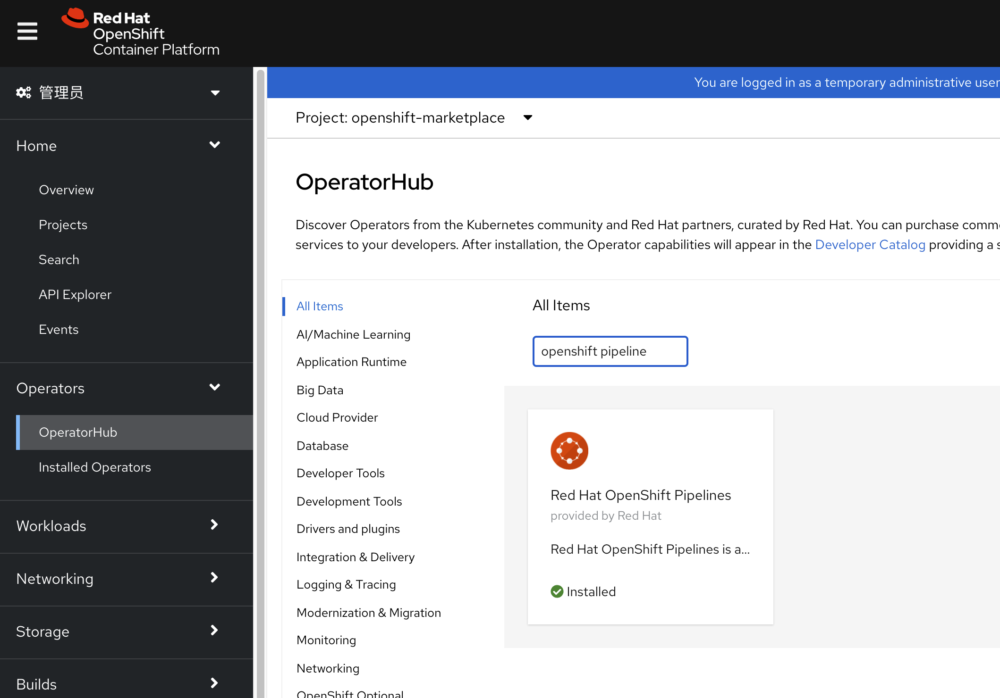

## install argocd(ci/cd gitops)

[openshift gitops官方安装文档](https://docs.openshift.com/container-platform/4.9/cicd/gitops/installing-openshift-gitops.html)写的很好，照着做，点一下鼠标就好了。

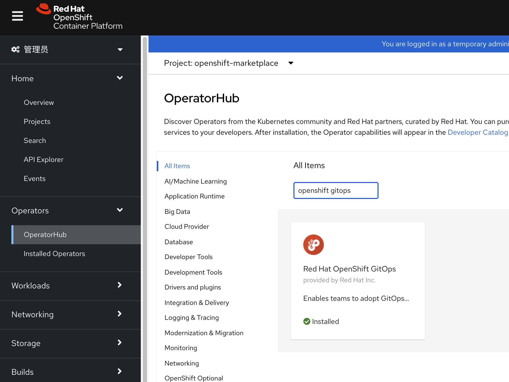

## install hostpath-provisioner from kubevirt

我们需要在openshift上的简单存储方案，那么我们就借用[openshift virtulization](https://docs.openshift.com/container-platform/4.9/virt/virtual_machines/virtual_disks/virt-features-for-storage.html)来搞，他里面有一个[hostpath](https://docs.openshift.com/container-platform/4.9/virt/virtual_machines/virtual_disks/virt-features-for-storage.html)组件

```bash
cat << EOF > /data/install/host-path.yaml
---
apiVersion: machineconfiguration.openshift.io/v1
kind: MachineConfig
metadata:
  name: 50-set-selinux-for-hostpath-master
  labels:
    machineconfiguration.openshift.io/role: master
spec:
  config:
    ignition:
      version: 3.2.0
    systemd:
      units:
        - contents: |
            [Unit]
            Description=Set SELinux chcon for hostpath baicell
            Before=kubelet.service

            [Service]
            Type=oneshot
            RemainAfterExit=yes
            ExecStartPre=-mkdir -p /var/hostpath
            ExecStart=chcon -Rt container_file_t /var/hostpath/

            [Install]
            WantedBy=multi-user.target
          enabled: true
          name: hostpath-baicell.service
EOF
oc create -f /data/install/host-path.yaml

cat << EOF > /data/install/host-path-provision.yaml
apiVersion: hostpathprovisioner.kubevirt.io/v1beta1
kind: HostPathProvisioner
metadata:
  name: hostpath-provisioner
spec:
  imagePullPolicy: IfNotPresent
  pathConfig:
    path: "/var/hostpath" 
    useNamingPrefix: false 

EOF
oc create -f /data/install/host-path-provision.yaml -n openshift-cnv

cat << EOF > /data/install/host-path-storage-class.yaml
apiVersion: storage.k8s.io/v1
kind: StorageClass
metadata:
  name: hostpath-provisioner 
provisioner: kubevirt.io/hostpath-provisioner
reclaimPolicy: Delete 
volumeBindingMode: WaitForFirstConsumer 
EOF
oc create -f /data/install/host-path-storage-class.yaml


```

# CI/CD in shell

CI/CD是一种理念，强调的是快速的从业务构想，到产品代码开发，到产品的上线以及后面的自动维护和升级。具体采用什么工具，各个团队和公司的情况不同，所以需要自己去研究。但是原则是，用自己熟悉的，能掌控的，能快速解决问题的就行。

根据我们的整体CI/CD设计，我们做2个版本的CI/CD，一个是用最简单的脚本实现，另外一个用openshift4的工具实现。这两个版本并没有谁好谁坏，只不过脚本的实现方式，更适合小团队，而openshift4的工具，更适合大团队。因为在大团队里面，沟通是一项成本非常高的活动，而openshift4中提供的这种工具，能很大程度的降低团队内部的沟通成本，所以推荐团队使用。

## 容器镜像版本号

容器镜像都版本，比如quay.io/baicell/fpga-driver:set_ip.v06，set_ip.v06就是版本号，这个版本号可以根据公司和团队的需求，进行格式定义，一般会有软件版本，架构信息，构建日期等信息。我们这个演示，大部分都用日期时间戳的方式。

注意，版本号格式虽然是随意的，但是一旦在公司/团队内部定义下来，就要进来遵循执行。

## build image && sync image

我们先来看看，怎么用脚本实现容器镜像的自动构建和自动上传/同步

### for vbbu app
先看看vBBU这个应用的容器镜像构建，这个镜像的特点是非常大，我们已经在公有云上构建了他的编译基础版本，有6G大小，并使用quay的功能，把他异步的同步到公司内网中，接下来，我们就进行增量的构建。并把构建结果上传到公司内部的镜像仓库中。
```bash
# on helper vm
# get git repo from gitee, and copy to helper
mkdir -p /data/cicd
cd /data/cicd
wget -O main.zip https://gitee.com/wangzheng422/container.build.demo/repository/archive/main.zip
# scp main.zip root@192.168.7.11:/data/tmp/

cd /data/cicd
unzip main.zip
cd /data/cicd/container.build.demo-main/vbbu

var_date=$(date '+%Y-%m-%d-%H%M')
podman build --no-cache --build-arg REGISTRY=quaylab.infra.redhat.ren -t quaylab.infra.redhat.ren/baicell/vbbu:$var_date .
podman push quaylab.infra.redhat.ren/baicell/vbbu:$var_date

echo quaylab.infra.redhat.ren/baicell/vbbu:$var_date

# sync to public cloud
podman tag quaylab.infra.redhat.ren/baicell/vbbu:$var_date quay.io/baicell/vbbu:$var_date
podman push quay.io/baicell/vbbu:$var_date

```

### for fpga driver
接下来，我们看看如何构建fpga driver的容器镜像。这个进行很小，我们就直接在github上面，用action直接自动构建了。

以下是假设我们需要在公有云上，手动编译的步骤。
```bash
# on public cloud host (vultr)
git clone https://github.com/wangzheng422/container.build.demo
cd container.build.demo/fpga

var_date=$(date '+%Y-%m-%d-%H%M')
podman build --no-cache -t quay.io/baicell/fpga-driver:$var_date -f driver.Dockerfile .

podman push quay.io/baicell/fpga-driver:$var_date

```

## auto deploy to openshift

自动化部署，我们采用k8s原生支持的[kustomize](https://kubernetes.io/zh/docs/tasks/manage-kubernetes-objects/kustomization/)来做。用kustomize倒不是他多强大，只不过他很简单，可以整体上线和下线。

```bash
# on helper vm
oc new-project baicell
oc project baicell

oc create sa demo
oc adm policy add-scc-to-user privileged -z demo

mkdir -p /data/cicd
cd /data/cicd
wget -O main.zip https://gitee.com/wangzheng422/container.build.demo/repository/archive/main.zip

unzip main.zip
cd container.build.demo-main/deploy.demo/

# oc new-project baicell

oc -n baicell kustomize .
oc -n baicell apply -k .

# to restore
oc -n baicell delete -k .

```

# CI/CD in openshift4

现在我们来看看，如果用openshift4里面自带的功能，如何用开源的方式来实现ci/cd。

## tekton / pipeline

首先我们来看看pipeline/tekton。我们先把配置过程，用截屏的方式记录一下。

我们已经定义好了一个pipeline，这个pipeline有2步组成，一个是用git的方式，从远端clone一个项目，另外一个，是用buildah来编译镜像。


我们点击编辑pipeline以后，进入了编辑流水线的页面，略过名称这里的配置，我们能看到一个流程图编辑界面，鼠标放到其中的步骤上，可以新增步骤/task，注意最后有一个workspace，这里面，我们需要配置一个存储，好让数据可以在不同task之间流动。
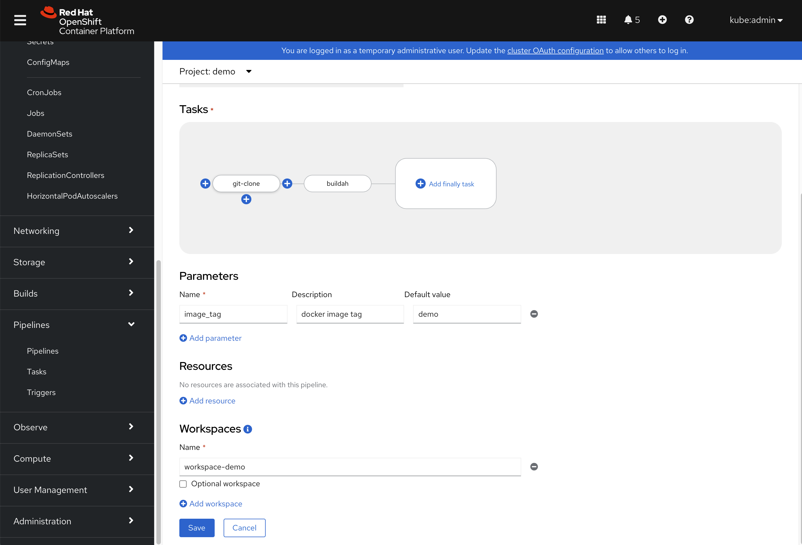

点击某一个步骤/task以后，我们就可以配置这个步骤的参数，以buildah为例子，我们给他配置镜像名称等参数。


pipeline的每次运行，都会有记录，叫pipeline run，我们可以进入每个pipeline run，看那一次运行的日志。
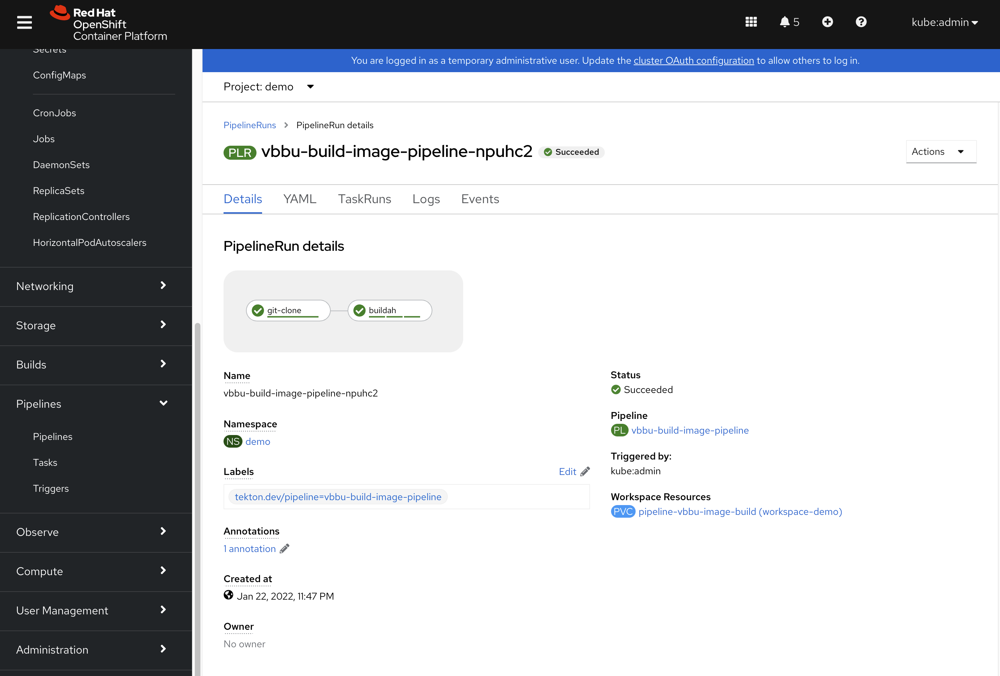

pipeline会对所有属于自己的pipeline run，进行简单的统计。
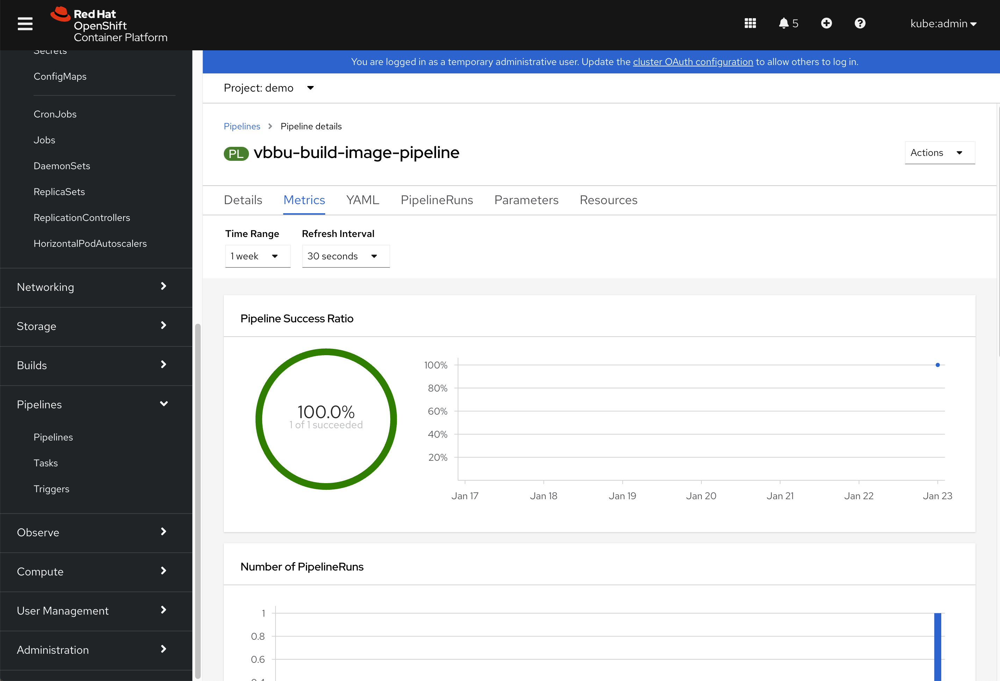

接下来，我们看配置的一些点。
```bash
oc new-project demo

oc project demo

# 要给service account创建push用的token
# https://docs.openshift.com/container-platform/4.9/openshift_images/managing_images/using-image-pull-secrets.html
oc create secret docker-registry pipeline-push-quaylab \
    --docker-server=quaylab.infra.redhat.ren \
    --docker-username=quayadmin \
    --docker-password=password \
    --docker-email=quayadmin@redhat.ren

oc secrets link pipeline pipeline-push-quaylab --for=pull,mount

# 我们需要定义存储，给pipeline使用
# we define a pvc for the pipeline
cat << EOF > /data/cicd/pipeline.pvc.yaml
kind: PersistentVolumeClaim
apiVersion: v1
metadata:
  name: pipeline-vbbu-image-build
  namespace: demo
spec:
  accessModes:
    - ReadWriteOnce
  resources:
    requests:
      storage: 1Gi
  storageClassName: hostpath-provisioner
  volumeMode: Filesystem
EOF
oc create -f /data/cicd/pipeline.pvc.yaml

# 我们在界面上定义的pipeline，实际的yaml长这个样子，可以直接在命令行上创建。
# we define a pipeline
cat << EOF > /data/cicd/pipeline.yaml
apiVersion: tekton.dev/v1beta1
kind: Pipeline
metadata:
  name: vbbu-build-image-pipeline
  namespace: demo
spec:
  params:
    - default: demo
      description: docker image tag
      name: image_tag
      type: string
  tasks:
    - name: git-clone
      params:
        - name: url
          value: 'https://gitee.com/wangzheng422/container.build.demo'
        - name: httpProxy
          value: 'http://192.168.7.1:18080'
        - name: httpsProxy
          value: 'http://192.168.7.1:18080'
      taskRef:
        kind: ClusterTask
        name: git-clone
      workspaces:
        - name: output
          workspace: workspace-demo
    - name: buildah
      params:
        - name: IMAGE
          value: 'quaylab.infra.redhat.ren/baicell/vbbu:$(params.image_tag)'
        - name: DOCKERFILE
          value: vbbu/Dockerfile
        - name: CONTEXT
          value: vbbu/
        - name: TLSVERIFY
          value: 'false'
        - name: BUILD_EXTRA_ARGS
          value: '--build-arg REGISTRY=''quaylab.infra.redhat.ren'''
      runAfter:
        - git-clone
      taskRef:
        kind: ClusterTask
        name: buildah
      workspaces:
        - name: source
          workspace: workspace-demo
  workspaces:
    - name: workspace-demo
EOF
oc create -f /data/cicd/pipeline.yaml

```

## argocd / gitops

接下来，我们来看看openshift4里面的gitops，他使用argocd做的。

gitops/argocd有专门的界面，在这里找登录位置，直接点击，用SSO登录就可以，默认operator都给你配置好了。


接入gitops/argocd界面后，我们要配置git源
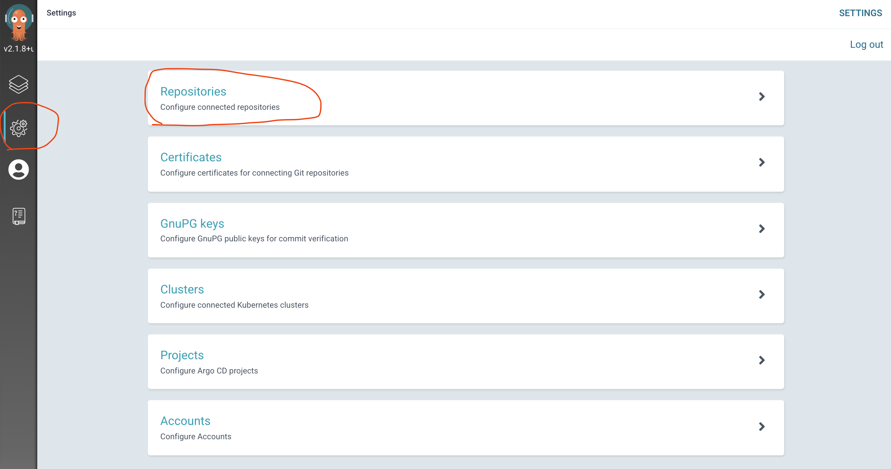

然后创建应用


应用配置的关键信息，有git源，目标cluster(默认就好)，git里面的路径等。后面有yaml配置，可以直接使用。
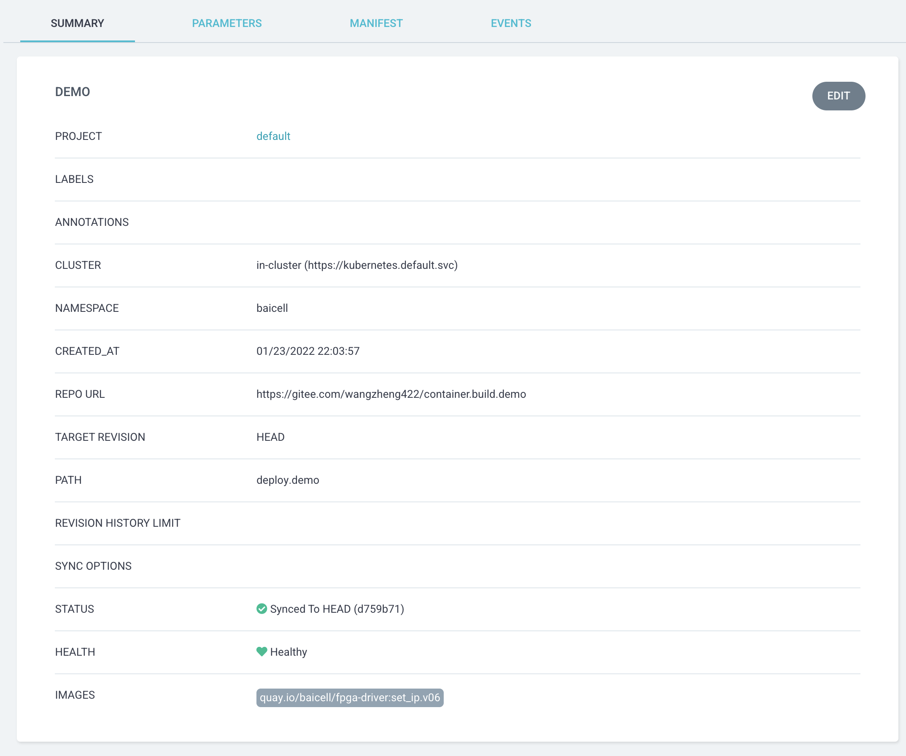

应用创建好以后，长这个样子


我们进入应用，看到了应用的结构图，很漂亮，我们点击同步，让gitops生效。这个时候，系统会根据git里面的yaml配置，来创建k8s对象。


gitops成功以后，拓扑图更好看了，他把隐藏创建的一些系统对象，也显示出来了。


回到概览页面，能看到，我们的应用已经正常了。
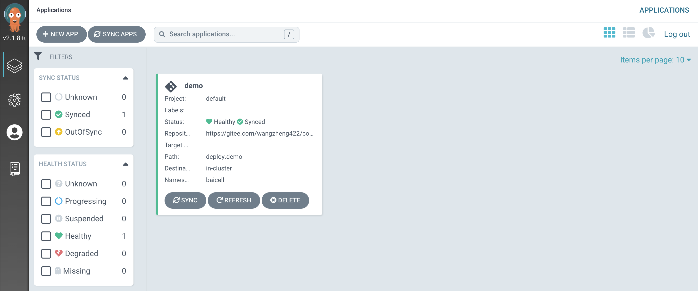

以下是一些用到的命令。
```bash
# 给被管理project打标签，让这个project被gitops管理。
oc label namespace baicell argocd.argoproj.io/managed-by=openshift-gitops

oc api-resources  | grep argo
# applications                          app,apps           argoproj.io/v1alpha1                           true         Application
# applicationsets                       appset,appsets     argoproj.io/v1alpha1                           true         ApplicationSet
# appprojects                           appproj,appprojs   argoproj.io/v1alpha1                           true         AppProject
# argocds                                                  argoproj.io/v1alpha1                           true         ArgoCD

oc project openshift-gitops

# 创建我们的gitops应用，这个可以直接创建，剩的在界面上敲字了。
cat << EOF > /data/cicd/gitops-app.yaml
apiVersion: argoproj.io/v1alpha1
kind: Application
metadata:
  name: demo
  namespace: openshift-gitops
spec:
  destination:
    namespace: baicell
    server: https://kubernetes.default.svc
  project: default
  source:
    path: deploy.demo
    repoURL: https://gitee.com/wangzheng422/container.build.demo
EOF
oc create -f /data/cicd/gitops-app.yaml

oc get applications
# NAME   SYNC STATUS   HEALTH STATUS
# demo   Synced        Healthy

```

# end