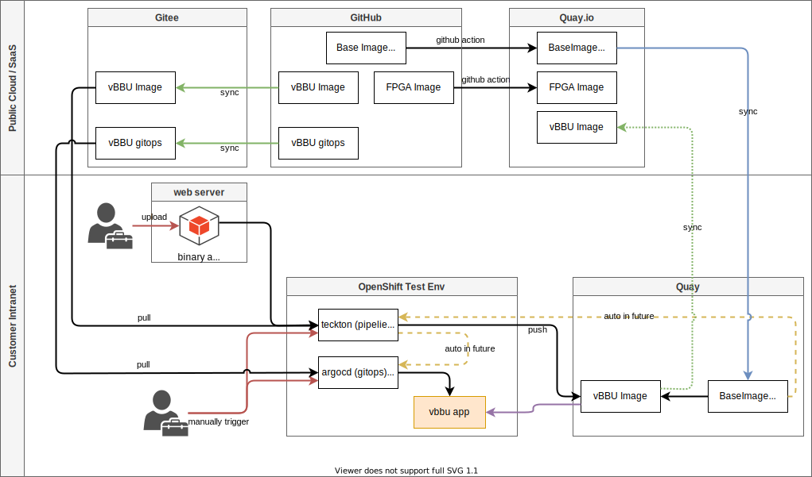
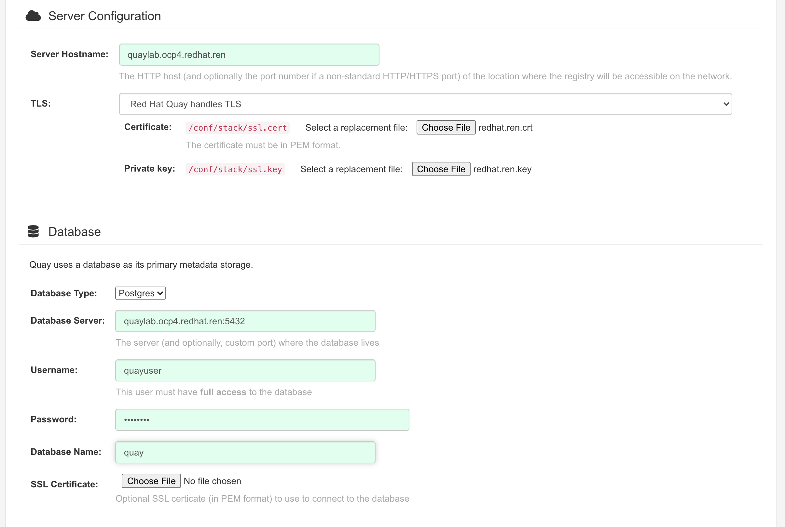
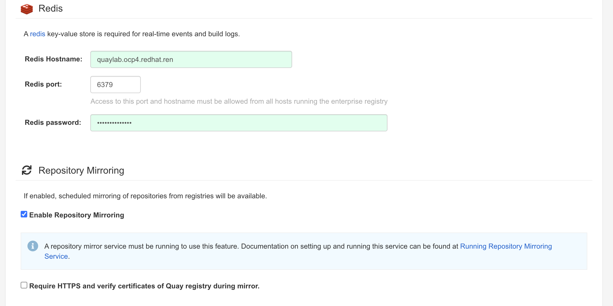
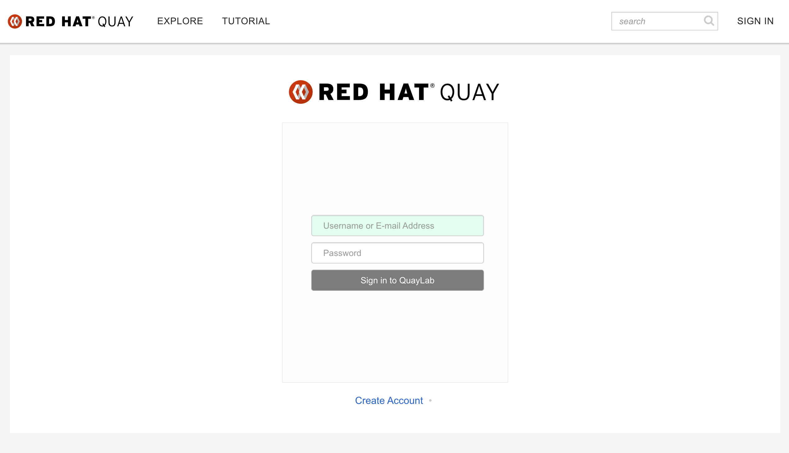
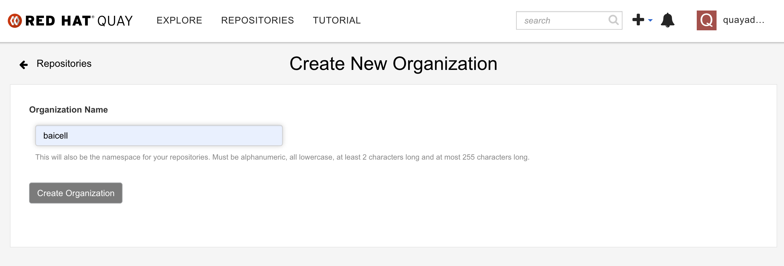
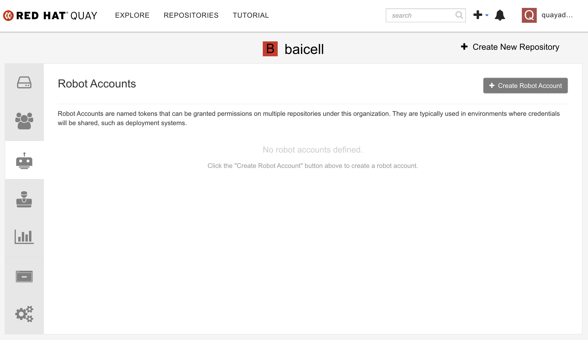
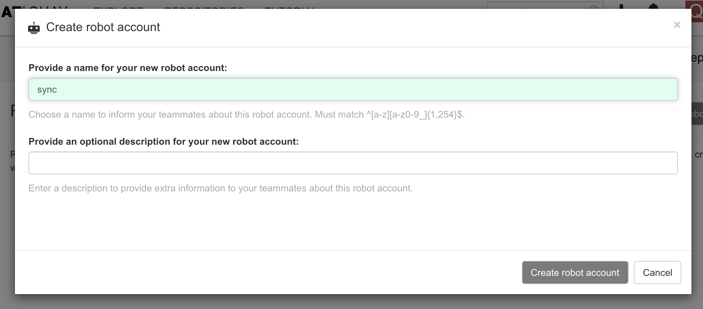
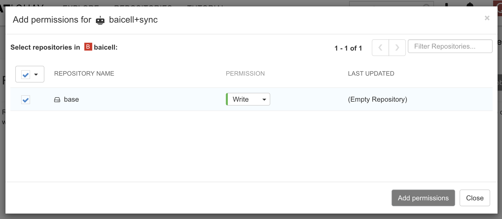
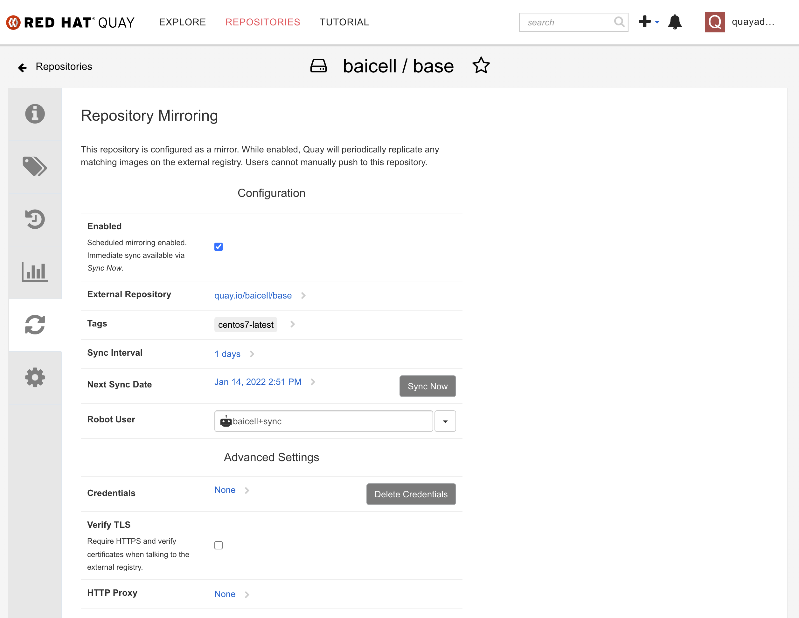
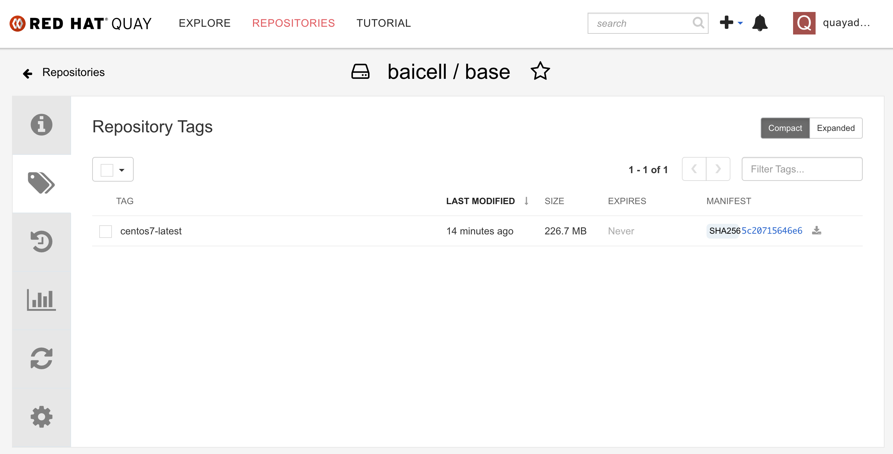

# a simple, working ci/cd process demo

客户需求:
1. 实现一个简单的ci/cd流程，因为现在容器的ci/cd流程还没有
2. 不能影响已有的开发流程，也就是和现在的开发流程手动对接，从现在的开发流程里面，直接拿到二进制文件
3. 可以使用公有云服务，包括github, quay.io
4. 手动触发ci/cd流程，手动出发测试环境部署。

客户现场的局限：
1. 公网连接的网速比较慢，大概1MB/s
2. 服务器硬盘资源相对有限

架构设计：


架构设计要点：
1. 公网服务采用github, quay.io，用途是持久化存储代码和镜像，避免内网服务器的硬盘空间不足。同时在公网服务上编译基础镜像。
2. 公司内网部署gitea, quay，并和公网服务同步。
3. 采用openshift的pipeline, gitops功能，实现CI/CD流程。

# 基础镜像 / base image

我们先来配置公有云服务的基础镜像构建。我们用quay.io来作为容器镜像存储平台，用github的action功能，来编译镜像。

用github action的功能，是因为未来，我们会给予redhat ubi来编译基础镜像，在这个过程中，需要导入redhat订阅文件，这个就对公有云上的ci/cd工具的灵活性有要求，那么我们就暂时用github的action来编译基础镜像。

## quay.io
在quay.io上，配置robot账号


查看和记录robot账号的用户密码


给robot账号分配权限


reference:
1. https://event-driven.io/en/how_to_buid_and_push_docker_image_with_github_actions/
2. https://github.com/docker/build-push-action
3. https://docs.github.com/cn/actions/publishing-packages/publishing-docker-images

## github

已经制作了单独的github项目，作为镜像编译的源文件项目，项目中只有一个docker file文件，是基于centos7的镜像基础，并安装一些软件，最终结果打包，并上传quay.io。

项目中的.github/workflow目录下的main.yml文件，描述了激活github action，并且ci/cd的步骤。可以参考这个文件看公有云上，如何编译镜像。

github action里面，需要quay.io的robot账号信息，我们使用github的secret功能来实现。


# quay

我们来部署一个quay服务，同时激活远程镜像同步功能。由于项目架构设计（基础镜像已经在公有云上扫描了）和服务器资源现状，我们就不开启镜像扫描了。

```bash
# on 103
cat << EOF >> /etc/hosts

172.21.6.103 quaylab.infra.redhat.ren
EOF

export QUAY=/data/quay

# generate cert for *.redhat.ren

# 配置registry
# 配置registry
mkdir -p /etc/crts/ && cd /etc/crts

# https://access.redhat.com/documentation/en-us/red_hat_codeready_workspaces/2.1/html/installation_guide/installing-codeready-workspaces-in-tls-mode-with-self-signed-certificates_crw
openssl genrsa -out /etc/crts/redhat.ren.ca.key 4096
openssl req -x509 \
  -new -nodes \
  -key /etc/crts/redhat.ren.ca.key \
  -sha256 \
  -days 36500 \
  -out /etc/crts/redhat.ren.ca.crt \
  -subj /CN="Local Red Hat Ren Signer" \
  -reqexts SAN \
  -extensions SAN \
  -config <(cat /etc/pki/tls/openssl.cnf \
      <(printf '[SAN]\nbasicConstraints=critical, CA:TRUE\nkeyUsage=keyCertSign, cRLSign, digitalSignature'))

openssl genrsa -out /etc/crts/redhat.ren.key 2048

openssl req -new -sha256 \
    -key /etc/crts/redhat.ren.key \
    -subj "/O=Local Red Hat Ren /CN=*.ocp4.redhat.ren" \
    -reqexts SAN \
    -config <(cat /etc/pki/tls/openssl.cnf \
        <(printf "\n[SAN]\nsubjectAltName=DNS:*.ocp4.redhat.ren,DNS:*.apps.ocp4.redhat.ren,DNS:*.ocp4a.redhat.ren,DNS:*.apps.ocp4a.redhat.ren,DNS:*.ocp4b.redhat.ren,DNS:*.apps.ocp4b.redhat.ren,DNS:*.ocp4c.redhat.ren,DNS:*.apps.ocp4c.redhat.ren,DNS:*.ocp4s.redhat.ren,DNS:*.apps.ocp4s.redhat.ren,DNS:*.infra.redhat.ren,DNS:*.tool.redhat.ren,DNS:*.redhat.ren\nbasicConstraints=critical, CA:FALSE\nkeyUsage=digitalSignature, keyEncipherment, keyAgreement, dataEncipherment\nextendedKeyUsage=serverAuth")) \
    -out /etc/crts/redhat.ren.csr

openssl x509 \
    -req \
    -sha256 \
    -extfile <(printf "subjectAltName=DNS:*.ocp4.redhat.ren,DNS:*.apps.ocp4.redhat.ren,DNS:*.ocp4a.redhat.ren,DNS:*.apps.ocp4a.redhat.ren,DNS:*.ocp4b.redhat.ren,DNS:*.apps.ocp4b.redhat.ren,DNS:*.ocp4c.redhat.ren,DNS:*.apps.ocp4c.redhat.ren,DNS:*.ocp4s.redhat.ren,DNS:*.apps.ocp4s.redhat.ren,DNS:*.infra.redhat.ren,DNS:*.tool.redhat.ren,DNS:*.redhat.ren\nbasicConstraints=critical, CA:FALSE\nkeyUsage=digitalSignature, keyEncipherment, keyAgreement, dataEncipherment\nextendedKeyUsage=serverAuth") \
    -days 365 \
    -in /etc/crts/redhat.ren.csr \
    -CA /etc/crts/redhat.ren.ca.crt \
    -CAkey /etc/crts/redhat.ren.ca.key \
    -CAcreateserial -out /etc/crts/redhat.ren.crt

openssl x509 -in /etc/crts/redhat.ren.crt -text

/bin/cp -f /etc/crts/redhat.ren.ca.crt /etc/pki/ca-trust/source/anchors/
update-ca-trust extract

# first config quay
mkdir -p $QUAY/postgres-quay
setfacl -m u:26:-wx $QUAY/postgres-quay
podman run -d --rm --name postgresql-quay \
  -e POSTGRESQL_USER=quayuser \
  -e POSTGRESQL_PASSWORD=quaypass \
  -e POSTGRESQL_DATABASE=quay \
  -e POSTGRESQL_ADMIN_PASSWORD=adminpass \
  -p 5432:5432 \
  -v $QUAY/postgres-quay:/var/lib/pgsql/data:Z \
  registry.redhat.io/rhel8/postgresql-10:1

# Ensure that the Postgres pg_trgm module is installed, as it is required by Quay
podman exec -it postgresql-quay /bin/bash -c 'echo "CREATE EXTENSION IF NOT EXISTS pg_trgm" | psql -d quay -U postgres'  
# CREATE EXTENSION

podman run -d --rm --name redis \
  -p 6379:6379 \
  -e REDIS_PASSWORD=strongpassword \
  registry.redhat.io/rhel8/redis-5:1

podman run --rm -it --name quay_config -p 80:8080 -p 443:8443 registry.redhat.io/quay/quay-rhel8:v3.6.2 config secret

# go to http://quaylab.infra.redhat.ren
# Log in with the username quayconfig and password secret
# make config, and download the config
```


Database Type: Postgres
Database Server: quaylab.infra.redhat.ren:5432
Username: quayuser
Password: quaypass
Database Name: quay



Redis Hostname: quaylab.infra.redhat.ren
Redis port: 6379 (default)
Redis password: strongpassword



log path: /logarchive


super user: quayadmin


ctrl-c exit the container

```bash
# then run the quay
mkdir $QUAY/config
cp ~/Downloads/quay-config.tar.gz $QUAY/config
cd $QUAY/config
tar xvf quay-config.tar.gz

mkdir $QUAY/storage
setfacl -m u:1001:-wx $QUAY/storage

podman run -d --rm -p 80:8080 -p 443:8443  \
   --name=quay \
   -v $QUAY/config:/conf/stack:Z \
   -v $QUAY/storage:/datastorage:Z \
   registry.redhat.io/quay/quay-rhel8:v3.6.2

```




```bash
# try it out
podman login quaylab.infra.redhat.ren
# Username: quayadmin
# Password: password

/bin/cp -f /run/user/0/containers/auth.json /data/registry.auth.json

# setup quay mirror
podman run -d --name mirroring-worker \
  -v $QUAY/config:/conf/stack:Z \
  registry.redhat.io/quay/quay-rhel8:v3.6.2 repomirror

# auto restart
cd ~/
podman generate systemd --new --files --name redis
podman generate systemd --new --files --name postgresql-quay
podman generate systemd --new --files --name quay
podman generate systemd --new --files --name mirroring-worker

cp -Z container-redis.service /usr/lib/systemd/system
cp -Z container-postgresql-quay.service /usr/lib/systemd/system
cp -Z container-quay.service /usr/lib/systemd/system
cp -Z container-mirroring-worker.service /usr/lib/systemd/system

systemctl daemon-reload

systemctl enable --now container-redis.service
systemctl enable --now container-postgresql-quay.service
systemctl enable --now container-quay.service
systemctl enable --now container-mirroring-worker.service

rm -f container*

```

















参考资料：
- [DEPLOY RED HAT QUAY FOR PROOF-OF-CONCEPT (NON-PRODUCTION) PURPOSES](https://access.redhat.com/documentation/en-us/red_hat_quay/3.6/html-single/deploy_red_hat_quay_for_proof-of-concept_non-production_purposes/index)
- [Chapter 10. Repository mirroring](https://access.redhat.com/documentation/en-us/red_hat_quay/3.6/html-single/manage_red_hat_quay/index#repo-mirroring-in-red-hat-quay)

# openshift4

```bash
# import openshift4 install images into quay
export BUILDNUMBER=4.9.12

tar -xzf /data/ocp4/${BUILDNUMBER}/openshift-client-linux-${BUILDNUMBER}.tar.gz -C /usr/local/sbin/

oc image mirror -a /data/registry.auth.json --from-dir=/data/file.registry/ 'file://openshift/release:4.9.12-x86_64*' quaylab.infra.redhat.ren/ocp4/openshift4

# setup nexus
mkdir -p /data/ccn
cd /data/ccn

podman create --name swap quay.io/wangzheng422/qimgs:nexus-fs-image-2022-01-14-2155 ls
podman cp swap:/nexus-image.tgz - > /data/ccn/nexus-image.tgz.tar
podman rm -fv swap
tar vxf nexus-image.tgz.tar
tar zvxf nexus-image.tgz
rm -f nexus-image.tgz*

chown -R 200 /data/ccn/nexus-image

podman run -d -p 8082:8081 -p 8083:8083 -it --name nexus-image -v /data/ccn/nexus-image:/nexus-data:Z docker.io/sonatype/nexus3:3.33.1

# auto start nexus
cd ~/
podman generate systemd --files --name nexus-image
cp -Z container-nexus-image.service  /usr/lib/systemd/system
systemctl daemon-reload
systemctl enable --now container-nexus-image.service

# we follow single node ocp4 deployment
cd /data/kvm

wget -O rhel8.iso 'https://access.cdn.redhat.com/content/origin/files/sha256/1f/1f78e705cd1d8897a05afa060f77d81ed81ac141c2465d4763c0382aa96cadd0/rhel-8.5-x86_64-dvd.iso?user=a768b217cf6ae8041b67586bb4dd5c77&_auth_=1642400208_d400d34f0d5e2caab120537d05b0b8c9'

create_lv() {
    var_vg=$1
    var_lv=$2
    var_size=$3
    lvremove -f $var_vg/$var_lv
    lvcreate -y -L $var_size -n $var_lv $var_vg
    wipefs --all --force /dev/$var_vg/$var_lv
}

create_lv vgdata lvhelper 120G

create_lv vgdata lvbootstrap 120G
create_lv vgdata lvmaster0 120G

export http_proxy="http://192.168.195.54:5085"
export https_proxy=${http_proxy}

wget https://raw.githubusercontent.com/wangzheng422/docker_env/dev/redhat/ocp4/4.9/scripts/helper-ks-rhel8.cfg

unset http_proxy
unset https_proxy

sed -i '0,/^network.*/s/^network.*/network  --bootproto=static --device=enp1s0 --gateway=192.168.7.1 --ip=192.168.7.11  --netmask=255.255.255.0 --nameserver=192.168.7.11  --ipv6=auto --activate/' helper-ks-rhel8.cfg
# https://stackoverflow.com/questions/18620153/find-matching-text-and-replace-next-line
sed -i '/^network.*/{n;s/^network.*/network  --hostname=ocp4-helper/}' helper-ks-rhel8.cfg

export KVM_DIRECTORY=/data/kvm
virt-install --name="ocp4-Helper" --vcpus=2 --ram=4096 \
--cpu=host-model \
--disk path=/dev/vgdata/lvhelper,device=disk,bus=virtio,format=raw \
--os-variant rhel8.5 --network bridge=baremetal,model=virtio \
--graphics vnc,port=59200 \
--boot menu=on \
--location ${KVM_DIRECTORY}/rhel8.iso \
--disk ${KVM_DIRECTORY}/rhel8.iso,device=cdrom \
--initrd-inject helper-ks-rhel8.cfg --extra-args "inst.ks=file:/helper-ks-rhel8.cfg" 

# config helper vm
ssh root@192.168.7.11

export YUMIP="192.168.7.1"
cat << EOF > /etc/yum.repos.d/remote.repo
[BaseOS]
name=BaseOS
baseurl=ftp://$YUMIP/rhel/dnf/rhel-8-for-x86_64-baseos-rpms
enabled=1
gpgcheck=0

[AppStream]
name=AppStream
baseurl=ftp://$YUMIP/rhel/dnf/rhel-8-for-x86_64-appstream-rpms
enabled=1
gpgcheck=0

[Ansible]
name=Ansible
baseurl=ftp://$YUMIP/rhel/dnf/ansible-2.9-for-rhel-8-x86_64-rpms
enabled=1
gpgcheck=0

EOF

sed -i 's/#UseDNS yes/UseDNS no/g' /etc/ssh/sshd_config
systemctl restart sshd

cat << EOF > /root/.ssh/config
StrictHostKeyChecking no
UserKnownHostsFile=/dev/null
EOF

echo "allow 192.0.0.0/8" >> /etc/chrony.conf
systemctl enable --now chronyd
# systemctl restart chronyd
chronyc tracking
chronyc sources -v
chronyc sourcestats -v
chronyc makestep

dnf update -y
reboot

dnf -y install ansible git unzip podman python3 buildah skopeo jq pigz

# copy in the ocp installer
mkdir -p /data/ocp4/
# scp ocp4.tgz to /data
# scp * root@192.168.7.11:/data/
cd /data
tar zvxf ocp.*.tgz
tar zvxf registry.*.tgz
cd /data/ocp4

rm -f /data/*.tgz

# update the certification for quay
mkdir -p /etc/crts/ && cd /etc/crts
# scp * root@192.168.7.11:/etc/crts/

/bin/cp -f /etc/crts/redhat.ren.ca.crt /etc/pki/ca-trust/source/anchors/
update-ca-trust extract

# create ssh key
ssh-keygen

# extract install ansible playbooks
cd /data/ocp4
unzip ocp4-upi-helpernode.zip
cd /data/ocp4/ocp4-upi-helpernode-master


cat << 'EOF' > /data/ocp4/ocp4-upi-helpernode-master/vars.yaml
---
ocp_version: 4.9.12
ssh_gen_key: false
staticips: true
firewalld: false
dns_forward: yes
iso:
  iso_dl_url: "/data/ocp4/rhcos-live.x86_64.iso"
  my_iso: "rhcos-live.iso" # this is internal file, just leave as it.
helper:
  name: "helper"
  ipaddr: "192.168.7.11"
  networkifacename: "enp1s0"
  gateway: "192.168.7.1"
  netmask: "255.255.255.0"
dns:
  domain: "redhat.ren"
  clusterid: "ocp4"
  forwarder1: "192.168.7.1"
  forwarder2: "192.168.7.1"
bootstrap:
  name: "bootstrap"
  ipaddr: "192.168.7.12"
  interface: "enp1s0"
  install_drive: "vda"
  manual: false
masters:
  - name: "master-0"
    ipaddr: "192.168.7.13"
    interface: "enp1s0"
    install_drive: "vda"
    manual: false
  # - name: "master-1"
  #   ipaddr: "192.168.7.14"
  #   interface: "enp1s0"
  #   install_drive: "vda"    
  # - name: "master-2"
  #   ipaddr: "192.168.7.15"
  #   interface: "enp1s0"
  #   install_drive: "vda"    
# workers:
  # - name: "worker-0"
  #   ipaddr: "192.168.7.16"
  #   interface: "ens3f0"
  #   install_drive: "sda"
  # - name: "worker-1"
  #   ipaddr: "192.168.7.17"
  #   interface: "enp1s0"
  #   install_drive: "sda"
  # - name: "worker-2"
  #   ipaddr: "192.168.7.18"
  #   interface: "enp1s0"
  #   install_drive: "vda"
  # - name: "infra-0"
  #   ipaddr: "192.168.7.19"
  #   interface: "enp1s0"
  #   install_drive: "vda"
  # - name: "infra-1"
  #   ipaddr: "192.168.7.20"
  #   interface: "enp1s0"
  #   install_drive: "vda"
  # - name: "worker-3"
  #   ipaddr: "192.168.7.21"
  #   interface: "enp1s0"
  #   install_drive: "vda"
  # - name: "worker-4"
  #   ipaddr: "192.168.7.22"
  #   interface: "enp1s0"
  #   install_drive: "vda"
others:
  - name: "registry"
    ipaddr: "192.168.7.1"
  - name: "yum"
    ipaddr: "192.168.7.1"
  - name: "quay"
    ipaddr: "192.168.7.1"
  - name: "nexus"
    ipaddr: "192.168.7.1"
  - name: "git"
    ipaddr: "192.168.7.1"
otherdomains:
  - domain: "rhv.redhat.ren"
    hosts:
    - name: "manager"
      ipaddr: "192.168.7.71"
    - name: "rhv01"
      ipaddr: "192.168.7.72"
  - domain: "others.redhat.ren"
    hosts:
    - name: "*"
      ipaddr: "192.168.7.71"
    - name: "*.apps"
      ipaddr: "192.168.7.71"
  - domain: "infra.redhat.ren"
    hosts:
      - name: "registry"
        ipaddr: "192.168.7.1"
      - name: "yum"
        ipaddr: "192.168.7.1"
      - name: "quay"
        ipaddr: "192.168.7.1"
      - name: "nexus"
        ipaddr: "192.168.7.1"
      - name: "git"
        ipaddr: "192.168.7.1"
force_ocp_download: false
remove_old_config_files: false
ocp_client: "file:///data/ocp4/{{ ocp_version }}/openshift-client-linux-{{ ocp_version }}.tar.gz"
ocp_installer: "file:///data/ocp4/{{ ocp_version }}/openshift-install-linux-{{ ocp_version }}.tar.gz"
ocp_bios: "file:///data/ocp4/rhcos-metal.x86_64.raw.gz"
ppc64le: false
arch: 'x86_64'
chronyconfig:
  enabled: true
  content:
    - server: "192.168.7.1"
      options: iburst
setup_registry: # don't worry about this, just leave it here
  deploy: false
  registry_image: docker.io/library/registry:2
  local_repo: "ocp4/openshift4"
  product_repo: "openshift-release-dev"
  release_name: "ocp-release"
  release_tag: "4.6.1-x86_64"
ocp_filetranspiler: "file:///data/ocp4/filetranspiler.tgz"
registry_server: "registry.infra.redhat.ren:5443"
EOF

cd /data/ocp4/ocp4-upi-helpernode-master
ansible-playbook -e @vars.yaml tasks/main.yml


```