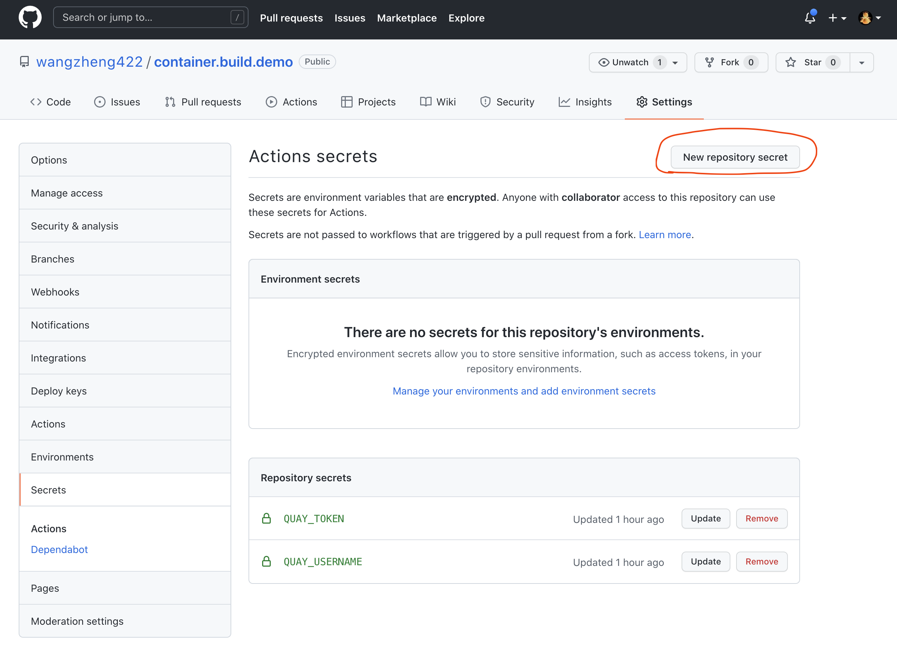
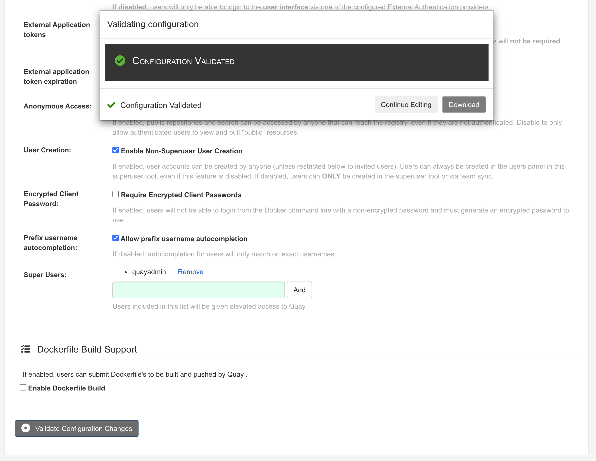

# a simple, working ci/cd process demo

客户需求:
1. 实现一个简单的ci/cd流程，因为现在容器的ci/cd流程还没有
2. 不能影响已有的开发流程，也就是和现在的开发流程手动对接，从现在的开发流程里面，直接拿到二进制文件
3. 可以使用公有云服务，包括github, quay.io
4. 手动触发ci/cd流程，手动出发测试环境部署。

客户现场的局限：
1. 公网连接的网速比较慢，大概1MB/s
2. 服务器硬盘资源相对有限

架构设计：


架构设计要点：
1. 公网服务采用github, quay.io，用途是持久化存储代码和镜像，避免内网服务器的硬盘空间不足。同时在公网服务上编译基础镜像。
2. 公司内网部署gitea, quay，并和公网服务同步。
3. 采用openshift的pipeline, gitops功能，实现CI/CD流程。

# 基础镜像 / base image

我们先来配置公有云服务的基础镜像构建。我们用quay.io来作为容器镜像存储平台，用github的action功能，来编译镜像。

用github action的功能，是因为未来，我们会给予redhat ubi来编译基础镜像，在这个过程中，需要导入redhat订阅文件，这个就对公有云上的ci/cd工具的灵活性有要求，那么我们就暂时用github的action来编译基础镜像。

## quay.io
在quay.io上，配置robot账号


查看和记录robot账号的用户密码


给robot账号分配权限


reference:
1. https://event-driven.io/en/how_to_buid_and_push_docker_image_with_github_actions/
2. https://github.com/docker/build-push-action
3. https://docs.github.com/cn/actions/publishing-packages/publishing-docker-images

## github

已经制作了单独的github项目，作为镜像编译的源文件项目，项目中只有一个docker file文件，是基于centos7的镜像基础，并安装一些软件，最终结果打包，并上传quay.io。

项目中的.github/workflow目录下的main.yml文件，描述了激活github action，并且ci/cd的步骤。可以参考这个文件看公有云上，如何编译镜像。

github action里面，需要quay.io的robot账号信息，我们使用github的secret功能来实现。



# quay

我们来部署一个quay服务，同时激活远程镜像同步功能。由于项目架构设计（基础镜像已经在公有云上扫描了）和服务器资源现状，我们就不开启镜像扫描了。

```bash
# on 103
cat << EOF >> /etc/hosts

172.21.6.103 quaylab.ocp4.redhat.ren
EOF

export QUAY=/data/quay

# generate cert for *.redhat.ren

# first config quay
mkdir -p $QUAY/postgres-quay
setfacl -m u:26:-wx $QUAY/postgres-quay
podman run -d --rm --name postgresql-quay \
  -e POSTGRESQL_USER=quayuser \
  -e POSTGRESQL_PASSWORD=quaypass \
  -e POSTGRESQL_DATABASE=quay \
  -e POSTGRESQL_ADMIN_PASSWORD=adminpass \
  -p 5432:5432 \
  -v $QUAY/postgres-quay:/var/lib/pgsql/data:Z \
  registry.redhat.io/rhel8/postgresql-10:1

# Ensure that the Postgres pg_trgm module is installed, as it is required by Quay
podman exec -it postgresql-quay /bin/bash -c 'echo "CREATE EXTENSION IF NOT EXISTS pg_trgm" | psql -d quay -U postgres'  

podman run -d --rm --name redis \
  -p 6379:6379 \
  -e REDIS_PASSWORD=strongpassword \
  registry.redhat.io/rhel8/redis-5:1

podman run --rm -it --name quay_config -p 80:8080 -p 443:8443 registry.redhat.io/quay/quay-rhel8:v3.6.2 config secret

# go to http://quaylab.ocp4.redhat.ren
# Log in with the username quayconfig and password secret
# make config, and download the config
```


Database Type: Postgres
Database Server: quaylab.ocp4.redhat.ren:5432
Username: quayuser
Password: quaypass
Database Name: quay


Redis Hostname: quaylab.ocp4.redhat.ren
Redis port: 6379 (default)
Redis password: strongpassword




ctrl-c exit the container

```bash
# then run the quay
mkdir $QUAY/config
cp ~/Downloads/quay-config.tar.gz $QUAY/config
cd $QUAY/config
tar xvf quay-config.tar.gz

mkdir $QUAY/storage
setfacl -m u:1001:-wx $QUAY/storage

podman run -d --rm -p 80:8080 -p 443:8443  \
   --name=quay \
   -v $QUAY/config:/conf/stack:Z \
   -v $QUAY/storage:/datastorage:Z \
   registry.redhat.io/quay/quay-rhel8:v3.6.2

```


```bash
# try it out
podman login quaylab.ocp4.redhat.ren
# Username: quayadmin
# Password: password


```


参考资料：
- [DEPLOY RED HAT QUAY FOR PROOF-OF-CONCEPT (NON-PRODUCTION) PURPOSES](https://access.redhat.com/documentation/en-us/red_hat_quay/3.6/html-single/deploy_red_hat_quay_for_proof-of-concept_non-production_purposes/index)
- [Chapter 10. Repository mirroring](https://access.redhat.com/documentation/en-us/red_hat_quay/3.6/html-single/manage_red_hat_quay/index#repo-mirroring-in-red-hat-quay)