# openshift 4.9 single node, assisted install mode, without dhcp, disconnected

本文描述，如何使用assisted service(辅助安装服务)，来安装一个单节点openshift4集群，特别的地方是，默认情况，openshift4要求网络上提供dhcp服务，让节点启动的时候，能拿到IP地址，从而进一步下载容器镜像，并且和assisted service交互，拿到配置。可是大部分客户的网络，是不允许开启dhcp服务的，那么我们在这里就使用assisted service暂时隐藏的功能，进行static ip模式的部署。

本实验设想的客户环境/需求是这样的：
1. 实验网络没有dhcp
2. 实验网络不能访问外网
3. 实验环境中有2台主机
4. 将在实验环境中的1台主机上，安装单节点openshift4(baremetal模式)

由于作者实验环境所限，我们就用kvm来代替baremetal进行实验。

安装过程大概是这样的：
1. 启动helper vm，并在helper节点上配置dns服务
2. 启动本地assisted service服务
3. 在assisted service上进行配置
4. 从assisted service上下载iso
5. 通过iso启动kvm/baremetal
6. 在assisted service上进行配置，开始安装
7. 观察和等待安装结束
8. 获得openshift4的用户名密码等信息，登录集群。

本次实验的架构图：

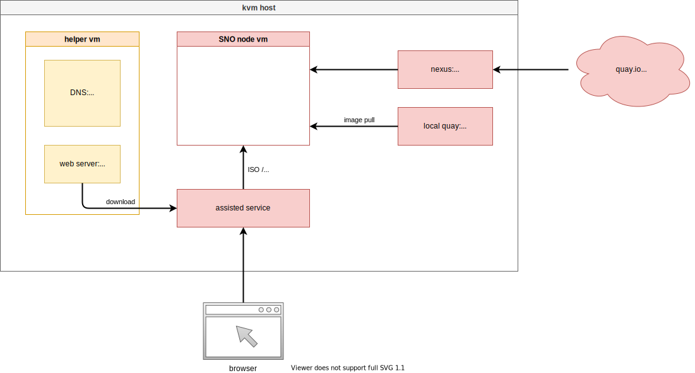

# 安装介质

本文的安装，使用openshift 4.9.12，未来方便，作者打包了安装介质，里面除了openshift镜像，还有一些辅助软件和工具。

打包好的安装包，在这里下载，百度盘下载链接，版本是 4.9.12 :
- 4.9.12
  - 链接: https://pan.baidu.com/s/1Wj5MUBLMFli1kOit1eafug 提取码: ur8r 

# 部署 dns

assisted install 模式下，如果想静态ip安装，需要在实验网络上部署一个dns服务。因为我们部署的是single node openshift，只需要把如下4个域名，指向同一个ip地址就可以。当然，你需要提前想好域名。

- api.ocp4s.redhat.ren
- api-int.ocp4s.redhat.ren
- *.apps.ocp4.redhat.ren
- ocp4-sno.ocp4.redhat.ren

```bash

cd /data/ocp4/ocp4-upi-helpernode-master/
cat << 'EOF' > /data/ocp4/ocp4-upi-helpernode-master/vars.yaml
---
ocp_version: 4.9.12
ssh_gen_key: false
staticips: true
firewalld: false
dns_forward: yes
iso:
  iso_dl_url: "file:///data/ocp4/rhcos-live.x86_64.iso"
  my_iso: "rhcos-live.iso" # this is internal file, just leave as it.
helper:
  name: "helper"
  ipaddr: "192.168.7.11"
  networkifacename: "enp1s0"
  gateway: "192.168.7.1"
  netmask: "255.255.255.0"
dns:
  domain: "redhat.ren"
  clusterid: "sno"
  forwarder1: "172.21.1.1"
  forwarder2: "172.21.1.1"
bootstrap:
  name: "bootstrap"
  ipaddr: "192.168.7.112"
  interface: "enp1s0"
  install_drive: "vda"
masters:
  - name: "master-0"
    ipaddr: "192.168.7.113"
    interface: "enp1s0"
    install_drive: "vda"
  # - name: "master-1"
  #   ipaddr: "192.168.7.14"
  #   interface: "enp1s0"
  #   install_drive: "vda"    
  # - name: "master-2"
  #   ipaddr: "192.168.7.15"
  #   interface: "enp1s0"
  #   install_drive: "vda"    
workers:
  - name: "worker-0"
    ipaddr: "192.168.7.116"
    interface: "eno1"
    install_drive: "sda"
  - name: "worker-1"
    ipaddr: "192.168.7.117"
    interface: "enp1s0"
    install_drive: "sda"
  # - name: "worker-2"
  #   ipaddr: "192.168.7.18"
  #   interface: "enp1s0"
  #   install_drive: "vda"
  # - name: "infra-0"
  #   ipaddr: "192.168.7.19"
  #   interface: "enp1s0"
  #   install_drive: "vda"
  # - name: "infra-1"
  #   ipaddr: "192.168.7.20"
  #   interface: "enp1s0"
  #   install_drive: "vda"
  # - name: "worker-3"
  #   ipaddr: "192.168.7.21"
  #   interface: "enp1s0"
  #   install_drive: "vda"
  # - name: "worker-4"
  #   ipaddr: "192.168.7.22"
  #   interface: "enp1s0"
  #   install_drive: "vda"
others:
  - name: "registry"
    ipaddr: "192.168.7.1"
  - name: "yum"
    ipaddr: "192.168.7.1"
  - name: "quay"
    ipaddr: "192.168.7.1"
  - name: "nexus"
    ipaddr: "192.168.7.1"
  - name: "git"
    ipaddr: "192.168.7.1"
otherdomains:
  - domain: "infra.redhat.ren"
    hosts:
    - name: "registry"
      ipaddr: "192.168.7.1"
    - name: "yum"
      ipaddr: "192.168.7.1"
    - name: "quay"
      ipaddr: "192.168.7.1"
    - name: "quaylab"
      ipaddr: "192.168.7.1"
    - name: "nexus"
      ipaddr: "192.168.7.1"
    - name: "git"
      ipaddr: "192.168.7.1"
  - domain: "ocp4s.redhat.ren"
    hosts:
    - name: "api"
      ipaddr: "192.168.7.13"
    - name: "api-int"
      ipaddr: "192.168.7.13"
    - name: "ocp4-sno"
      ipaddr: "192.168.7.13"
    - name: "*.apps"
      ipaddr: "192.168.7.13"
force_ocp_download: false
remove_old_config_files: false
ocp_client: "file:///data/ocp4/{{ ocp_version }}/openshift-client-linux-{{ ocp_version }}.tar.gz"
ocp_installer: "file:///data/ocp4/{{ ocp_version }}/openshift-install-linux-{{ ocp_version }}.tar.gz"
ppc64le: false
arch: 'x86_64'
chronyconfig:
  enabled: true
  content:
    - server: "192.168.7.11"
      options: iburst
setup_registry: # don't worry about this, just leave it here
  deploy: false
  registry_image: docker.io/library/registry:2
  local_repo: "ocp4/openshift4"
  product_repo: "openshift-release-dev"
  release_name: "ocp-release"
  release_tag: "4.6.1-x86_64"
ocp_filetranspiler: "file:///data/ocp4/filetranspiler.tgz"
registry_server: "registry.ocp4.redhat.ren:5443"
EOF

ansible-playbook -e @vars.yaml tasks/main.yml

/bin/cp -f /data/ocp4/rhcos-live.x86_64.iso /var/www/html/install/live.iso

```

# 部署 assisted install service

assisted install service有2个版本，一个是cloud.redhat.com上面那个，同时还有一个本地版本，两个版本功能一样，因为我们需要有定制需求，所以我们选择本地版本。

```bash
# https://github.com/openshift/assisted-service/blob/master/docs/user-guide/assisted-service-on-local.md

# https://github.com/openshift/assisted-service/tree/master/deploy/podman

podman version
# Version:      3.4.2
# API Version:  3.4.2
# Go Version:   go1.16.12
# Built:        Wed Feb  2 07:59:28 2022
# OS/Arch:      linux/amd64

mkdir -p /data/assisted-service/
cd /data/assisted-service/

export http_proxy="http://192.168.195.54:5085"
export https_proxy=${http_proxy}

wget https://raw.githubusercontent.com/openshift/assisted-service/master/deploy/podman/configmap.yml
wget https://raw.githubusercontent.com/openshift/assisted-service/master/deploy/podman/pod.yml

/bin/cp -f configmap.yml configmap.yml.bak

unset http_proxy
unset https_proxy

sed -i 's/ SERVICE_BASE_URL:.*/ SERVICE_BASE_URL: "http:\/\/172.21.6.103:8090"/' configmap.yml

cat << EOF > /data/assisted-service/os_image.json
[{
  "openshift_version": "4.9",
  "cpu_architecture": "x86_64",
  "url": "http://192.168.7.11:8080/install/live.iso",
  "rootfs_url": "http://192.168.7.11:8080/install/rootfs.img",
  "version": "49.84.202110081407-0"
}]
EOF
cat << EOF > /data/assisted-service/release.json
[{
  "openshift_version": "4.9",
  "cpu_architecture": "x86_64",
  "url": "quaylab.infra.redhat.ren/ocp4/openshift4:4.9.12-x86_64",
  "version": "4.9.12",
  "default": true
}]
EOF

cat configmap.yml.bak \
  | python3 -c 'import json, yaml, sys; print(json.dumps(yaml.load(sys.stdin)))' \
  | jq --arg OSIMAGE "$(jq -c . /data/assisted-service/os_image.json)" '. | .data.OS_IMAGES = $OSIMAGE ' \
  | jq --arg RELEASE_IMAGES "$(jq -c . /data/assisted-service/release.json)" '. | .data.RELEASE_IMAGES = $RELEASE_IMAGES ' \
  | python3 -c 'import yaml, sys; print(yaml.dump(yaml.load(sys.stdin), default_flow_style=False))' \
  > configmap.yml

# 启动本地assisted service
cd /data/assisted-service/
podman play kube --configmap configmap.yml pod.yml

# 注入离线镜像仓库的证书
podman cp /etc/crts/redhat.ren.ca.crt assisted-installer-service:/etc/pki/ca-trust/source/anchors/quaylab.crt
podman exec assisted-installer-service update-ca-trust

# 用以下命令，停止/删除本地assisted service
cd /data/assisted-service/
podman play kube --down pod.yml

podman exec assisted-installer-image-service du -h /data
# 1.1G    /data
```

运行成功以后，访问以下url

http://172.21.6.103:8080

# 创建cluster

访问本地的assist install service, 创建一个cluster
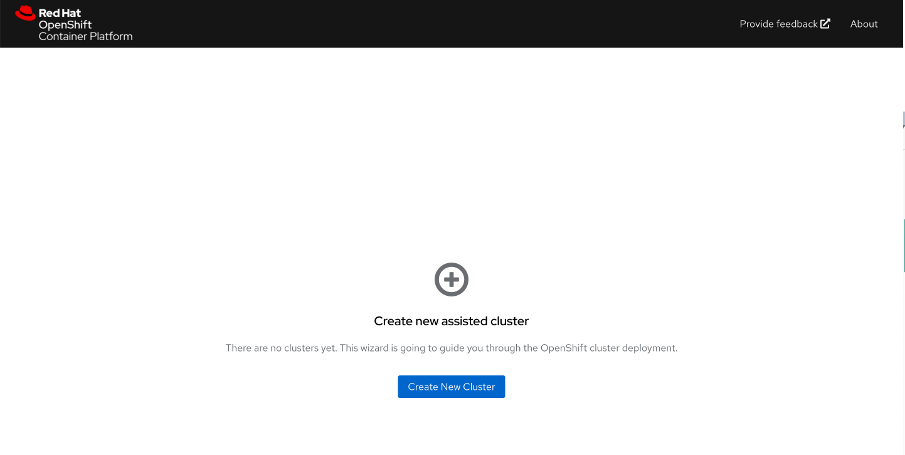

配置集群的基本信息
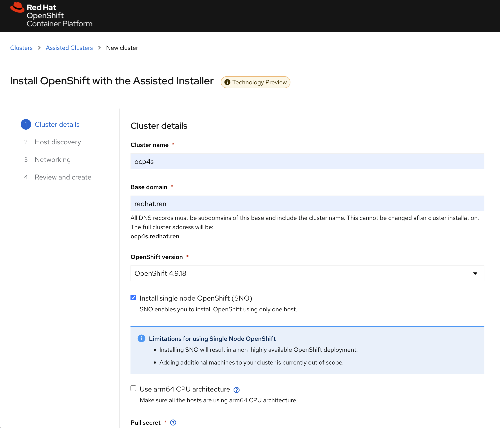

填写自己的pull-secret信息，并点击下一步
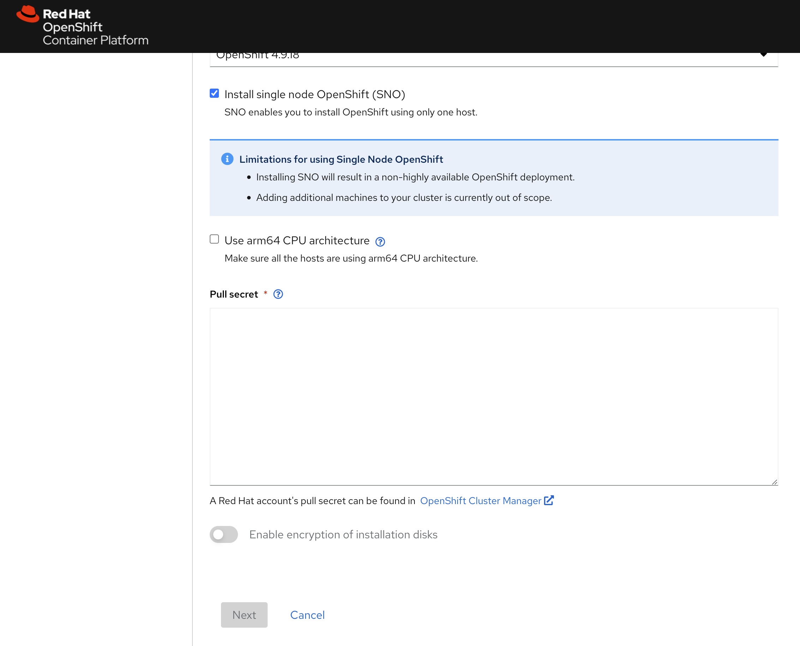

进入下一个页面后，点击add host
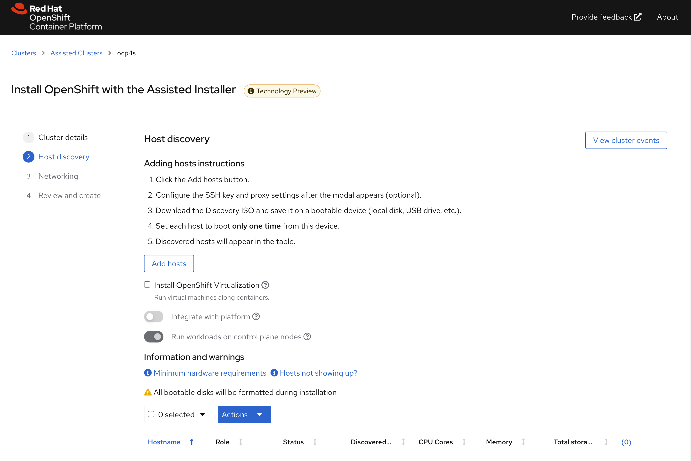

直接点击generate discovery iso，我们会在后面定制ssh key，现在不需要配置。
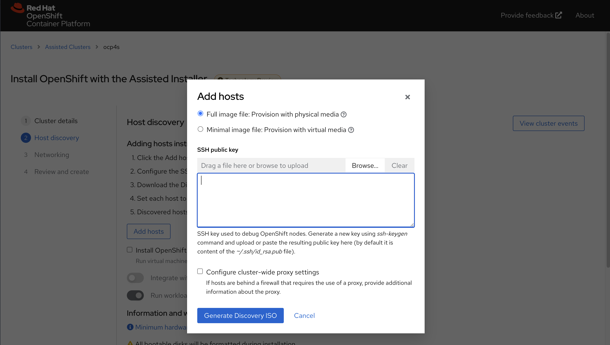

记录下来download command，因为我们需要里面的env infra id
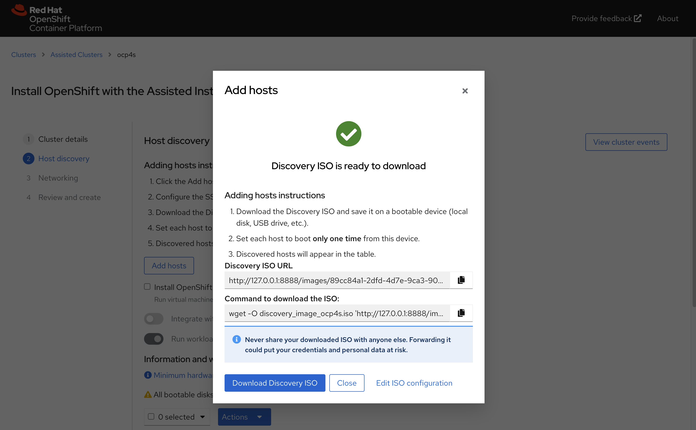

我们这里的command是
```bash
wget -O discovery_image_ocp4s.iso 'http://127.0.0.1:8888/images/57a10e57-1b1b-441f-b9ef-df8670cc8b56?arch=x86_64&type=full-iso&version=4.9'
```

# 定制 assisted install service的配置

assisted install service创建的iso，要去实验网络必须有dhcp服务，我们要做的是static ip，那么我们就要定制一下 assisted install service, 激活他现在还是隐藏的功能（暂时没有官方支持）。

```bash
# on helper
cd /data/sno

ASSISTED_SERVICE_URL=http://172.21.6.103:8080
# infra id is part of download url on UI
INFRA_ENV_ID=1245bbaa-c5e2-4a57-890b-838180f245af
NODE_SSH_KEY="$(cat ~/.ssh/id_rsa.pub)"

SNO_IP=192.168.7.13
SNO_GW=192.168.7.1
SNO_NETMAST=255.255.255.0
SNO_NETMAST_S=24
SNO_HOSTNAME=ocp4-sno
SNO_IF=enp1s0
SNO_IF_MAC=`printf '00:60:2F:%02X:%02X:%02X' $[RANDOM%256] $[RANDOM%256] $[RANDOM%256]`
SNO_DNS=192.168.7.11
SNO_DISK=/dev/vda
SNO_CORE_PWD=redhat

echo ${SNO_IF_MAC} > /data/sno/sno.mac

cat << EOF > /data/sno/server-a.yaml
dns-resolver:
  config:
    server:
    - ${SNO_DNS}
interfaces:
- ipv4:
    address:
    - ip: ${SNO_IP}
      prefix-length: ${SNO_NETMAST_S}
    dhcp: false
    enabled: true
  name: ${SNO_IF}
  state: up
  type: ethernet
routes:
  config:
  - destination: 0.0.0.0/0
    next-hop-address: ${SNO_GW}
    next-hop-interface: ${SNO_IF}
    table-id: 254
EOF

cat << EOF > /data/sno/static.ip.bu
variant: openshift
version: 4.9.0
metadata:
  labels:
    machineconfiguration.openshift.io/role: master
  name: 99-zzz-master-static-ip
passwd:
  users:
    name: wzh
    password_hash: "$(openssl passwd -1 wzh)"
# storage:
#   files:
#     - path: /etc/NetworkManager/system-connections/${SNO_IF}.nmconnection
#       overwrite: true
#       contents:
#         inline: |
#           [connection]
#           id=${SNO_IF}
#           type=ethernet
#           autoconnect-retries=1
#           interface-name=${SNO_IF}
#           multi-connect=1
#           permissions=
#           wait-device-timeout=60000

#           [ethernet]
#           mac-address-blacklist=

#           [ipv4]
#           address1=${SNO_IP}/${SNO_NETMAST_S=24},${SNO_GW}
#           dhcp-hostname=${SNO_HOSTNAME}
#           dhcp-timeout=90
#           dns=${SNO_DNS};
#           dns-search=
#           may-fail=false
#           method=manual

#           [ipv6]
#           addr-gen-mode=eui64
#           dhcp-hostname=${SNO_HOSTNAME}
#           dhcp-timeout=90
#           dns-search=
#           method=disabled

#           [proxy]

EOF

VAR_INSTALL_IMAGE_REGISTRY=quaylab.infra.redhat.ren
cat << EOF > /data/sno/install.images.bu
variant: openshift
version: 4.9.0
metadata:
  labels:
    machineconfiguration.openshift.io/role: master
  name: 99-zzz-master-install-images
storage:
  files:
    - path: /etc/containers/registries.conf.d/base.registries.conf
      overwrite: true
      contents:
        inline: |
          unqualified-search-registries = ["registry.access.redhat.com", "docker.io"]
          short-name-mode = ""

          [[registry]]
            prefix = ""
            location = "quay.io/openshift-release-dev/ocp-release"
            mirror-by-digest-only = true

            [[registry.mirror]]
              location = "${VAR_INSTALL_IMAGE_REGISTRY}/ocp4/openshift4"

            [[registry.mirror]]
              location = "${VAR_INSTALL_IMAGE_REGISTRY}/ocp4/release"

          [[registry]]
            prefix = ""
            location = "quay.io/openshift-release-dev/ocp-v4.0-art-dev"
            mirror-by-digest-only = true

            [[registry.mirror]]
              location = "${VAR_INSTALL_IMAGE_REGISTRY}/ocp4/openshift4"

            [[registry.mirror]]
              location = "${VAR_INSTALL_IMAGE_REGISTRY}/ocp4/release"

EOF

cat << EOF > /data/sno/install.crts.bu
variant: openshift
version: 4.9.0
metadata:
  labels:
    machineconfiguration.openshift.io/role: master
  name: 99-zzz-master-install-crts
storage:
  files:
    - path: /etc/pki/ca-trust/source/anchors/quaylab.crt
      overwrite: true
      contents:
        inline: |
$( cat /etc/crts/redhat.ren.ca.crt | sed 's/^/          /g' )

EOF

mkdir -p /data/sno/disconnected/
# copy ntp related config
/bin/cp -f  /data/ocp4/ocp4-upi-helpernode-master/machineconfig/* /data/sno/disconnected/

# copy image registry proxy related config
cd /data/ocp4
bash image.registries.conf.sh nexus.infra.redhat.ren:8083

/bin/cp -f /data/ocp4/99-worker-container-registries.yaml /data/sno/disconnected/
/bin/cp -f /data/ocp4/99-master-container-registries.yaml /data/sno/disconnected/

cd /data/sno/

# scripts to get ignition from yaml file
# run under bash
get_file_content_for_ignition() {
  VAR_FILE_NAME=$1
  VAR_FILE_CONTENT_IN_FILE=$2

  tmppath=$(mktemp)

cat << EOF > $tmppath
      {
        "overwrite": true,
        "path": "$VAR_FILE_NAME",
        "user": {
          "name": "root"
        },
        "contents": {
          "source": "data:text/plain,$(cat $VAR_FILE_CONTENT_IN_FILE | python3 -c "import sys, urllib.parse; print(urllib.parse.quote(''.join(sys.stdin.readlines())))"  )"
        }
      }
EOF

  RET_VAL=$(cat $tmppath | jq -c .)

  FILE_JSON=$(cat $VAR_FILE_CONTENT_IN_FILE | python3 -c 'import json, yaml, sys; print(json.dumps(yaml.load(sys.stdin)))')

cat << EOF > $tmppath
      {
        "overwrite": true,
        "path": "$(echo $FILE_JSON | jq -r .spec.config.storage.files[0].path )",
        "user": {
          "name": "root"
        },
        "contents": {
          "source": "$( echo $FILE_JSON | jq -r .spec.config.storage.files[0].contents.source )"
        }
      }
EOF
  # cat $tmppath

  RET_VAL_2=$(cat $tmppath | jq -c .)

  /bin/rm -f $tmppath
}

get_file_content_for_ignition "/opt/openshift/openshift/99-master-chrony-configuration.yaml" "/data/sno/disconnected/99-master-chrony-configuration.yaml"
VAR_99_master_chrony=$RET_VAL
VAR_99_master_chrony_2=$RET_VAL_2

get_file_content_for_ignition "/opt/openshift/openshift/99-worker-chrony-configuration.yaml" "/data/sno/disconnected/99-worker-chrony-configuration.yaml"
VAR_99_worker_chrony=$RET_VAL
VAR_99_worker_chrony_2=$RET_VAL_2

get_file_content_for_ignition "/opt/openshift/openshift/99-master-container-registries.yaml" "/data/sno/disconnected/99-master-container-registries.yaml"
VAR_99_master_container_registries=$RET_VAL
VAR_99_master_container_registries_2=$RET_VAL_2

get_file_content_for_ignition "/opt/openshift/openshift/99-worker-container-registries.yaml" "/data/sno/disconnected/99-worker-container-registries.yaml"
VAR_99_worker_container_registries=$RET_VAL
VAR_99_worker_container_registries_2=$RET_VAL_2

butane /data/sno/install.images.bu > /data/sno/disconnected/99-zzz-master-install-images.yaml
get_file_content_for_ignition "/opt/openshift/openshift/99-zzz-master-install-images.yaml" "/data/sno/disconnected/99-zzz-master-install-images.yaml"
VAR_99_master_install_images=$RET_VAL
VAR_99_master_install_images_2=$RET_VAL_2

butane /data/sno/install.crts.bu > /data/sno/disconnected/99-zzz-master-install-crts.yaml
get_file_content_for_ignition "/opt/openshift/openshift/99-zzz-master-install-crts.yaml" "/data/sno/disconnected/99-zzz-master-install-crts.yaml"
VAR_99_master_install_crts=$RET_VAL
VAR_99_master_install_crts_2=$RET_VAL_2

# https://access.redhat.com/solutions/6194821
# butane /data/sno/static.ip.bu | python3 -c 'import json, yaml, sys; print(json.dumps(yaml.load(sys.stdin)))'

# https://stackoverflow.com/questions/2854655/command-to-escape-a-string-in-bash
# VAR_PULL_SEC=`printf "%q" $(cat  /data/pull-secret.json)`
tmppath=$(mktemp)
butane /data/sno/static.ip.bu \
  | python3 -c 'import json, yaml, sys; print(json.dumps(yaml.load(sys.stdin)))' \
  | jq '.spec.config | .ignition.version = "3.1.0" ' \
  | jq --argjson VAR "$VAR_99_master_chrony" '.storage.files += [$VAR] ' \
  | jq --argjson VAR "$VAR_99_worker_chrony" '.storage.files += [$VAR] ' \
  | jq --argjson VAR "$VAR_99_master_container_registries" '.storage.files += [$VAR] ' \
  | jq --argjson VAR "$VAR_99_worker_container_registries" '.storage.files += [$VAR] ' \
  | jq --argjson VAR "$VAR_99_master_install_images" '.storage.files += [$VAR] ' \
  | jq --argjson VAR "$VAR_99_master_install_crts" '.storage.files += [$VAR] ' \
  | jq --argjson VAR "$VAR_99_master_chrony_2" '.storage.files += [$VAR] ' \
  | jq --argjson VAR "$VAR_99_master_container_registries_2" '.storage.files += [$VAR] ' \
  | jq --argjson VAR "$VAR_99_master_install_images_2" '.storage.files += [$VAR] ' \
  | jq --argjson VAR "$VAR_99_master_install_crts_2" '.storage.files += [$VAR] ' \
  | jq -c . \
  > ${tmppath}
VAR_IGNITION=$(cat ${tmppath})
rm -f ${tmppath}

# cat /run/user/0/containers/auth.json
# {
#         "auths": {
#                 "quaylab.infra.redhat.ren": {
#                         "auth": "cXVheWFkbWluOnBhc3N3b3Jk"
#                 }
#         }
# }
request_body=$(mktemp)

jq -n --arg SSH_KEY "$NODE_SSH_KEY" \
  --arg NMSTATE_YAML1 "$(cat server-a.yaml)" \
  --arg MAC_ADDR "$(cat /data/sno/sno.mac)" \
  --arg IF_NIC "${SNO_IF}" \
  --arg PULL_SEC '{"auths":{"registry.ocp4.redhat.ren:5443": {"auth": "ZHVtbXk6ZHVtbXk=","email": "noemail@localhost"},"quaylab.infra.redhat.ren": {"auth": "cXVheWFkbWluOnBhc3N3b3Jk","email": "noemail@localhost"}}}' \
  --arg IGNITION "${VAR_IGNITION}" \
'{
    "proxy":{"http_proxy":"","https_proxy":"","no_proxy":""},
    "ssh_authorized_key":$SSH_KEY,
    "pull_secret":$PULL_SEC,
    "image_type":"full-iso",
    "ignition_config_override":$IGNITION,
    "static_network_config": [
      {
        "network_yaml": $NMSTATE_YAML1,
        "mac_interface_map": [{"mac_address": $MAC_ADDR, "logical_nic_name": $IF_NIC}]
      }
    ]
}' > $request_body

# 我们来看看创建的request body
cat $request_body

# 向 assisted install service发送请求，进行定制
curl -H "Content-Type: application/json" -X PATCH -d @$request_body ${ASSISTED_SERVICE_URL}/api/assisted-install/v2/infra-envs/$INFRA_ENV_ID
# {"cluster_id":"850934fd-fa64-4057-b9d2-1eeebd890e1a","cpu_architecture":"x86_64","created_at":"2022-02-11T03:54:46.632598Z","download_url":"http://127.0.0.1:8888/images/89cc84a1-2dfd-4d7e-9ca3-903342c40d60?arch=x86_64&type=full-iso&version=4.9","email_domain":"Unknown","expires_at":"0001-01-01T00:00:00.000Z","href":"/api/assisted-install/v2/infra-envs/89cc84a1-2dfd-4d7e-9ca3-903342c40d60","id":"89cc84a1-2dfd-4d7e-9ca3-903342c40d60","kind":"InfraEnv","name":"ocp4s_infra-env","openshift_version":"4.9","proxy":{"http_proxy":"","https_proxy":"","no_proxy":""},"pull_secret_set":true,"ssh_authorized_key":"ssh-rsa AAAAB3NzaC1yc2EAAAADAQABAAABgQCrkO4oLIFTwjkGON+aShlQRKwXHOf3XKrGDmpb+tQM3UcbsF2U7klsr9jBcGObQMZO7KBW8mlRu0wC2RxueBgjbqvylKoFacgVZg6PORfkclqE1gZRYFwoxDkLo2c5y5B7OhcAdlHO0eR5hZ3/0+8ZHZle0W+A0AD7qqowO2HlWLkMMt1QXFD7R0r6dzTs9u21jASGk3jjYgCOw5iHvqm2ueVDFAc4yVwNZ4MXKg5MRvqAJDYPqhaRozLE60EGIziy9SRj9HWynyNDncCdL1/IBK2z9T0JwDebD6TDNcPCtL+AeKIpaHed52PkjnFf+Q+8/0Z0iXt6GyFYlx8OkxdsiMgMxiXx43yIRaWZjx54kVtc9pB6CL50UKPQ2LjuFPIZSfaCab5KDgPRtzue82DE6Mxxg4PS+FTW32/bq1WiOxCg9ABrZ0n1CGaZWFepJkSw47wodMnvlBkcKY3Rn/SsLZVOUsJysd+b08LQgl1Fr3hjVrEQMLbyU0UxvoerYfk= root@ocp4-helper","static_network_config":"dns-resolver:\n  config:\n    server:\n    - 172.21.1.1\ninterfaces:\n- ipv4:\n    address:\n    - ip: 172.21.6.13\n      prefix-length: 24\n    dhcp: false\n    enabled: true\n  name: enp1s0\n  state: up\n  type: ethernet\nroutes:\n  config:\n  - destination: 0.0.0.0/0\n    next-hop-address: 172.21.6.254\n    next-hop-interface: enp1s0\n    table-id: 254HHHHH00:60:2F:8B:42:88=enp1s0","type":"full-iso","updated_at":"2022-02-11T04:01:14.008388Z","user_name":"admin"}

rm -f ${request_body}

# on helper
cd /data/sno/
wget -O discovery_image_ocp4s.iso "http://172.21.6.103:8888/images/${INFRA_ENV_ID}?arch=x86_64&type=full-iso&version=4.9"

# coreos-installer iso kargs modify -a \
#   " ip=${SNO_IP}::${SNO_GW}:${SNO_NETMAST}:${SNO_HOSTNAME}:${SNO_IF}:none nameserver=${SNO_DNS}" \
#   /data/sno/discovery_image_ocp4s.iso

/bin/mv -f /data/sno/discovery_image_ocp4s.iso /data/sno/sno.iso

```

# 启动kvm

我们回到kvm宿主机，启动kvm，开始安装single node openshift

```bash
# back to kvm host

create_lv() {
    var_vg=$1
    var_lv=$2
    var_size=$3
    lvremove -f $var_vg/$var_lv
    lvcreate -y -L $var_size -n $var_lv $var_vg
    wipefs --all --force /dev/$var_vg/$var_lv
}

create_lv vgdata lvsno 120G

export KVM_DIRECTORY=/data/kvm

mkdir -p  ${KVM_DIRECTORY}
cd ${KVM_DIRECTORY}
scp root@192.168.7.11:/data/sno/sno.* ${KVM_DIRECTORY}/

# on kvm host
# export KVM_DIRECTORY=/data/kvm
virt-install --name=ocp4-sno --vcpus=16 --ram=65536 \
--cpu=host-model \
--disk path=/dev/vgdata/lvsno,device=disk,bus=virtio,format=raw \
--os-variant rhel8.3 --network bridge=baremetal,model=virtio,mac=$(<sno.mac) \
--graphics vnc,port=59012 \
--boot menu=on --cdrom ${KVM_DIRECTORY}/sno.iso

```
<!-- 等待vm重启一次。在这一步，vm里面会根据ignition文件，下载coreos镜像，并且安装coreos。 -->

# 在 assisted install service里面配置sno参数

回到 assisted install service webUI，能看到node已经被发现
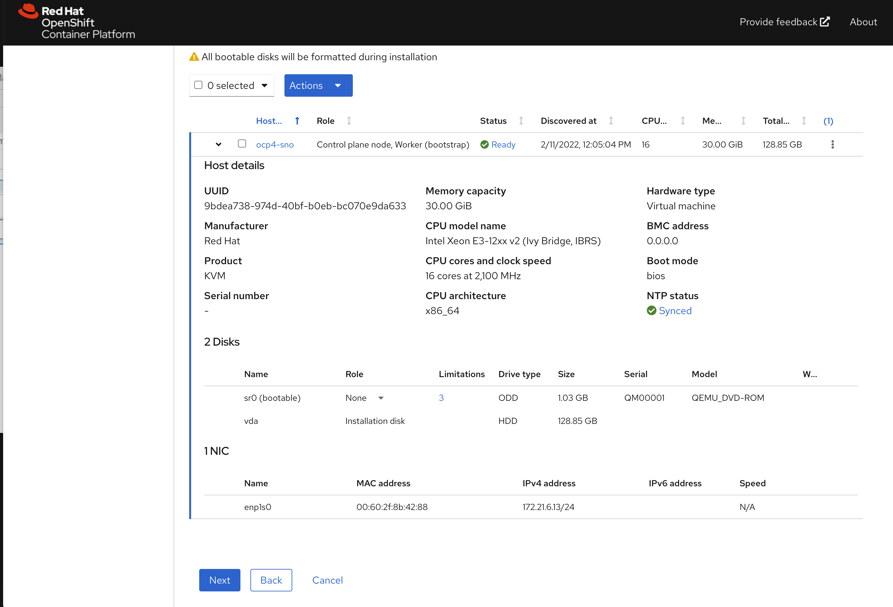

点击下一步，配置物理机的安装子网
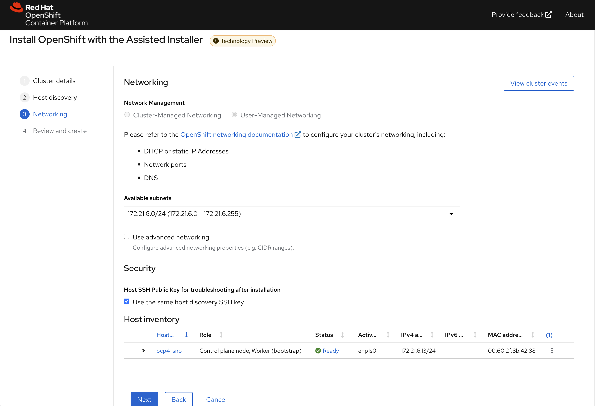

点击下一步，回顾集群配置信息
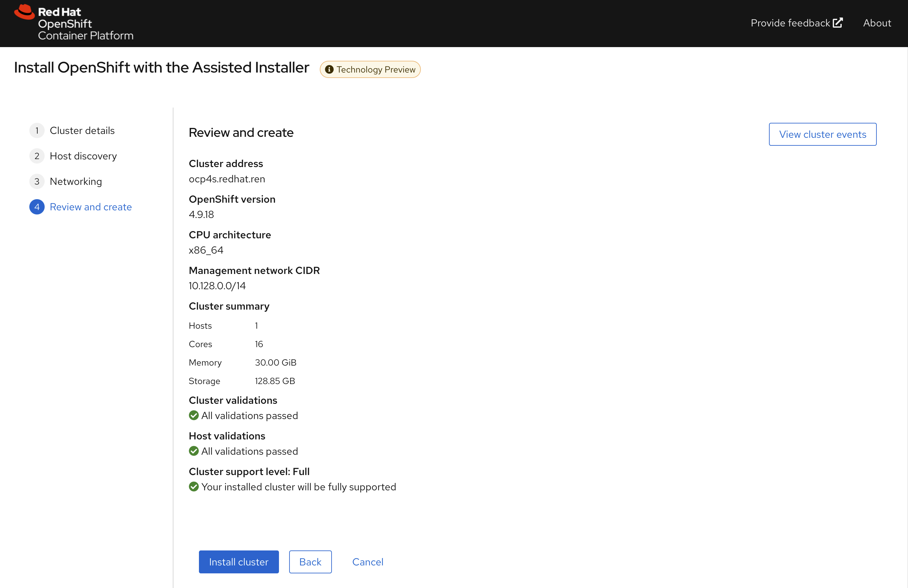

开始安装，到这里，我们等待就可以
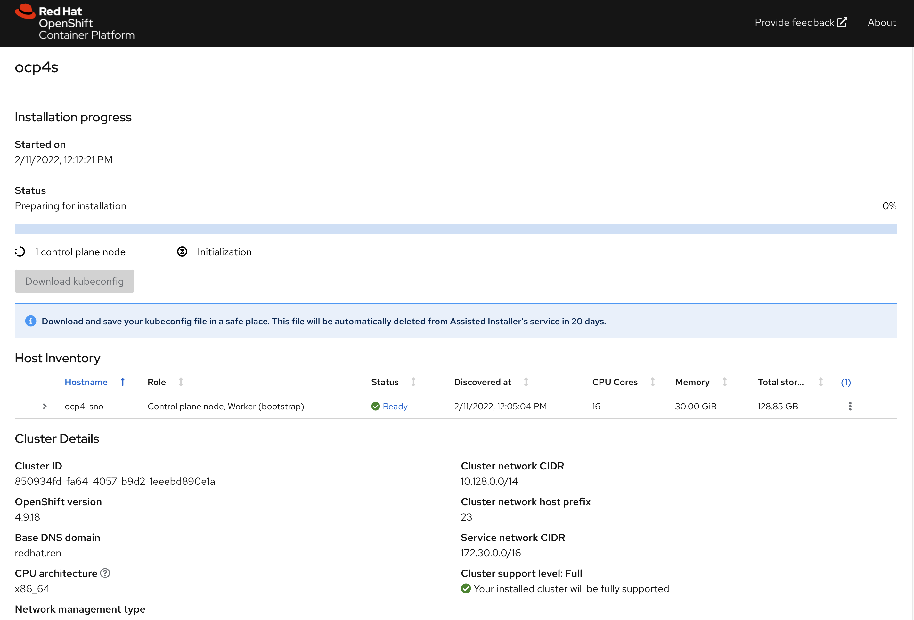

一段时间以后，通常20-30分钟，就安装完成了，当然这要网络情况比较好的条件下。


⚠️不要忘记下载集群证书，还有webUI的用户名，密码。

# 访问sno集群

```bash
# back to helper
# copy kubeconfig from web browser to /data/sno
export KUBECONFIG=/data/sno/auth/kubeconfig

oc get node
# NAME       STATUS   ROLES           AGE   VERSION
# ocp4-sno   Ready    master,worker   9h    v1.22.3+e790d7f

oc get co
# NAME                                       VERSION   AVAILABLE   PROGRESSING   DEGRADED   SINCE   MESSAGE
# authentication                             4.9.12    True        False         False      6h6m
# baremetal                                  4.9.12    True        False         False      9h
# cloud-controller-manager                   4.9.12    True        False         False      9h
# cloud-credential                           4.9.12    True        False         False      9h
# cluster-autoscaler                         4.9.12    True        False         False      9h
# config-operator                            4.9.12    True        False         False      9h
# console                                    4.9.12    True        False         False      9h
# csi-snapshot-controller                    4.9.12    True        False         False      9h
# dns                                        4.9.12    True        False         False      6h6m
# etcd                                       4.9.12    True        False         False      9h
# image-registry                             4.9.12    True        False         False      9h
# ingress                                    4.9.12    True        False         False      9h
# insights                                   4.9.12    True        False         False      9h
# kube-apiserver                             4.9.12    True        False         False      9h
# kube-controller-manager                    4.9.12    True        False         False      9h
# kube-scheduler                             4.9.12    True        False         False      9h
# kube-storage-version-migrator              4.9.12    True        False         False      9h
# machine-api                                4.9.12    True        False         False      9h
# machine-approver                           4.9.12    True        False         False      9h
# machine-config                             4.9.12    True        False         False      9h
# marketplace                                4.9.12    True        False         False      9h
# monitoring                                 4.9.12    True        False         False      9h
# network                                    4.9.12    True        False         False      9h
# node-tuning                                4.9.12    True        False         False      9h
# openshift-apiserver                        4.9.12    True        False         False      6h4m
# openshift-controller-manager               4.9.12    True        False         False      9h
# openshift-samples                          4.9.12    True        False         False      6h4m
# operator-lifecycle-manager                 4.9.12    True        False         False      9h
# operator-lifecycle-manager-catalog         4.9.12    True        False         False      9h
# operator-lifecycle-manager-packageserver   4.9.12    True        False         False      9h
# service-ca                                 4.9.12    True        False         False      9h
# storage                                    4.9.12    True        False         False      9h
```
访问集群的webUI

https://console-openshift-console.apps.ocp4s.redhat.ren/

用户名密码是：  kubeadmin  /   3VUQK-4NDwI-YuKg8-KgmRY


# reference

https://github.com/openshift/assisted-service/tree/master/docs/user-guide

- https://access.redhat.com/solutions/6135171
- https://github.com/openshift/assisted-service/blob/master/docs/user-guide/assisted-service-on-local.md
- https://github.com/openshift/assisted-service/blob/master/docs/user-guide/restful-api-guide.md

search
- pre-network-manager-config.sh
- /Users/wzh/Desktop/dev/assisted-service/internal/constants/scripts.go
- NetworkManager

https://superuser.com/questions/218340/how-to-generate-a-valid-random-mac-address-with-bash-shell

# end
```bash

cat << EOF > test
02:00:00:2c:23:a5=enp1s0
EOF
cat test | cut -d= -f1 | tr '[:lower:]' '[:upper:]'

printf '00-60-2F-%02X-%02X-%02X\n' $[RANDOM%256] $[RANDOM%256] $[RANDOM%256]
virsh domifaddr freebsd11.1

cat configmap.yml | python3 -c 'import json, yaml, sys; print(json.dumps(yaml.load(sys.stdin)))' | jq -r .data.OS_IMAGES | jq '.[] | select( .openshift_version == "4.9" and .cpu_architecture == "x86_64" ) ' | jq .
# {
#   "openshift_version": "4.9",
#   "cpu_architecture": "x86_64",
#   "url": "https://mirror.openshift.com/pub/openshift-v4/dependencies/rhcos/4.9/4.9.0/rhcos-4.9.0-x86_64-live.x86_64.iso",
#   "rootfs_url": "https://mirror.openshift.com/pub/openshift-v4/dependencies/rhcos/4.9/4.9.0/rhcos-live-rootfs.x86_64.img",
#   "version": "49.84.202110081407-0"
# }

cat configmap.yml | python3 -c 'import json, yaml, sys; print(json.dumps(yaml.load(sys.stdin)))' | jq -r .data.RELEASE_IMAGES | jq -r .
# [
#   {
#     "openshift_version": "4.6",
#     "cpu_architecture": "x86_64",
#     "url": "quay.io/openshift-release-dev/ocp-release:4.6.16-x86_64",
#     "version": "4.6.16"
#   },
#   {
#     "openshift_version": "4.7",
#     "cpu_architecture": "x86_64",
#     "url": "quay.io/openshift-release-dev/ocp-release:4.7.42-x86_64",
#     "version": "4.7.42"
#   },
#   {
#     "openshift_version": "4.8",
#     "cpu_architecture": "x86_64",
#     "url": "quay.io/openshift-release-dev/ocp-release:4.8.29-x86_64",
#     "version": "4.8.29"
#   },
#   {
#     "openshift_version": "4.9",
#     "cpu_architecture": "x86_64",
#     "url": "quay.io/openshift-release-dev/ocp-release:4.9.18-x86_64",
#     "version": "4.9.18",
#     "default": true
#   },
#   {
#     "openshift_version": "4.9",
#     "cpu_architecture": "arm64",
#     "url": "quay.io/openshift-release-dev/ocp-release:4.9.18-aarch64",
#     "version": "4.9.18"
#   },
#   {
#     "openshift_version": "4.10",
#     "cpu_architecture": "x86_64",
#     "url": "quay.io/openshift-release-dev/ocp-release:4.10.0-rc.0-x86_64",
#     "version": "4.10.0-rc.0"
#   }
# ]

```