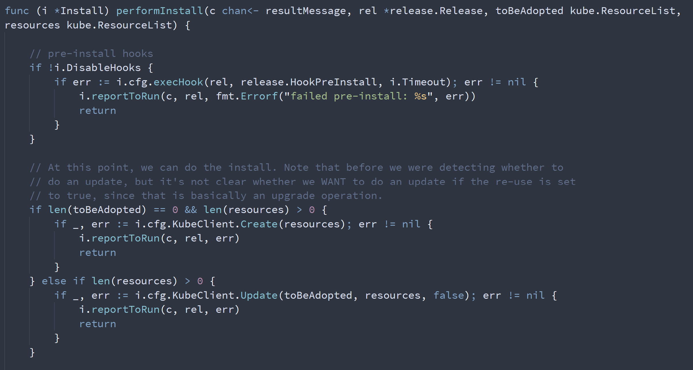
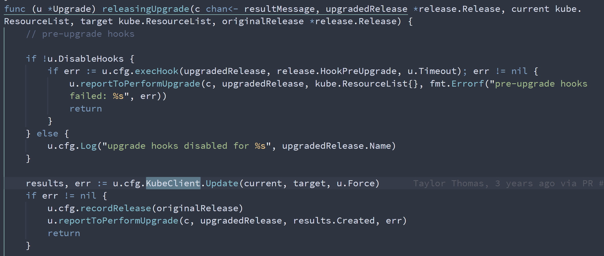

# helm 在 update, upgrade 操作时候的逻辑

helm是一个模板引擎，作用是讲模板填上参数，创建成yaml，然后apply到目标系统上。那么在helm update, upgrade操作的时候，他的运行逻辑是什么样子的呢？

作者猜测应该是这样的，helm都回根据新的模板，创建出yaml来，然后通过k8s的update操作，来完成配置的更新。

# 分析代码

我们先从代码分析入手，看一下helm的源代码，checkout https://github.com/helm/helm

在文件 pkg/action/install.go 中，有这样一段，还带注释

从代码逻辑，以及注释，就可以看出来，当helm遇到新的install的时候，它使用 kubectl create 来创建resource. 当他处理旧的install的时候，他会使用 kubectl patch 来更新resource.

在文件 /root/dev/helm/pkg/action/upgrade.go 中，有这样一段代码，

从代码逻辑中，我们可以看出来，helm处理 upgrade 的时候，直接使用 kubectl patch 来更新resource

# 实践操作

代码分析是一回事，我们还需要到实际系统上验证一下我们的说法，那么我们就先从构建一个简单的helm chart开始。

## 构建一个helm chart

