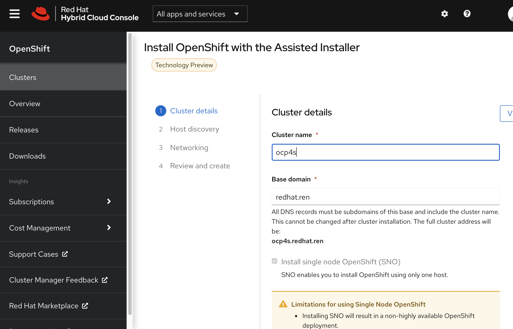

# openshift 4.9 single node install mode

all ways are here
- https://cloud.redhat.com/blog/deploy-openshift-at-the-edge-with-single-node-openshift
  
# try poc way

reference
- https://github.com/eranco74/bootstrap-in-place-poc

we use helper node way, combine the poc way above.
```bash
# first you should config your helper node

# the sno cluster will use sno.redhat.ren dns name
cat << 'EOF' > /data/ocp4/ocp4-upi-helpernode-master/vars.yaml
---
ocp_version: 4.9.5
ssh_gen_key: false
staticips: true
firewalld: false
dns_forward: yes
iso:
  iso_dl_url: "file:///data/ocp4/rhcos-live.x86_64.iso"
  my_iso: "rhcos-live.iso" # this is internal file, just leave as it.
helper:
  name: "helper"
  ipaddr: "192.168.7.11"
  networkifacename: "enp1s0"
  gateway: "192.168.7.1"
  netmask: "255.255.255.0"
dns:
  domain: "redhat.ren"
  clusterid: "ocp4"
  forwarder1: "202.106.0.20"
  forwarder2: "202.106.0.20"
bootstrap:
  name: "bootstrap"
  ipaddr: "192.168.7.12"
  interface: "enp1s0"
  install_drive: "vda"
masters:
  - name: "master-0"
    ipaddr: "192.168.7.13"
    interface: "enp1s0"
    install_drive: "vda"
  - name: "master-1"
    ipaddr: "192.168.7.14"
    interface: "enp1s0"
    install_drive: "vda"    
  - name: "master-2"
    ipaddr: "192.168.7.15"
    interface: "enp1s0"
    install_drive: "vda"    
workers:
  - name: "worker-0"
    ipaddr: "192.168.7.16"
    interface: "ens18f0"
    install_drive: "sda"
  - name: "worker-1"
    ipaddr: "192.168.7.17"
    interface: "enp1s0"
    install_drive: "sda"
  # - name: "worker-2"
  #   ipaddr: "192.168.7.18"
  #   interface: "enp1s0"
  #   install_drive: "vda"
  # - name: "infra-0"
  #   ipaddr: "192.168.7.19"
  #   interface: "enp1s0"
  #   install_drive: "vda"
  # - name: "infra-1"
  #   ipaddr: "192.168.7.20"
  #   interface: "enp1s0"
  #   install_drive: "vda"
  # - name: "worker-3"
  #   ipaddr: "192.168.7.21"
  #   interface: "enp1s0"
  #   install_drive: "vda"
  # - name: "worker-4"
  #   ipaddr: "192.168.7.22"
  #   interface: "enp1s0"
  #   install_drive: "vda"
others:
  - name: "registry"
    ipaddr: "192.168.7.1"
  - name: "yum"
    ipaddr: "192.168.7.1"
  - name: "quay"
    ipaddr: "192.168.7.11"
  - name: "nexus"
    ipaddr: "192.168.7.1"
  - name: "git"
    ipaddr: "192.168.7.11"
otherdomains:
  - domain: "rhv.redhat.ren"
    hosts:
    - name: "manager"
      ipaddr: "192.168.7.71"
    - name: "rhv01"
      ipaddr: "192.168.7.72"
  - domain: "sno.redhat.ren"
    hosts:
    - name: "*"
      ipaddr: "192.168.7.71"
    - name: "*.apps"
      ipaddr: "192.168.7.71"
force_ocp_download: false
remove_old_config_files: false
ocp_client: "file:///data/ocp4/{{ ocp_version }}/openshift-client-linux-{{ ocp_version }}.tar.gz"
ocp_installer: "file:///data/ocp4/{{ ocp_version }}/openshift-install-linux-{{ ocp_version }}.tar.gz"
ppc64le: false
arch: 'x86_64'
chronyconfig:
  enabled: true
  content:
    - server: "192.168.7.1"
      options: iburst
setup_registry: # don't worry about this, just leave it here
  deploy: false
  registry_image: docker.io/library/registry:2
  local_repo: "ocp4/openshift4"
  product_repo: "openshift-release-dev"
  release_name: "ocp-release"
  release_tag: "4.6.1-x86_64"
ocp_filetranspiler: "file:///data/ocp4/filetranspiler.tgz"
registry_server: "registry.ocp4.redhat.ren:5443"
EOF

ansible-playbook -e @vars.yaml tasks/main.yml

mkdir -p /data/sno

# 定制ignition
cd /data/sno

# 根据现场环境，修改 install-config.yaml
# 至少要修改ssh key， 还有 additionalTrustBundle，这个是镜像仓库的csr 

SNO_IP=192.168.7.71
SNO_GW=192.168.7.1
SNO_NETMAST=255.255.255.0
SNO_HOSTNAME=ocp4-sno
SNO_IF=enp3s0
SNO_DNS=192.168.7.11
SNO_DISK=sda

# vi install-config.yaml 
cat << EOF > /data/sno/install-config.yaml 
apiVersion: v1
baseDomain: redhat.ren
compute:
- hyperthreading: Enabled
  name: worker
  replicas: 0
controlPlane:
  hyperthreading: Enabled
  name: master
  replicas: 1
metadata:
  name: sno
networking:
  clusterNetworks:
  - cidr: 10.128.0.0/14
    hostPrefix: 23
  networkType: OpenShiftSDN
  serviceNetwork:
  - 172.30.0.0/16
platform:
  none: {}
BootstrapInPlace:
  InstallationDisk: ${SNO_DISK}
pullSecret: '{"auths":{"registry.ocp4.redhat.ren:5443": {"auth": "ZHVtbXk6ZHVtbXk=","email": "noemail@localhost"},"registry.ppa.redhat.ren:5443": {"auth": "ZHVtbXk6ZHVtbXk=","email": "noemail@localhost"}}}'
sshKey: |
$( cat /root/.ssh/id_rsa.pub | sed 's/^/   /g' )
additionalTrustBundle: |
$( cat /etc/crts/redhat.ren.ca.crt | sed 's/^/   /g' )
imageContentSources:
- mirrors:
  - registry.ocp4.redhat.ren:5443/ocp4/openshift4
  - registry.ocp4.redhat.ren:5443/ocp4/release
  source: quay.io/openshift-release-dev/ocp-release
- mirrors:
  - registry.ocp4.redhat.ren:5443/ocp4/openshift4
  - registry.ocp4.redhat.ren:5443/ocp4/release
  source: quay.io/openshift-release-dev/ocp-v4.0-art-dev
EOF


cd /data/sno/
/bin/rm -rf *.ign .openshift_install_state.json auth bootstrap manifests master*[0-9] worker*[0-9] 

openshift-install create manifests --dir=/data/sno

# copy ntp related config
/bin/cp -f  /data/ocp4/ocp4-upi-helpernode-master/machineconfig/* /data/sno/openshift/

# copy image registry proxy related config
cd /data/ocp4
bash image.registries.conf.sh nexus.ocp4.redhat.ren:8083

# /bin/cp -f /data/ocp4/image.registries.conf /etc/containers/registries.conf.d/

/bin/cp -f /data/ocp4/99-worker-container-registries.yaml /data/sno/openshift
/bin/cp -f /data/ocp4/99-master-container-registries.yaml /data/sno/openshift

cd /data/sno/
openshift-install create single-node-ignition-config --dir=/data/sno

coreos-installer iso ignition embed /data/ocp4/rhcos-live.x86_64.iso \
  --force \
  --ignition-file /data/sno/bootstrap-in-place-for-live-iso.ign \
  --output /data/sno/sno.iso

coreos-installer iso kargs modify -a \
  " ip=${SNO_IP}::${SNO_GW}:${SNO_NETMAST}:${SNO_HOSTNAME}:${SNO_IF}:none nameserver=${SNO_DNS} coreos.inst.install_dev=${SNO_DISK} " \
  /data/sno/sno.iso

# go back to kvm host
export KVM_DIRECTORY=/home/data/kvm

mkdir -p  ${KVM_DIRECTORY}
cd ${KVM_DIRECTORY}
scp root@192.168.7.11:/data/sno/sno.iso ${KVM_DIRECTORY}/


```


# failed following official docs



The iso downloaded can't be booted.

# failed

http://schmaustech.blogspot.com/2021/09/deploy-disconnected-single-node.html

```bash

# on helper
install /data/ocp4/4.8.13/openshift-baremetal-install /usr/local/bin/openshift-baremetal-install
install /data/ocp4/clients/coreos-installer_amd64 /usr/local/bin/coreos-installer

dnf install -y libvirt

# vi install-config.yaml 
cat << EOF > /data/install/install-config.yaml 
apiVersion: v1
baseDomain: redhat.ren
compute:
- hyperthreading: Enabled
  name: worker
  replicas: 0
controlPlane:
  hyperthreading: Enabled
  name: master
  replicas: 1
metadata:
  name: ocp4
networking:
  clusterNetworks:
  - cidr: 10.128.0.0/16
    hostPrefix: 23
  networkType: OVNKubernetes
  serviceNetwork:
  - 172.30.0.0/16
platform:
  none: {}
BootstrapInPlace:
  InstallationDisk: /dev/vda
pullSecret: '{"auths":{"registry.ocp4.redhat.ren:5443": {"auth": "ZHVtbXk6ZHVtbXk=","email": "noemail@localhost"},"registry.ppa.redhat.ren:5443": {"auth": "ZHVtbXk6ZHVtbXk=","email": "noemail@localhost"}}}'
sshKey: |
$( cat /root/.ssh/id_rsa.pub | sed 's/^/   /g' )
additionalTrustBundle: |
$( cat /etc/crts/redhat.ren.ca.crt | sed 's/^/   /g' )
imageContentSources:
- mirrors:
  - registry.ocp4.redhat.ren:5443/ocp4/openshift4
  - registry.ocp4.redhat.ren:5443/ocp4/release
  source: quay.io/openshift-release-dev/ocp-release
- mirrors:
  - registry.ocp4.redhat.ren:5443/ocp4/openshift4
  - registry.ocp4.redhat.ren:5443/ocp4/release
  source: quay.io/openshift-release-dev/ocp-v4.0-art-dev
EOF

cd /data/install/
/bin/rm -rf *.ign .openshift_install_state.json auth bootstrap manifests master*[0-9] worker*[0-9] 

openshift-baremetal-install create manifests --dir=/data/install

cat << EOF > /data/install/manifests/cluster-network-03-config.yml
apiVersion: operator.openshift.io/v1
kind: Network
metadata:
  name: cluster
spec:
  defaultNetwork:
    ovnKubernetesConfig:
      hybridOverlayConfig:
        hybridClusterNetwork: 
        - cidr: 10.132.0.0/16
          hostPrefix: 23
        hybridOverlayVXLANPort: 9898 
EOF

# copy ntp related config
/bin/cp -f  /data/ocp4/ocp4-upi-helpernode-master/machineconfig/* /data/install/openshift/

# copy image registry proxy related config
cd /data/ocp4
bash image.registries.conf.sh nexus.ocp4.redhat.ren:8083

/bin/cp -f /data/ocp4/image.registries.conf /etc/containers/registries.conf.d/

/bin/cp -f /data/ocp4/99-worker-container-registries.yaml /data/install/openshift
/bin/cp -f /data/ocp4/99-master-container-registries.yaml /data/install/openshift

cd /data/install/
# openshift-baremetal-install create ignition-configs --dir=/data/install
openshift-baremetal-install create single-node-ignition-config --dir=/data/install 

coreos-installer iso ignition embed -fi bootstrap-in-place-for-live-iso.ign /data/ocp4/rhcos-live.x86_64.iso -o /data/install/bootstrap-in-place.iso

# on kvm host
export KVM_DIRECTORY=/data/kvm
virt-install --name=ocp4-master-0 --vcpus=16 --ram=30720 \
--cpu=host-model \
--disk path=/data/nvme/ocp4-master-0.qcow2,bus=virtio,size=120 \
--os-variant rhel8.4 --network bridge=baremetal,model=virtio \
--graphics vnc,port=59002 \
--boot menu=on --cdrom ${KVM_DIRECTORY}/bootstrap-in-place.iso

```