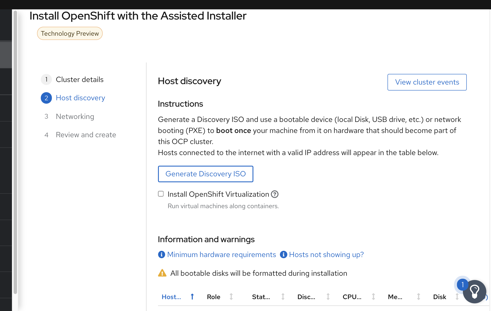
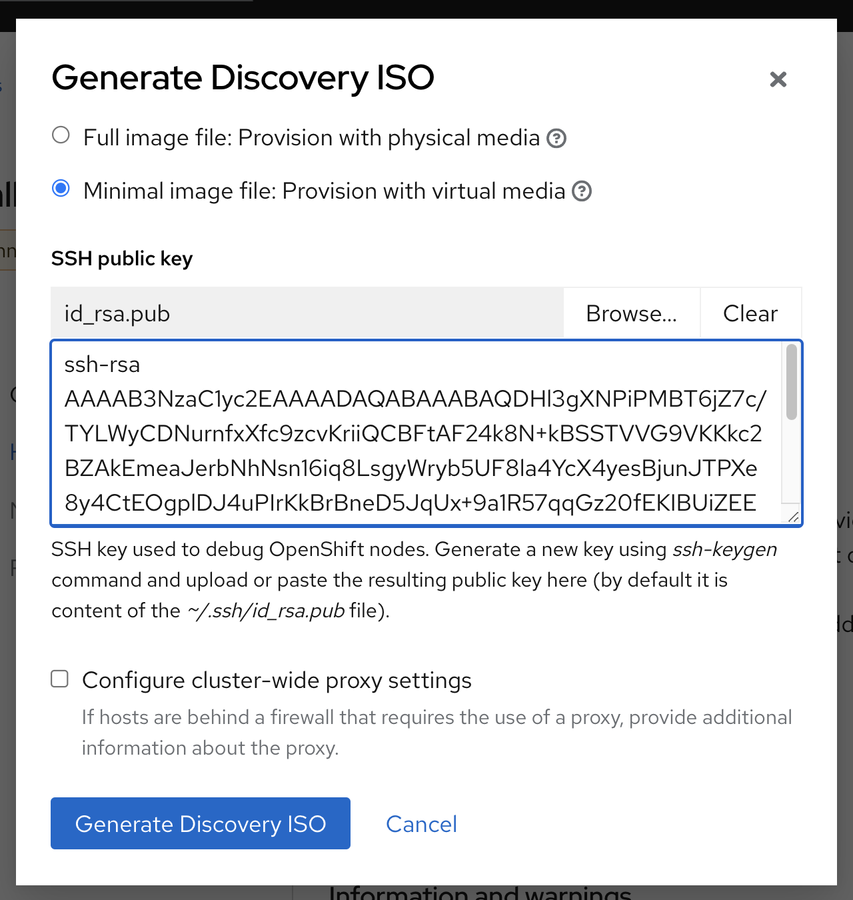
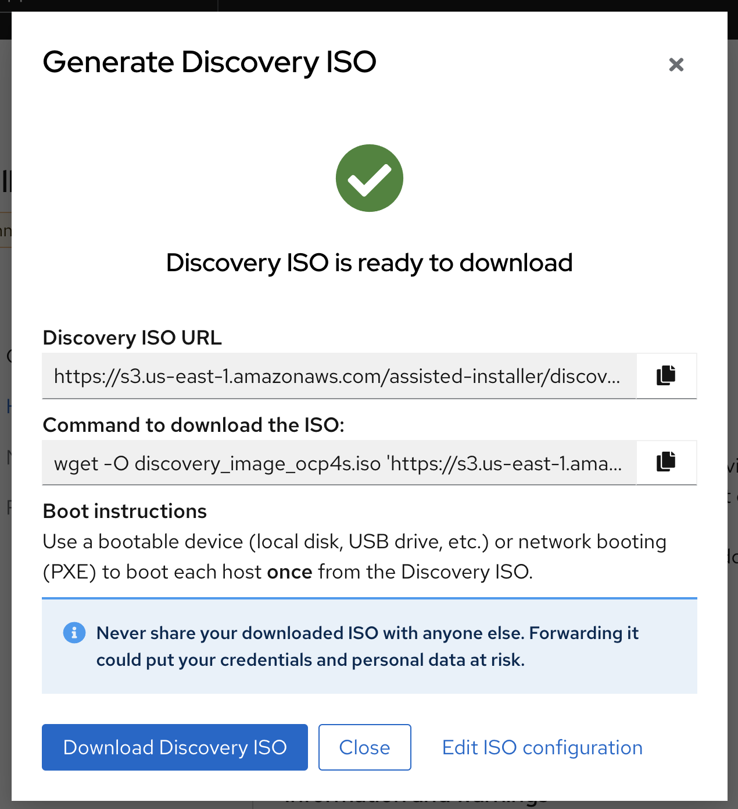

# openshift 4.9 single node install mode

all ways are here
- https://cloud.redhat.com/blog/deploy-openshift-at-the-edge-with-single-node-openshift
  
# try poc way

- https://github.com/eranco74/bootstrap-in-place-poc


# failed following official docs








The iso downloaded can't be booted.

# failed

http://schmaustech.blogspot.com/2021/09/deploy-disconnected-single-node.html

```bash

# on helper
install /data/ocp4/4.8.13/openshift-baremetal-install /usr/local/bin/openshift-baremetal-install
install /data/ocp4/clients/coreos-installer_amd64 /usr/local/bin/coreos-installer

dnf install -y libvirt

# vi install-config.yaml 
cat << EOF > /data/install/install-config.yaml 
apiVersion: v1
baseDomain: redhat.ren
compute:
- hyperthreading: Enabled
  name: worker
  replicas: 0
controlPlane:
  hyperthreading: Enabled
  name: master
  replicas: 1
metadata:
  name: ocp4
networking:
  clusterNetworks:
  - cidr: 10.128.0.0/16
    hostPrefix: 23
  networkType: OVNKubernetes
  serviceNetwork:
  - 172.30.0.0/16
platform:
  none: {}
BootstrapInPlace:
  InstallationDisk: /dev/vda
pullSecret: '{"auths":{"registry.ocp4.redhat.ren:5443": {"auth": "ZHVtbXk6ZHVtbXk=","email": "noemail@localhost"},"registry.ppa.redhat.ren:5443": {"auth": "ZHVtbXk6ZHVtbXk=","email": "noemail@localhost"}}}'
sshKey: |
$( cat /root/.ssh/id_rsa.pub | sed 's/^/   /g' )
additionalTrustBundle: |
$( cat /etc/crts/redhat.ren.ca.crt | sed 's/^/   /g' )
imageContentSources:
- mirrors:
  - registry.ocp4.redhat.ren:5443/ocp4/openshift4
  - registry.ocp4.redhat.ren:5443/ocp4/release
  source: quay.io/openshift-release-dev/ocp-release
- mirrors:
  - registry.ocp4.redhat.ren:5443/ocp4/openshift4
  - registry.ocp4.redhat.ren:5443/ocp4/release
  source: quay.io/openshift-release-dev/ocp-v4.0-art-dev
EOF

cd /data/install/
/bin/rm -rf *.ign .openshift_install_state.json auth bootstrap manifests master*[0-9] worker*[0-9] 

openshift-baremetal-install create manifests --dir=/data/install

cat << EOF > /data/install/manifests/cluster-network-03-config.yml
apiVersion: operator.openshift.io/v1
kind: Network
metadata:
  name: cluster
spec:
  defaultNetwork:
    ovnKubernetesConfig:
      hybridOverlayConfig:
        hybridClusterNetwork: 
        - cidr: 10.132.0.0/16
          hostPrefix: 23
        hybridOverlayVXLANPort: 9898 
EOF

# copy ntp related config
/bin/cp -f  /data/ocp4/ocp4-upi-helpernode-master/machineconfig/* /data/install/openshift/

# copy image registry proxy related config
cd /data/ocp4
bash image.registries.conf.sh nexus.ocp4.redhat.ren:8083

/bin/cp -f /data/ocp4/image.registries.conf /etc/containers/registries.conf.d/

/bin/cp -f /data/ocp4/99-worker-container-registries.yaml /data/install/openshift
/bin/cp -f /data/ocp4/99-master-container-registries.yaml /data/install/openshift

cd /data/install/
# openshift-baremetal-install create ignition-configs --dir=/data/install
openshift-baremetal-install create single-node-ignition-config --dir=/data/install 

coreos-installer iso ignition embed -fi bootstrap-in-place-for-live-iso.ign /data/ocp4/rhcos-live.x86_64.iso -o /data/install/bootstrap-in-place.iso

# on kvm host
export KVM_DIRECTORY=/data/kvm
virt-install --name=ocp4-master-0 --vcpus=16 --ram=30720 \
--cpu=host-model \
--disk path=/data/nvme/ocp4-master-0.qcow2,bus=virtio,size=120 \
--os-variant rhel8.4 --network bridge=baremetal,model=virtio \
--graphics vnc,port=59002 \
--boot menu=on --cdrom ${KVM_DIRECTORY}/bootstrap-in-place.iso

```